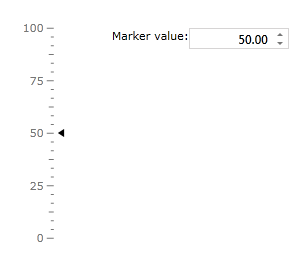

# Interactivity

Scale interactivity refers to the ability for the end-user to interact with the scale object. This ability is governed by the Boolean IsInteractive property. When this Boolean value is set to True, the end-user can click on the scale or drag the indicator along the values of its scale.

#### __XAML__
```XAML
	<telerik:RadVerticalLinearGauge Width="102" Height="210" telerik:StyleManager.Theme="Windows8">
	    <telerik:VerticalLinearScale Min="0" 
	                    Max="20"
	                    IsInteractive="True"
	                    RelativeHeight="1"
	                    RelativeY="0"
	                    MiddleTickRelativeWidth="0.05\*"
	                    MiddleTickRelativeHeight="0.003\*"
	                    MinorTickRelativeHeight="0.003\*"
	                    MajorTickRelativeHeight="0.003\*">
	        <telerik:VerticalLinearScale.Indicators>
	            <telerik:Marker Value="5"
	                    telerik:LinearScale.RotateForVertical="True"
	                    telerik:ScaleObject.RelativeWidth="0.08\*"
	                    telerik:ScaleObject.RelativeHeight="0.03\*" 
	                    telerik:ScaleObject.Location="OverCenter" />
	        </telerik:VerticalLinearScale.Indicators>
	    </telerik:VerticalLinearScale>
	</telerik:RadVerticalLinearGauge>
```

When end-user click on a scale at an approximate value all indicators move, or snap, to a value on the scale which is closest to where the end-user clicked.

The end-user can click and drag the indicator along the values of its scale.

Using interactivity features of the scale you can create two-way binding between indicator’s value and value of any other control (RadNumericIndicator, for example).

#### __XAML__
```XAML
	<Grid Margin="20">
	    <Grid.ColumnDefinitions>
	        <ColumnDefinition Width="Auto" />
	        <ColumnDefinition Width="Auto" />
	    </Grid.ColumnDefinitions>
	    <telerik:RadVerticalLinearGauge Width="102" Height="210"
	                                    VerticalAlignment="Top"
	                                    HorizontalAlignment="Left"
	                                    telerik:StyleManager.Theme="Windows8">
	        <telerik:VerticalLinearScale Min="0" Max="100"
	                                     RelativeHeight="1"
	                                     RelativeY="0"
	                                     MiddleTickRelativeWidth="0.05\*"
	                                     MiddleTickRelativeHeight="0.003\*"
	                                     MinorTickRelativeHeight="0.003\*"
	                                     MajorTickRelativeHeight="0.003\*"
	                                     IsInteractive="True">
	            <telerik:VerticalLinearScale.Indicators>
	                <telerik:Marker Name="marker" 
	                                telerik:LinearScale.RotateForVertical="True"
	                                telerik:ScaleObject.RelativeWidth="0.08\*"
	                                telerik:ScaleObject.RelativeHeight="0.03\*" 
	                                telerik:ScaleObject.Location="OverCenter"
	                                Value="{Binding ElementName=markerValue, Path=Value, Mode=TwoWay}"  />
	            </telerik:VerticalLinearScale.Indicators>
	        </telerik:VerticalLinearScale>
	    </telerik:RadVerticalLinearGauge>
	    <Grid Grid.Column="1">
	        <Grid.ColumnDefinitions>
	            <ColumnDefinition Width="Auto" />
	            <ColumnDefinition Width="Auto" />
	        </Grid.ColumnDefinitions>
	        <TextBlock>Marker value:</TextBlock>
	        <telerik:RadNumericUpDown Name="markerValue" 
	                                  Grid.Column="1"
	                                  VerticalAlignment="Top"
	                                  Width="100"
	                                  Height="21"
	                                  Minimum="0"
	                                  Maximum="100"
	                                  Value="50"
	                                  telerik:StyleManager.Theme="Windows8"/>
	    </Grid>
	</Grid>
```

When end-user click on the scale or drag indicator along the scale values the value of the RadNumericIndicator will be changed correspondently.

>You should add reference to __Telerik.Windows.Controls.Input.dll__ in order to use the RadNumericIndicator control


