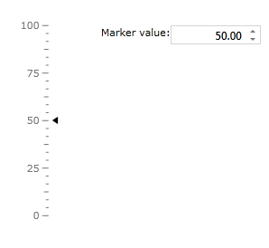

# Interactivity

Scale interactivity refers to the ability for the end-user to interact with the scale object. This ability is governed by the Boolean IsInteractive property. When this Boolean value is set to True, the end-user can click on the scale or drag the indicator along the values of its scale.

<snippet id='radgauge-linear-scale-interactivity-block_1-xaml' />

When end-user click on a scale at an approximate value all indicators move, or snap, to a value on the scale which is closest to where the end-user clicked.

The end-user can click and drag the indicator along the values of its scale.

Using interactivity features of the scale you can create two-way binding between indicator’s value and value of any other control (RadNumericIndicator, for example).

<snippet id='radgauge-linear-scale-interactivity-block_2-xaml' />

When end-user click on the scale or drag indicator along the scale values the value of the RadNumericIndicator will be changed correspondently.

>You should add reference to __Telerik.Windows.Controls.Input.dll__ in order to use the RadNumericIndicator control

