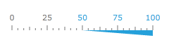

# Labels

Tick labels are shown for the major tick marks. You can set the label location around the scale bar, the font properties (like family, size and foreground), the format of the label, or even change the whole control template for a label. To change the location of the tick mark label you should use the __LabelLocation__ property of the scale element in XAML as shown below:

<snippet id='radgauge-linear-scale-labels-block_1-xaml' />

You can use the GaugeRange element to set specific color to your labels. The LinearScale element has the boolean __LabelUseRangeColor__ property. If its value is True, then each label within the range uses a color according to the specified __LabelForeground__ property:

<snippet id='radgauge-linear-scale-labels-block_2-xaml' />

