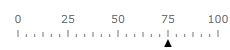

# Marker

The Marker is a scale indicator that points to a value along a scale. It is a small shape that can be located around the scale bar. To add marker to the scale you have to include Marker element to the list of the scale indicators:

#### __XAML__
```XAML
	<telerik:RadHorizontalLinearGauge Width="250" Height="100" telerik:StyleManager.Theme="Windows8">
	    <telerik:HorizontalLinearScale Min="0" Max="100">
	        <telerik:HorizontalLinearScale.Indicators>
	            <telerik:Marker  Value="75"
	                             telerik:ScaleObject.Offset="0.02*"
	                             telerik:ScaleObject.RelativeWidth="0.03*"
	                             telerik:ScaleObject.RelativeHeight="0.08*" 
	                             telerik:ScaleObject.Location="OverOutside" />
	        </telerik:HorizontalLinearScale.Indicators>
	    </telerik:HorizontalLinearScale>
	</telerik:RadHorizontalLinearGauge>
```



The Marker supports the following features:

1. Layout 

2. You can set location of the Marker relative to a scale bar using Location property.

3. Outside - the marker is located at left of the scale

4. OverOutside - the marker is located at right of left border of the scale

5. OverCenter - the marker is located over center of the scale

6. OverInside - the marker is located at left of right border of the scale

7. CenterOutside - the marker is located at left of the scale center

8. CenterInside - the marker is located at right of the scale center

9. Inside - the marker is located at right of the scale

10. Offset relative to a scale bar.

11. RelativeHeight that specifies a height of the Marker given as part of the container size.

12. RelativeWidth that specifies a width of the Marker given as part of the container size.

13. The default Marker template exposes the Background, BorderBrush and BorderThickness properties for easy customizations.           

	>You can change the Marker template to setup specific appearance.

14. The Marker can be snapped along to scale ticks or to specified interval.

15. Movement animation allows the Marker to smooth its movement when it shows next value.

16. The refresh rate allows calculating the displayed value using values which are assigned during the specified interval according to the specified method.
