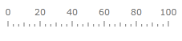
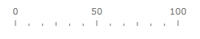
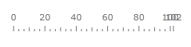
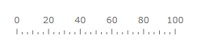
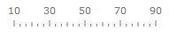
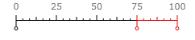

# Tick Marks

Tick marks allow displaying of the value intervals along the gauge scale. There are 3 types of the tick marks:

1. __Major__ - specify the primary value intervals. MajorTicks scale's property specifies the number of the value intervals along the whole length of the scale bar. Major tick marks can have labels. You can specify the common properties and the appearance of the major tick mark using MajorTick property of the scale.

2. __Middle__ - specify the secondary value intervals. MiddleTicks scale's property specifies the number of the secondary value intervals inside the primary value interval. Middle tick marks can't have labels. You can specify the common properties and the appearance of the middle tick mark using MiddleTick property of the scale.

3. __Minor__ - specify the third level of the value intervals. MinorTicks scale's property specifies the number of the third level value intervals inside the secondary value interval. Minor tick marks can't have labels. You can specify the common properties and the appearance of the minor tick mark using MinorTick property of the scale.

There are 2 alternative ways to set number of the major ticks along the scale. This first one is using MajorTicks property. It sets number of the of the value intervals along the entire length of the scale bar:


```XAML
	<telerik:RadHorizontalLinearGauge Width="250" Height="100" telerik:StyleManager.Theme="Windows8">
	    <telerik:HorizontalLinearScale Min="0" Max="100" MajorTicks="5" />
	</telerik:RadHorizontalLinearGauge>
```



The second one uses MajorTickStep property. It sets length of the single tick interval in the scale units:


```XAML
	<telerik:RadHorizontalLinearGauge Width="250" Height="100" telerik:StyleManager.Theme="Windows8">
	    <telerik:HorizontalLinearScale Min="0" Max="100" MajorTickStep="50" />
	</telerik:RadHorizontalLinearGauge>
```



Sometimes desirable length of the major tick (MajorTickStep) creates situations when major tick mark at the end point of scale is shown very close to the last regular one:



In this situation we can use ShowLastLabel property to indicate whether the tick mark at the end position should be shown:


```XAML
	<telerik:RadHorizontalLinearGauge Width="250" Height="100" telerik:StyleManager.Theme="Windows8">
	    <telerik:HorizontalLinearScale Min="0" Max="102" MajorTickStep="20" ShowLastLabel="False" />
	</telerik:RadHorizontalLinearGauge>
```



By default, the major tick marks start from the minimum scale value and move to the maximum value. But you can shift first and last major tick marks along scale using StartTickOffset and EndTickOffset properties:


```XAML
	<telerik:RadHorizontalLinearGauge Width="250" Height="100" telerik:StyleManager.Theme="Windows8">
	    <telerik:HorizontalLinearScale Min="0" Max="100" StartTickOffset="10" EndTickOffset="-10" />
	</telerik:RadHorizontalLinearGauge>
```



To change properties of the tick mark (Major, Middle or Minor) you should set the correspondent property to the scale element in XAML:

2. __Major tick mark__ - MajorTickBackground, MajorTickLocation, MajorTickOffset, MajorTickStroke, MajorTickStrokeThickness and etc.

3. __Middle tick mark__ - MiddleTickBackground, MiddleTickLocation, MiddleTickOffset, MiddleTickStroke, MiddleTickStrokeThickness and etc.

4. __Minor tick mark__ - MinorTickBackground, MinorTickLocation, MinorTickOffset, MinorTickStroke, MinorTickStrokeThickness and etc.

Then you have to define tick mark properties using MajorTickProperties, MiddleTickProperties and MinorTickProperties element:


```XAML
	<telerik:RadHorizontalLinearGauge Grid.Column="2" Width="250" Height="100" telerik:StyleManager.Theme="Windows8">
	    <telerik:HorizontalLinearScale Min="0" Max="100" 
	                    MajorTickUseRangeColor="True"
	                    MiddleTickUseRangeColor="True"
	                    MinorTickUseRangeColor="True" >
	        <telerik:HorizontalLinearScale.Ranges>
	            <telerik:GaugeRange Min="60" Max="100" 
	                        TickBackground="#FFE50000" />
	        </telerik:HorizontalLinearScale.Ranges>
	    </telerik:HorizontalLinearScale>
	</telerik:RadHorizontalLinearGauge>
```

The Major, Middle and Minor ticks have the boolean UseRangeColor property. If it is True, then each tick mark within the range uses a color according to the specified range's TickBackground property:


## Custom Tick Marks

The RadGauge control provides very flexible standard tick marks and labels, but sometimes it is necessary to show additional elements in particular scale position. This can be achievied by using custom elements which can be placed at a specific value (shown at value 0,75 and 100 in the image below) by setting the Value property. Just like the major and minor tick marks, the look of the custom tick marks can be fully customized.


```XAML
	<telerik:RadHorizontalLinearGauge Grid.Column="2" Width="250" Height="100" telerik:StyleManager.Theme="Windows8">
	    <telerik:RadHorizontalLinearGauge.Resources>
	        <Style x:Key="CustomTick" TargetType="Ellipse">
	            <Setter Property="Fill" Value="White" />
	            <Setter Property="Width" Value="5" />
	            <Setter Property="Height" Value="5" />
	            <Setter Property="telerik:ScaleObject.Location" Value="CenterInside" />
	            <Setter Property="Canvas.ZIndex" Value="1001" />
	        </Style>
	        <Style x:Key="CustomTickLine" TargetType="Rectangle">
	            <Setter Property="telerik:ScaleObject.RelativeHeight" Value="0.07*" />
	            <Setter Property="Width" Value="1" />
	            <Setter Property="telerik:ScaleObject.Location" Value="CenterOutside" />
	            <Setter Property="Canvas.ZIndex" Value="1001" />
	        </Style>
	    </telerik:RadHorizontalLinearGauge.Resources>
	    <telerik:HorizontalLinearScale Min="0" Max="100"
	                    MajorTickUseRangeColor="True"
	                    MiddleTickUseRangeColor="True"
	                    MinorTickUseRangeColor="True"
	                    RangeLocation="Outside">
	        <telerik:HorizontalLinearScale.Ranges>
	            <telerik:GaugeRange Min="0" Max="75" 
	                        Background="Black"
	                        TickBackground="Black"
	                        StartWidth="0.01"/>
	            <telerik:GaugeRange Min="75" Max="100" 
	                        Background="#FFE50000"
	                        TickBackground="#FFE50000"
	                        StartWidth="0.01"/>
	        </telerik:HorizontalLinearScale.Ranges>
	        <telerik:HorizontalLinearScale.CustomItems>
	            <Ellipse telerik:ScaleObject.Value="0" Style="{StaticResource CustomTick}" Stroke="Black" />
	            <Ellipse telerik:ScaleObject.Value="75" Style="{StaticResource CustomTick}" Stroke="#FFE50000" />
	            <Ellipse telerik:ScaleObject.Value="100" Style="{StaticResource CustomTick}" Stroke="#FFE50000" />
	            <Rectangle telerik:ScaleObject.Value="0" Style="{StaticResource CustomTickLine}" Fill="Black" />
	            <Rectangle telerik:ScaleObject.Value="75" Style="{StaticResource CustomTickLine}" Fill="#FFE50000" />
	            <Rectangle telerik:ScaleObject.Value="100" Style="{StaticResource CustomTickLine}" Fill="#FFE50000" />
	        </telerik:HorizontalLinearScale.CustomItems>
	    </telerik:HorizontalLinearScale>
	</telerik:RadHorizontalLinearGauge>
```



## Off position

Some gauge applications require that indicator clearly show when there is not valid data currently available. The special "Off Position" tick mark can be created using CustomTickMark control. When double.NaN value is passed to the scale indicator it looks for "Off position" and points to it if found. You can decorate it on your own using styling and templating ability. To force a particular tick mark to behave like "Off position" you should change its "Type" property to be "OffPosition". You can precisely set position of this tick mark by setting its "Value" property. It can be located outside the scale Max and Min values.
