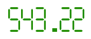

# Numeric Scale Overview

The NumericScale is a container to display numeric and/or state indicator when no other scales (radial or linear) are necessary.



To add a numeric scale to any container (including RadialGauge and LinearGauge containers) you have to include NumericScale element as child to the contained element. Then you can put NumericIndicator and/or StateIndicator to the list of the numeric scale indicators:

#### __XAML__
```XAML
	<telerik:RadVerticalLinearGauge Width="150" Height="50" telerik:StyleManager.Theme="Windows8">
	    <telerik:NumericScale Min="0">
	        <telerik:NumericScale.Indicators>
	            <telerik:NumericIndicator Name="numericIndicator" Value="543.216" 
	                    Format="{}{0:F2}"
	                    Foreground="#FF1E8D00"
	                    telerik:ScaleObject.RelativeX="0"
	                    telerik:ScaleObject.RelativeY="0"
	                    telerik:ScaleObject.RelativeWidth="1&ast;" 
	                    telerik:ScaleObject.RelativeHeight="1&ast;">
	                <telerik:NumericIndicator.Positions>
	                    <telerik:HexagonalNumberPosition />
	                    <telerik:HexagonalNumberPosition />
	                    <telerik:HexagonalNumberPosition />
	                    <telerik:HexagonalNumberPosition />
	                    <telerik:HexagonalNumberPosition />
	                    <telerik:HexagonalNumberPosition />
	                </telerik:NumericIndicator.Positions>
	            </telerik:NumericIndicator>
	        </telerik:NumericScale.Indicators>
	    </telerik:NumericScale>
	</telerik:RadVerticalLinearGauge>
```
