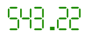

# Numeric Scale Overview

The NumericScale is a container to display numeric and/or state indicator when no other scales (radial or linear) are necessary.

To add a numeric scale to any container (including RadialGauge and LinearGauge containers) you have to include NumericScale element as child to the contained element. Then you can put NumericIndicator and/or StateIndicator to the list of the numeric scale indicators:

<snippet id='radgauge-numeric-scale-overview-block_1-xaml' />

