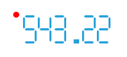

# State Indicator

The State Indicator is a shape with arbitrary size located anywhere in the scale. If the state indicator's value puts into one of the scale ranges then shape is filled with brush of this range. To add a state indicator to the scale you have to include the StateIndicator element to the NumericScale.Indicators:


```XAML
	<telerik:RadVerticalLinearGauge Width="150" Height="50" telerik:StyleManager.Theme="Windows8">
	    <telerik:NumericScale Min="0">
	        <telerik:NumericScale.Indicators>
	            <telerik:NumericIndicator Name="numericIndicator" Value="543.216" 
	            Format="{}{0:F2}"
	            telerik:ScaleObject.RelativeX="0"
	            telerik:ScaleObject.RelativeY="0"
	            telerik:ScaleObject.RelativeWidth="1*" 
	            telerik:ScaleObject.RelativeHeight="1*">
	                <telerik:NumericIndicator.Positions>
	                    <telerik:HexagonalNumberPosition />
	                    <telerik:HexagonalNumberPosition />
	                    <telerik:HexagonalNumberPosition />
	                    <telerik:HexagonalNumberPosition />
	                    <telerik:HexagonalNumberPosition />
	                    <telerik:HexagonalNumberPosition />
	                </telerik:NumericIndicator.Positions>
	            </telerik:NumericIndicator>
	            <telerik:StateIndicator Name="stateIndicator"
	                                    Background="Red"
										telerik:ScaleObject.RelativeX="-0.07"
										telerik:ScaleObject.RelativeY="0"
										telerik:ScaleObject.RelativeWidth="0.07*"
										telerik:ScaleObject.RelativeHeight="0.2*"/>
	        </telerik:NumericScale.Indicators>
	    </telerik:NumericScale>
	</telerik:RadVerticalLinearGauge>
```



The State indicator supports the following features:

1. Layout 

2. The 'telerik:ScaleObject.RelativeX' property specifies the position of Numeric Indicator left side relative to a scale width.

3. The 'telerik:ScaleObject.RelativeY' property specifies the position of Numeric Indicator top side relative to a scale height.

4. The 'telerik:ScaleObject.RelativeHeight' property specifies the height of the Numeric Indicator relative to a scale height.

5. The 'telerik:ScaleObject.RelativeWidth' property specifies the width of the Numeric Indicator relative to a scale height.

6. Appearance 

7. The standard Telerik provided State Indicator templates allow using the BorderBrush and the StrokeThickness properties to draw a border.

8. The State Indicator could have its own template to setup a desirable appearance.
