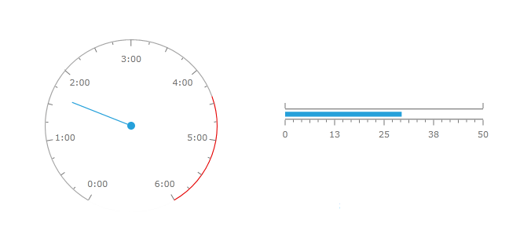

# {{ site.framework_name }} Gauge Overview

Thank you for choosing __RadGauge__!

If you are building business dashboards or you just need graphical indicators, you will find the new __RadGauge__ control indispensable. With the rich assortment of circular, linear and numeric gauge types and the powerful customization capabilities of the control you are free to build the exact dynamic data visualization tool that you need.





__RadGauge's__ key features include:

* __Completely Stylable, Lookless Control__ - __RadGauge__ introduces an innovative approach that completely separates functionality from appearance. This allows you to completely restyle the control without changing a single line of code. You are free to customize the appearance of your gauges with your own theme or you can use one of the several themes shipped with the control. Restyling the __RadGauge__ control with the available themes is as simple as changing a property. Furthermore almost all gauge elements can be modified according to your needs.

* __Radial Gauges__ - radial gauge is a circular scale with numbers and ticks. It can display multiple scales and ranges.

* __Linear Gauges__ - linear gauge is a linear scale, which can display multiple scales and ranges.

* __Indicators__ - __RadGauge__ by Telerik features 5 types of indicators: 

* __Needle__ – points to a value along a scale and can be associated with a radial scale only 

* __Marker__ - a scale indicator that points to a value along a scale. It is a small shape that can be located around the scale bar 

* __Bar__ – a colored bar that is drawn around scale bar. One of the ends of this bar points to the scale value 

* __Numeric__ – an indicator that displays its __Value__ property as digital indicator device 

* __State__ – a shape with arbitrary size located anywhere in the scale. If state indicator's value put into one of the scale ranges then shape is filled with brush of this range.

* __Rich Customization Capabilities__- the gauges are extremely customizable with a variety of built-in behaviors starting from scales, indicators, labels, ticks etc. 

* __Flexible Inner Layout__ - __RadGauge__ control allows flexible inner layout. Any control can be inserted and precisely positioned inside the gauge controls. Also the control gives the possibility to insert several gauges in a single container.

* __Animations__ - All gauges are smoothly animated out of the box.

* __Events__ - indicator value changes generate the __ValueChanged__ and range based events.


## Telerik UI for WPF Support and Learning Resources

* [Telerik UI for WPF Gauge Homepage](https://www.telerik.com/products/wpf/gauge.aspx)
* [Get Started with the Telerik UI for WPF Gauge]()
* [Telerik UI for WPF API Reference](https://docs.telerik.com/devtools/wpf/api/)
* [Getting Started with Telerik UI for WPF Components]()
* [Telerik UI for WPF Virtual Classroom (Training Courses for Registered Users)](https://learn.telerik.com/learn/course/external/view/elearning/16/telerik-ui-for-wpf) 
* [Telerik UI for WPF Gauge Forums](https://www.telerik.com/forums/wpf)
* [Telerik UI for WPF Knowledge Base](https://docs.telerik.com/devtools/wpf/knowledge-base)


