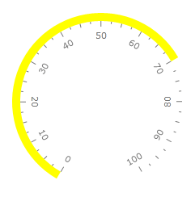
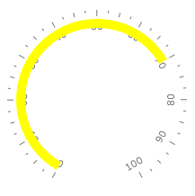
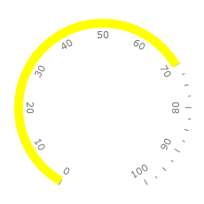
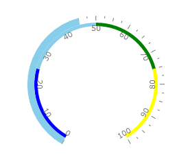
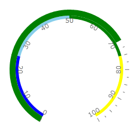
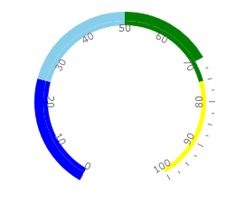

# Bar Indicator

The Bar indicator is a colored bar that is drawn around scale bar. One of ends of this bar points to the scale value. To add bar indicator to the scale you have to include RadialBar element to the list of the scale indicators:

<snippet id='radgauge-radial-scale-bar-indicator-block_1-xaml' />

The Bar indicator supports the following features:

1. Layout 

2. You can set location of the Bar indicator relative to a scale bar using telerik:ScaleObject.Location property.
	For example, "Outside" 

	

	"Inside"  

	

	or "OverCenter" 

	

3. telerik:ScaleObject.Offset relative to a scale bar.

4. The thickness of the Bar indicator is controlled by StartWidth and EndWidth properties.

5. Appearance 

6. The Brush used for the filled part is controlled by Background property.

7. The Brush used for the empty part is controlled by EmptyFill property.

8. You can set stroke thickness (StrokeThickness property) and stroke brush (BorderBrush property).

9. The Bar indicator can be snapped along to scale ticks or to specified interval.

10. Movement animation allows the Bar indicator to smooth its movement when it shows next value.

11. The refresh rate allows calculating the displayed value using values which are assigned during the specified interval according to the specified method.

There are several ways how you can change color of the bar indicator. By default you set it using "Background" property. But sometimes it is useful to change color of the bar indicator according to the value it points to. RadGauge supports this feature for the bar indicators. You can configure bar indicator to use the color of the range which contains indicator's value. For example:

 

or 

To do it you need add few ranges to your scale and specify background of the indicator for every range. Then you should set UseRangeColor property of the bar indicator to true:

<snippet id='radgauge-radial-scale-bar-indicator-block_2-xaml' />

There several modes which can be used to colorize bar indicator. Example above uses default mode. If you'd like to have bar indicator with background consists of the stack of the range colors, then you should set RangeColorMode property to ProportionalBrush:

<snippet id='radgauge-radial-scale-bar-indicator-block_3-xaml' />

