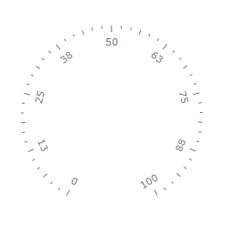
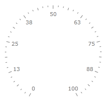
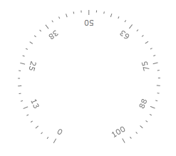
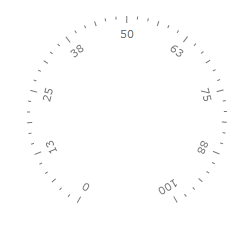
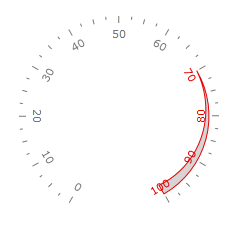

# Labels

## 

Tick labels are shown for major tick marks. You can set label location around scale bar, font properties (like family, size and foreground), format of the label, or even change whole control template for label. 

Here is an example:

#### __XAML__

{{region radial-scale-labels_0}}
	<telerik:RadRadialGauge Width="200" Height="200" telerik:StyleManager.Theme="Windows8">
	    <telerik:RadialScale Min="0" Max="100"
	            MajorTicks="8"
	            MiddleTicks="2"
	            MinorTicks="3"
	            LabelRotationMode="Automatic">
	    </telerik:RadialScale>
	</telerik:RadRadialGauge>
	{{endregion}}

You can control label rotation on radial scale using __LabelRotationMode__ property. It can have following values:

__Automatic__

__None__

__SurroundIn__

__SurroundOut__

You can use the GaugeRange element on a radial scale to re-color labels automatically. The RadialScale has the boolean LabelUseRangeColor property. If it is True, then each label within the range uses a color according to the specified range's LabelForeground property:

#### __XAML__

{{region radial-scale-labels_1}}
	<telerik:RadRadialGauge Width="200" Height="200" telerik:StyleManager.Theme="Windows8">
	    <telerik:RadialScale Min="0" Max="100"
	                            LabelLocation="Inside"
	                            LabelUseRangeColor="True">
	        <telerik:RadialScale.Ranges>
	            <telerik:GaugeRange Min="70"
	                                Max="100"
	                                StartWidth="0"
	                                EndWidth="0.1"
	                                Background="#FFD6D4D4"
	                                Stroke="#FFE50000"
	                                StrokeThickness="1"
	                                LabelForeground="#FFE50000">
	            </telerik:GaugeRange>
	        </telerik:RadialScale.Ranges>
	    </telerik:RadialScale>
	</telerik:RadRadialGauge>
	{{endregion}}

