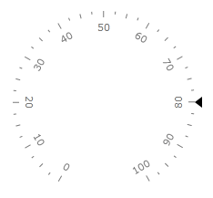
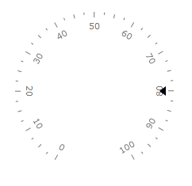
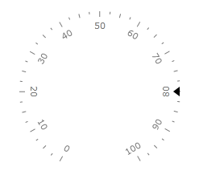

# Marker

## 

The Marker is a scale indicator that points to a value along a scale. It is a small shape that can be located around the scale bar. To add marker to the scale you have to include Marker element to the list of the scale indicators:

#### __XAML__

{{region radial-scale-marker_0}}
	<telerik:RadRadialGauge Width="200" Height="200" telerik:StyleManager.Theme="Windows8">
	    <telerik:RadialScale>
	        <telerik:RadialScale.Indicators>
	            <telerik:Marker Value="80" telerik:ScaleObject.Location="Outside"/>
	        </telerik:RadialScale.Indicators>
	    </telerik:RadialScale>
	</telerik:RadRadialGauge>
	{{endregion}}

The Marker supports the following features:

1. Layout 

1. You can set location of the Marker relative to a scale bar using a telerik:ScaleObject.Location property.
 For example, "Outside" 

         
      , "Inside" 

         
       or "OverCenter" 

         
      

1. telerik:ScaleObject.Offset relative to a scale bar.

1. telerik:ScaleObject.RelativeHeight that specifies a height of the Marker given as part of the container size.

1. telerik:ScaleObject.RelativeWidth that specifies a width of the Marker given as part of the container size.

1. The standard Telerik provided Marker templates allow to use the BorderBrush and the BorderThickness properties to drawing a border.
          NOTE: The left of BorderThickness property is applied for the border around a Marker. Styles provided by Telerik allow using of the most popular form of Markers. You can change template of the Marker to setup desirable appearance.

1. The Marker can be snapped along to scale ticks or to specified interval.

1. Movement animation allows the Marker to smooth its movement when it shows next value.

1. The refresh rate allows calculating the displayed value using values which are assigned during the specified interval according to the specified method.
