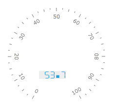

# Numeric Indicator

Numeric Indicator is an indicator that displays its Value property as digital indicator device. It is a character cells set that has common properties for layout, appearance and character templating. Also any character cell can be configured separately by style.

To add numeric indicator to the scale you have to include NumericIndicator element to the list of the scale indicators:


```XAML
	<telerik:RadRadialGauge Width="200" Height="200" telerik:StyleManager.Theme="Windows8">
	    <telerik:RadialScale>
	        <telerik:RadialScale.Indicators>
	            <telerik:NumericIndicator Name="numericIndicator"
	                                Format="{}{0:F1}"
	                                telerik:ScaleObject.RelativeX="0.32"
	                                telerik:ScaleObject.RelativeY="0.65"
	                                telerik:ScaleObject.RelativeWidth="0.55\*"
	                                telerik:ScaleObject.RelativeHeight="0.16\*"
	                                Value="53.7">
	                <telerik:NumericIndicator.Background>
	                    <SolidColorBrush Color="#EEEEEE"/>
	                </telerik:NumericIndicator.Background>
	                <telerik:NumericIndicator.Positions>
	                    <telerik:SevenSegsNumberPosition />
	                    <telerik:SevenSegsNumberPosition />
	                    <telerik:SevenSegsNumberPosition />
	                    <telerik:SevenSegsNumberPosition />
	                    <telerik:SevenSegsNumberPosition />
	                </telerik:NumericIndicator.Positions>
	            </telerik:NumericIndicator>
	        </telerik:RadialScale.Indicators>
	    </telerik:RadialScale>
	</telerik:RadRadialGauge>
```

Every digital cell in the indicator is defined by a corresponding __SevenSegsNumberPosition__ element. The topmost element in the list define rightmost digital cell.



The Numeric indicator supports the following features:

1. Layout 

2. The 'telerik.ScaleObject.RelativeX' property specifies the position of Numeric Indicator left side relative to a scale size.

3. The 'telerik:ScaleObject.RelativeY' property specifies the position of Numeric Indicator top side relative to a scale size.

4. The 'telerik.ScaleObject.RelativeHeight' property specifies height of the Numeric Indicator relative to a scale size.

5. The 'telerik.ScaleObject.RelativeWidth' property specifies width of the Numeric Indicator relative to a scale size.

6. Appearance 

7. The 'Format' property specifies position of decimal point.

8. The standard Telerik provided Numeric Indicator templates allow to use the BorderBrush and the BorderThickness properties to draw a border.

9. Telerik provided styles allow to use most popular types of Numeric Indicators.

10. The Numeric Indicator could have its own template to setup desirable appearance.

11. Animation allows the Numeric Indicator to show a sequence of each value from previous value to next.

12. The refresh rate allows calculating the displayed value using values which are assigned during the specified interval according to the specified method.
