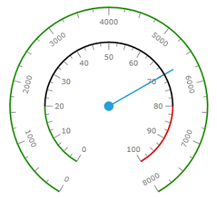
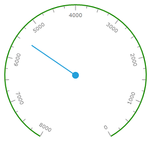
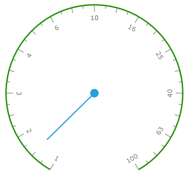
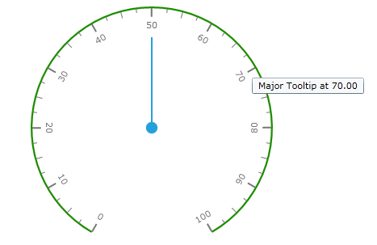

# Radial Scale Overview

RadialScale is used to control the overall layout of tick marks, tick labels, indicators and ranges and to render an optional scale bar.

## Scale Bar

         
      

The scale bar is rendered by the RadialScale element as a continuous band spanning the entire sweep angle. The scale bar is also used as a basis for the placement of child elements, such as the tick marks.

The radius of the scale bar is controlled by the Radius property. This value should be between 0 and 1 and is relative to the size of the container which contains this scale. In the image above, the orange scale has a larger radius than the yellow scale bar. This allows several scales to be defined and positioned as desired.

The thickness of the scale bar is controlled by StartWidth and EndWidth properties.

Origin and length of the scale bar is controlled by StartAngle and SweepAngle properties. Value of these properties should be given in degrees and following WPFSilverlight standards, 0° points due east and positive angles result in a clockwise rotation.

StartAngle, SweepAngle, StartWidth and EndWidth properties set the region where all other elements (labels, tick marks and so on) will be located.

By default, the values start from the minimum value and move clock-wise to the maximum value. It is possible to reverse this direction by setting the IsReversed property to true:

         
      

Scales can be of type __Linear__ or __Logarithmic__. When the IsLogarithmic property is set to true, base 10 is used for the logarithmic scale by default. To modify the base of the logarithmic scale, set the LogarithmicBase property accordingly:
        

         
      

The scale elements like tick mark, label or indicator can have dynamically changed tooltip associated with it. This behavior is controlled by TootipFormat property which can be set at the correspondent property element:

#### __XAML__

{{region radial-scale-overview_0}}
	<telerik:RadRadialGauge Width="200" Height="200" telerik:StyleManager.Theme="Windows8">
	    <telerik:RadialScale MajorTickTooltipFormat="0.00"/>
	</telerik:RadRadialGauge>
	{{endregion}}

         
      

The only parameter is passed to the tooltip format string is value at the element location.
