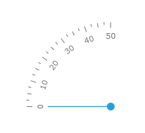
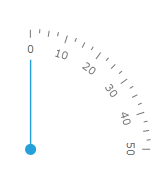
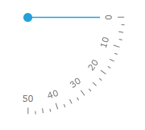
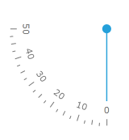

# Quadrant-style gauge

Many gauge application requires radial scale which have a quadrant shape: 

For the purpose the RadRadialGauge object exposes an enumerable with 4 orientations of the quadrant gauges:

* __North-West__ - the RadRadialGauge control has a template which represents north-west oriented quadrant circle.          

	```XAML
		<telerik:RadQuadrantNWGauge Width="120" Height="120" telerik:StyleManager.Theme="Windows8">
			<telerik:QuadrantNWScale Min="0" Max="50" MajorTickStep="10">
				<telerik:QuadrantNWScale.Indicators>
					<telerik:Needle IsAnimated="True" />
					<telerik:Pinpoint />
				</telerik:QuadrantNWScale.Indicators>
			</telerik:QuadrantNWScale>
		</telerik:RadQuadrantNWGauge>
	```

	

* __North-East__ - the RadRadialGauge control has a template which represents north-east oriented quadrant circle.          

	```XAML
		<telerik:RadQuadrantNEGauge Width="120" Height="120" telerik:StyleManager.Theme="Windows8">
			<telerik:QuadrantNEScale Min="0" Max="50" MajorTickStep="10">
				<telerik:QuadrantNEScale.Indicators>
					<telerik:Needle IsAnimated="True" />
					<telerik:Pinpoint />
				</telerik:QuadrantNEScale.Indicators>
			</telerik:QuadrantNEScale>
		</telerik:RadQuadrantNEGauge>
	```

	

* __South-East__ - the RadRadialGauge control has a template which represents south-east oriented quadrant circle.

	```XAML
		<telerik:RadQuadrantSEGauge Width="120" Height="120" telerik:StyleManager.Theme="Windows8">
			<telerik:QuadrantSEScale Min="0" Max="50" MajorTickStep="10">
				<telerik:QuadrantSEScale.Indicators>
					<telerik:Needle IsAnimated="True" />
					<telerik:Pinpoint />
				</telerik:QuadrantSEScale.Indicators>
			</telerik:QuadrantSEScale>
		</telerik:RadQuadrantSEGauge>
	```

	

* __South-West__ - the RadRadialGauge control has a template which represents south-west oriented quadrant circle.          

	```XAML
		<telerik:RadQuadrantSWGauge Width="120" Height="120" telerik:StyleManager.Theme="Windows8">
			<telerik:QuadrantSWScale Min="0" Max="50" MajorTickStep="10" >
				<telerik:QuadrantSWScale.Indicators>
					<telerik:Needle IsAnimated="True" />
					<telerik:Pinpoint />
				</telerik:QuadrantSWScale.Indicators>
			</telerik:QuadrantSWScale>
		</telerik:RadQuadrantSWGauge>
	```

	