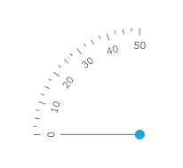
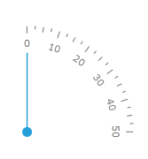
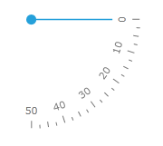
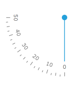

# Quadrant-style gauge

Many gauge application requires radial scale which have a quadrant shape: 

For the purpose the RadRadialGauge object exposes an enumerable with 4 orientations of the quadrant gauges:

* __North-West__ - the RadRadialGauge control has a template which represents north-west oriented quadrant circle.          

	<snippet id='radgauge-radial-scale-quadrant-style-gauge-block_1-xaml' />

	

* __North-East__ - the RadRadialGauge control has a template which represents north-east oriented quadrant circle.          

	<snippet id='radgauge-radial-scale-quadrant-style-gauge-block_2-xaml' />

	

* __South-East__ - the RadRadialGauge control has a template which represents south-east oriented quadrant circle.

	<snippet id='radgauge-radial-scale-quadrant-style-gauge-block_3-xaml' />

	

* __South-West__ - the RadRadialGauge control has a template which represents south-west oriented quadrant circle.          

	<snippet id='radgauge-radial-scale-quadrant-style-gauge-block_4-xaml' />

	