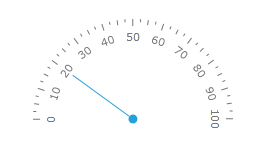
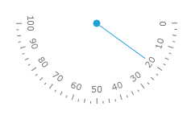
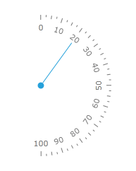
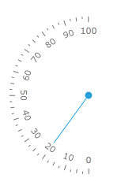

# Semicircle gauge

Many gauge application require radial scale which have a semicircle shape:

For the purpose the RadRadialGauge object exposes an enumerable with 4 orientations of the semicircle gauges:

* __North__ - the RadRadialGauge control has a template which represents north-oriented semi-circle.          

	```XAML
		<telerik:RadSemicircleNorthGauge telerik:StyleManager.Theme="Windows8">
			<telerik:SemicircleNorthScale>
				<telerik:SemicircleNorthScale.Indicators>
					<telerik:Needle Value="20" />
					<telerik:Pinpoint />
				</telerik:SemicircleNorthScale.Indicators>
			</telerik:SemicircleNorthScale>
		</telerik:RadSemicircleNorthGauge>
	```

	

* __South__ - the RadRadialGauge control has a template which represents south-oriented semi-circle.          

	```XAML
		<telerik:RadSemicircleSouthGauge telerik:StyleManager.Theme="Windows8">
			<telerik:SemicircleSouthScale>
				<telerik:SemicircleSouthScale.Indicators>
					<telerik:Needle Value="20" />
					<telerik:Pinpoint />
				</telerik:SemicircleSouthScale.Indicators>
			</telerik:SemicircleSouthScale>
		</telerik:RadSemicircleSouthGauge>
	```

	

* __East__ - the RadRadialGauge control has a template which represents east-oriented semi-circle.          

	```XAML
		<telerik:RadSemicircleEastGauge telerik:StyleManager.Theme="Windows8">
			<telerik:SemicircleEastScale>
				<telerik:SemicircleEastScale.Indicators>
					<telerik:Needle Value="20" />
					<telerik:Pinpoint />
				</telerik:SemicircleEastScale.Indicators>
			</telerik:SemicircleEastScale>
		</telerik:RadSemicircleEastGauge>
	```

	

* __West__ - the RadRadialGauge control has a template which represents west-oriented semi-circle.          

	```XAML
		<telerik:RadSemicircleWestGauge telerik:StyleManager.Theme="Windows8">
			<telerik:SemicircleWestScale>
				<telerik:SemicircleWestScale.Indicators>
					<telerik:Needle Value="20" />
					<telerik:Pinpoint />
				</telerik:SemicircleWestScale.Indicators>
			</telerik:SemicircleWestScale>
		</telerik:RadSemicircleWestGauge>
	```

	