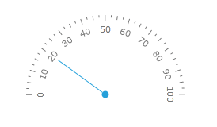
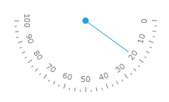
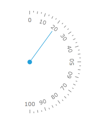
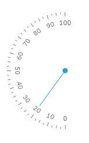

# Semicircle gauge

Many gauge application require radial scale which have a semicircle shape:

For the purpose the RadRadialGauge object exposes an enumerable with 4 orientations of the semicircle gauges:

* __North__ - the RadRadialGauge control has a template which represents north-oriented semi-circle.          

	<snippet id='radgauge-radial-scale-semicircle-gauge-block_1-xaml' />

	

* __South__ - the RadRadialGauge control has a template which represents south-oriented semi-circle.          

	<snippet id='radgauge-radial-scale-semicircle-gauge-block_2-xaml' />

	

* __East__ - the RadRadialGauge control has a template which represents east-oriented semi-circle.          

	<snippet id='radgauge-radial-scale-semicircle-gauge-block_3-xaml' />

	

* __West__ - the RadRadialGauge control has a template which represents west-oriented semi-circle.          

	<snippet id='radgauge-radial-scale-semicircle-gauge-block_4-xaml' />

	