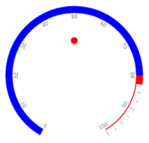

# State Indicator

The State Indicator is a shape with arbitrary size located anywhere in the scale. If state indicator's value put into one of the scale ranges then shape is filled with brush of this range. To add state indicator to the scale you have to include StateIndicator element to the list of the scale indicators:


```XAML
	<telerik:RadRadialGauge Width="300" Height="300" telerik:StyleManager.Theme="Windows8">
	    <telerik:RadialScale x:Name="radialScale1"
	                            Min="0" Max="100"                                 
	                            RangeOffset="-0.015*"                                 
	                            IsInteractive="True">
	        <telerik:RadialScale.Ranges>
	            <telerik:GaugeRange x:Name="range1"
	                                Min="0" Max="80"
	                                StartWidth="0.015"
	                                EndWidth="0.015"
	                                Background="Blue"  
	                                IndicatorBackground="Blue"/>
	            <telerik:GaugeRange x:Name="range2"
	                                Min="80." Max="100"
	                                StartWidth="0.015"
	                                EndWidth="0.015"
	                                IndicatorBackground="Red"
	                                Background="Red"/>
	        </telerik:RadialScale.Ranges>
	        <telerik:RadialScale.Indicators>                    
	            <telerik:BarIndicator Name="marker" Value="25" RangeColorMode="ProportionalBrush" UseRangeColor="True"/>
	            <!--The State Indicator:-->
	            <telerik:StateIndicator Value="{Binding Value, ElementName=marker}" UseRangeColor="True"/>
	        </telerik:RadialScale.Indicators>
	    </telerik:RadialScale>
	</telerik:RadRadialGauge>
```



The State indicator supports the following features:

1. Layout 

2. Appearance 
