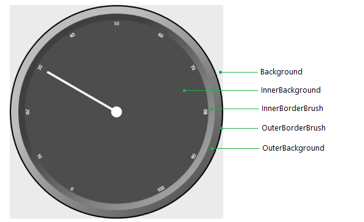

# Backgrounds and Borders

The controls from the RadGauge suite expose several properties that can be used to customize their backgrounds and borders. This article describes those properties and demonstrates how to use them in __RadVerticalLinearGauge__ and __RadRadialGauge__. 

* [RadVerticalLinearGauge](#radverticallineargauge)
* [RadRadialGauge](#radradialgauge)

> The other controls in the suite are not covered in this article because they can be customized similarly.

## RadVerticalLinearGauge

The linear gauges expose the following color properties.

* __Background__: Gets or sets a brush that describes the background of the control
* __BorderBrush__: Gets or sets a brush that describes the border of the control
* __BorderThickness__: Gets or sets the thickness of the BorderBrush
* __OuterBackground__: Gets or sets a brush that describes the outer background of the control
* __OuterBorderBrush__: Gets or sets a brush that describes the outer border of the control
* __OuterBorderThickness__: Gets or sets the thickness of the OuterBorderBrush

__Figure 1__ demonstrates how these properties affect the control.

#### __Figure 1: Customized RadVerticalLinearGauge control__

## RadRadialGauge

The radial gauges expose the following color properties.

* __InnerBackground__: Gets or sets a brush that describes the outer background of the control
* __Background__: Gets or sets a brush that describes the background of the control
* __OuterBackground__: Gets or sets a brush that describes the outer background of the control
* __OuterBorderBrush__: Gets or sets a brush that describes the outer border of the control
* __OuterBorderThickness__: Gets or sets the thickness of the OuterBorderBrush
* __InnerBorderBrush__: Gets or sets a brush that describes the inner border of the control
* __InnerBorderThickness__: Gets or set the thickness of the InnerBorderBrush

__Figure 2__ demonstrates how these properties affect the control.

#### __Figure 2: Customized RadRadialGauge control__

You can also customize the __RadialScale’s__ colors using its __Fill__, __Stroke__ and __StrokeThickness__ properties.

* __Fill__: Gets or sets a brush that describes the fill of the scale
* __Stroke__: Gets or sets a brush that describes the stroke of the scale
* __StrokeThickness__: Gets or sets the thickness of the scale’s stroke

#### __Figure 3: Customized RadialScale__

## See Also  
* [RadRadialGauge]()
* [RadVerticalLinearGauge]()
* [RadialScale]()
