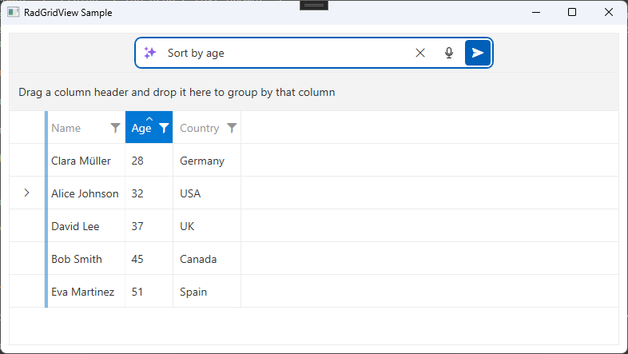

# AI Features

The AI features of __RadGridView__ enable natural language interactions with the grid. Users type a text prompt and the grid translates the AI model response into grid operations such as sorting, filtering, grouping, selection, paging, column manipulation, and data export.

The feature introduces a built-in prompt input panel, an extensible command-based API for communicating with an AI model, and a JSON response processor that applies the returned commands to the grid.

## Enabling AI Features

To activate the AI prompt panel, set the `IsAIEnabled` property to `True`. The grid automatically creates a default `GridViewAISettings` instance when `IsAIEnabled` is set to `True` and no settings object exists. The `GridViewAISettings` object can be accessed via the `AISettings` property of `RadGridView`.

__Enabling AI features__

```xml
<telerik:RadGridView x:Name="gridView' IsAIEnabled="True"/>
```

```C#
this.gridView.IsAIEnabled = true;
```

> The panel that allows AI text input contains a `RadSpeechToTextButton` that requires to install the following NuGet package: `Microsoft.Web.WebView2`.



## Configuring AI Settings

The `AISettings` property accepts an instance of `GridViewAISettings` that controls the prompt input panel behavior.

__Configuring AISettings__

```XAML
<telerik:RadGridView IsAIEnabled="True" ItemsSource="{Binding Items}">
    <telerik:RadGridView.AISettings>
        <gridView:GridViewAISettings InputText=""
                                     SubmitPromptOnSelection="False"
                                     IsSuggestedPromptsVisible="True"
                                     IsRecentPromptsVisible="True"
                                     EnableIsBusy="True"
                                     OpenPromptSuggestionsOnFocus="True" />
    </telerik:RadGridView.AISettings>
</telerik:RadGridView>
```

The following table lists the available properties of the `GridViewAISettings` class.

| Property | Type | Description |
|---|---|---|
| `InputText` | `string` | Gets or sets the text in the prompt input field. Supports two-way binding. |
| `SuggestedPrompts` | `IEnumerable<string>` | Gets or sets the collection of suggested prompts displayed in the suggestions dropdown. |
| `RecentPrompts` | `IEnumerable<string>` | Gets or sets the collection of recent prompts. Automatically updated when a prompt is submitted. |
| `SubmitPromptOnSelection` | `bool` | When set to `True`, selecting a suggested prompt submits the request immediately. Default is `False`. |
| `IsSuggestedPromptsVisible` | `bool` | Gets or sets whether the suggested prompts section is visible. Default is `True`. |
| `IsRecentPromptsVisible` | `bool` | Gets or sets whether the recent prompts section is visible. Default is `True`. |
| `EnableIsBusy` | `bool` | Gets or sets whether the grid shows a busy indicator during prompt processing. Default is `True`. |
| `OpenPromptSuggestionsOnFocus` | `bool` | Gets or sets whether the prompt suggestions dropdown opens when the input receives focus. Default is `True`. |

The smart AI features of `RadGridView` work with a special `JSON` format that is constructed by using a combination between the internal GridView workings and an AI client (like `AzureOpenAIClient`).

__Setting up an AI chat client__  

```C#
IChatClient aiChatClient;

public MainWindow()
{
    this.InitializeComponent();    

    var azureClient = new AzureOpenAIClient(new Uri("azure-AI-resource-address-here"), new Azure.AzureKeyCredential("azure-key-here")).GetChatClient("gpt-5");
    aiChatClient = new ChatClientBuilder(azureClient.AsIChatClient()).UseFunctionInvocation().Build();
}
```

The `aiChatClient` from the example above will be used in the `HandlePromptRequest` to produce the required `JSON` contents.

## Handling Prompt Requests

When the user submits a prompt, the GridView raises the `HandlePromptRequest` event. Subscribe to this event to send the request to your AI model and set the response JSON.

__Handling the prompt request event__

```C#
this.gridView.HandlePromptRequest += OnHandlePromptRequest;

private async void OnHandlePromptRequest(object sender, GridViewPromptRequestCommandEventArgs e)
{
	 var request = JsonSerializer.Deserialize<GridAIRequest>(e.RequestJson);
	 var options = new ChatOptions();
	 ChatOptionsExtensions.AddGridChatTools(options, request.Columns);
	 List<ChatMessage> messages = request.Contents.Select(m => new ChatMessage(ChatRole.User, m.Text)).ToList();
	 ChatResponse completion = await this.chatClient1.GetResponseAsync(messages, options);
	 var gridResponse = completion.ExtractGridResponse();
	 var prop = new JsonSerializerOptions() { PropertyNamingPolicy = JsonNamingPolicy.CamelCase };
	 var response = JsonSerializer.Serialize(gridResponse, prop);

	 e.ResponseJson = response;
}
```

The example above requires to install the following NuGet packages:

* `Azure.AI.OpenAI`
* `Microsoft.Extensions.AI.OpenAI`
* `Telerik.AI.SmartComponents.Extensions`

The `GridViewPromptRequestCommandEventArgs` class provides the following members:

| Member | Type | Description |
|---|---|---|
| `Prompt` | `string` | The user's text prompt. |
| `RequestJson` | `string` | The JSON payload with grid metadata (columns and content) sent to the AI model. |
| `ResponseJson` | `string` | Set this property with the AI model's JSON response. The grid processes the commands when the value is set. |
| `HasError` | `bool` | Set to `True` to indicate an error during processing. |

## Handling Prompt Request Cancellation

To handle cancellation of an in-flight prompt request, subscribe to the `CancelPromptRequest` event.

__Handling cancellation__

```C#
this.gridView.CancelPromptRequest += OnCancelPromptRequest;

private void OnCancelPromptRequest(object sender, EventArgs e)
{
    // Cancel the ongoing AI request.
}
```
