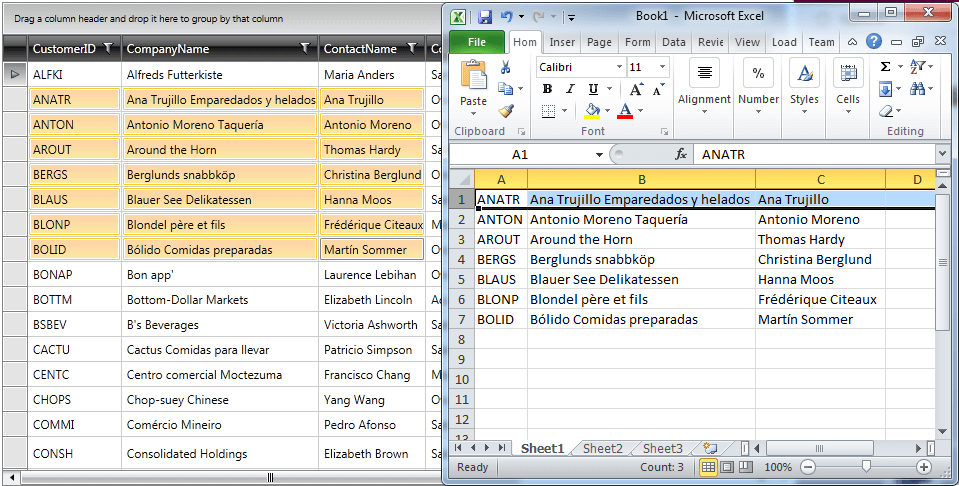

# Overview

Introduced in __Q2 2010__ (2010.2.714), the revamped clipboard capabilities of __RadGridView__ allow users to copy and paste between __RadGridView__ and other applications on your computer or another __RadGridView__. Developers have a fine-grained control over [Copying]() and [Pasting]() through a number of properties and events.
