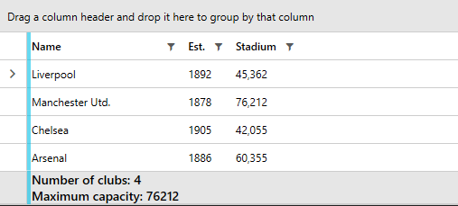
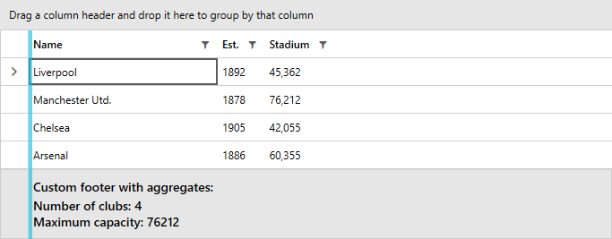

 
# Aggregate Functions

You can display aggregated information for the data in a column by adding aggregate functions to the __AggregateFunctions__ collection of the column. The aggregate functions are included in __Telerik.Windows.Data__ assembly.

## Available Aggregate Functions

* __AverageFunction__: Returns the **average** of the values in the column. 

* __CountFunction__: Returns the **number of all items** in the column. 

* __FirstFunction__: Returns the **first element** in the column according to the current sorting. 

* __LastFunction__: Returns the **last element** in the column according to the current sorting. 

* __MaxFunction__: Returns the **maximum** value of the cell values in the column. 

* __MinFunction__: Returns the **minimum** value of the cell values in the column. 

* __SumFunction__: Returns the **sum** of all cell values in the column. 

>tipYou can also create a generic aggregate function to define some custom aggregate expressions. For example implementations, check out the __Custom Aggregate Function__ RadGridView example from our [demos](https://demos.telerik.com/wpf/) and the [CustomAggregateFunctionEnumerableProperty](https://github.com/telerik/xaml-sdk/tree/master/GridView/CustomAggregateFunctionEnumerableProperty) SDK exampleAn example can be found [here](https://demos.telerik.com/silverlight/#GridView/CustomAggregates).

## Adding an Aggregate Function

Aggregate functions can be added in xaml or in code behind. __Examples 1 and 2__ demonstrate both approaches. Note, that the RadGridView is populated with data as demonstrated in the [Getting Started]() article.

#### __[XAML] Example 1: Populating the AggregateFunctions collection in xaml__

{{region xaml-gridview-columns-aggregate-functions_1}}
	<telerik:RadGridView x:Name="clubsGrid"
	                     ItemsSource="{Binding Clubs}"
						 AutoGenerateColumns="False"
						 GroupRenderMode="Flat"
						 ShowColumnFooters="True">
		<telerik:RadGridView.Columns>

			<telerik:GridViewDataColumn DataMemberBinding="{Binding Name}">
				<telerik:GridViewDataColumn.AggregateFunctions>
					<telerik:CountFunction Caption="Number of clubs: " />
					<telerik:MaxFunction Caption="Maximum capacity: " SourceField="StadiumCapacity" />
				</telerik:GridViewDataColumn.AggregateFunctions>
			</telerik:GridViewDataColumn>
			<telerik:GridViewDataColumn DataMemberBinding="{Binding Established}"
										Header="Est." 
										DataFormatString="{}{0:yyyy}"/>
			<telerik:GridViewDataColumn DataMemberBinding="{Binding StadiumCapacity}" 
										Header="Stadium" 
										DataFormatString="{}{0:N0}"/>
		</telerik:RadGridView.Columns>
	</telerik:RadGridView>
{{endregion}}

#### __[C#] Example 2: Populating the AggregateFunctions collection in code__

{{region cs-gridview-columns-aggregate-functions_2}}
	var countFunction = new CountFunction() {  Caption = "Number of clubs: " };
	var maxCapacityFunction = new MaxFunction() { Caption = "Maximum capacity: ", SourceField = "StadiumCapacity" };
	var column = this.clubsGrid.Columns["Name"];
	column.AggregateFunctions.Add(countFunction);
	column.AggregateFunctions.Add(maxCapacityFunction);
{{endregion}}

#### __[VB.NET] Example 2: Populating the AggregateFunctions collection in code__

{{region vb-gridview-columns-aggregate-functions_3}}
	Dim countFunction = New CountFunction() With {.Caption = "Number of clubs: "}
	Dim maxCapacityFunction = New MaxFunction() With {
		.Caption = "Maximum capacity: ",
		.SourceField = "StadiumCapacity"
	}
	Dim column = Me.clubsGrid.Columns("Name")
	column.AggregateFunctions.Add(countFunction)
	column.AggregateFunctions.Add(maxCapacityFunction)
{{endregion}}

#### __Figure 1: RadGridView with ShowColumnFooters set to True__

>You need to set the __ShowColumnFooters__ and __ShowGroupFooters__ properties to __True__ in order to display aggregates under the columns and grouped rows respectively.

<!-- -->

> If omitted, the __SourceField__ property of the aggregate functions is automatically set to the __DataMemberBinding__ of the column.
            
<!-- -->
            
>RadGridView uses __System.Linq__ to generate a proper __Expression__ to do the calculation based on aggregate function defined and type of the bound data. Note that if an expression cannot be automatically generated, an exception will be thrown.

## Autogenerated Columns

If your columns are auto-generated, you can subscribe to the **AutoGeneratingColumn** event and populate the AggregateFunctions collection as demonstrated in **Example 3**.

#### __[C#] Example 3: Configuring column on AutoGeneratingColumn__

{{region cs-gridview-columns-aggregate-functions_4}}
	private void clubsGrid_AutoGeneratingColumn(object sender, GridViewAutoGeneratingColumnEventArgs e)
	{
		var dataColumn = e.Column as GridViewBoundColumnBase;
		if (dataColumn.DataMemberBinding.Path.Path == "Name")
		{
			var countFunction = new CountFunction() { Caption = "Number of clubs: " };
			e.Column.AggregateFunctions.Add(countFunction);
		}
	}
{{endregion}}

#### __[VB.NET] Example 3: Configuring column on AutoGeneratingColumn__

{{region vb-gridview-columns-aggregate-functions_5}}
	Private Sub clubsGrid_AutoGeneratingColumn(ByVal sender As Object, ByVal e As GridViewAutoGeneratingColumnEventArgs)
			Dim dataColumn = TryCast(e.Column, GridViewBoundColumnBase)
			If dataColumn.DataMemberBinding.Path.Path = "Name" Then
				Dim countFunction = New CountFunction() With {.Caption = "Number of clubs: "}
				e.Column.AggregateFunctions.Add(countFunction)
			End If
	End Sub
{{endregion}}

## ResultFormatString

You can specify a format string for the aggregate results by setting the __ResultFormatString__ property of an aggregate function.

#### __[XAML] Example 4: Specifying ResultFormatString__

{{region xaml-gridview-columns-aggregate-functions_6}}
	<telerik:GridViewDataColumn.AggregateFunctions>
	    <telerik:SumFunction Caption="Total: $" ResultFormatString="{}{0:C2}"/>
	</telerik:GridViewDataColumn.AggregateFunctions>
{{endregion}}

The code from __Example 4__ will display the aggregate results in the currency format with two digits after the decimal separator.

## Update Results      
    
If you need to recalculate the aggregate results, you can call the **CalculateAggregates** method of the control as shown in __Example 5__.

#### __[C#] Example 5: Invoke CalculateAggregates() method__

{{region cs-gridview-columns-aggregate-functions_7}}

	private void Button1_Click(object sender, RoutedEventArgs e)
	{
		this.radGridView.CalculateAggregates();
	}
{{endregion}}

#### __[VB.NET] Example 5: Invoke CalculateAggregates() method__

{{region vb-gridview-columns-aggregate-functions_8}}

	Private Sub Button1_Click(ByVal sender As Object, ByVal e As RoutedEventArgs)
		Me.radGridView.CalculateAggregates()
	End Sub
{{endregion}}

>Note that group aggregates will not be updated using this approach. Please check this [troubleshooting article](#column-group-aggregates) on how to refresh them.

## Modify Displayed Aggregates

You can modify the default template of the displayed aggregates by setting the __Footer__ property of the column as per your specific requirements.

#### __[XAML] Example 6: Overriding GridViewDataColumn.Footer__

{{region xaml-gridview-columns-aggregate-functions_9}}
	<telerik:GridViewDataColumn.Footer>
		<StackPanel Orientation="Vertical"
					Margin="0,10">
			<TextBlock Text="Custom footer with aggregates:"
					   Margin="0,0,0,2" />
			<telerik:AggregateResultsList ItemsSource="{Binding}"
										  VerticalAlignment="Center"
										  Grid.Column="4">
				<ItemsControl.ItemTemplate>
					<DataTemplate>
						<StackPanel Orientation="Horizontal"
									VerticalAlignment="Center">
							<TextBlock VerticalAlignment="Center"
									   Text="{Binding Caption}" />
							<TextBlock VerticalAlignment="Center"
									   Text="{Binding FormattedValue}" />
						</StackPanel>
					</DataTemplate>
				</ItemsControl.ItemTemplate>
				<ItemsControl.ItemsPanel>
					<ItemsPanelTemplate>
						<StackPanel Orientation="Vertical" />
					</ItemsPanelTemplate>
				</ItemsControl.ItemsPanel>
			</telerik:AggregateResultsList>
		</StackPanel>
	</telerik:GridViewDataColumn.Footer>
{{endregion}}

#### __Figure 2: A GridViewDataColumn with a custom Footer__

>Note that the Footer's DataContext is of type [AggregateResultsList](https://docs.telerik.com/devtools/wpf/api/telerik.windows.controls.gridview.aggregateresultslist).

## Group Aggregates
        
Aggregate functions can also be defined per group. To find out more, take a look at the [Group Aggregates]() article.

## Default AggregateFunctions for a Custom Column

If you want to have a default aggregate function for the custom column which is __not added in XAML__, you need to add it after the initialization of the column. This can be done by overriding the __EndInit__ method of [FrameworkContentelement](https://msdn.microsoft.com/en-us/library/system.windows.frameworkcontentelement(v=vs.110).aspx).

#### __[C#] Example 7: Adding a default AggregateFunction__

{{region cs-gridview-columns-aggregate-functions_10}}
	public class MyColumn : GridViewDataColumn
    {
        public MyColumn()
        {
            
        }

        public override void EndInit()
        {
            this.AggregateFunctions.Add(new SumFunction());

            base.EndInit();
        }
    }
{{endregion}}

#### __[VB.NET] Example 7: Adding a default AggregateFunction__

{{region vb-gridview-columns-aggregate-functions_11}}
	Public Class MyColumn
		Inherits GridViewDataColumn

			Public Sub New()

			End Sub

			Public Overrides Sub EndInit()
				Me.AggregateFunctions.Add(New SumFunction())

				MyBase.EndInit()
			End Sub
	End Class
{{endregion}}

## See Also  
 * [Group Aggregates]()
 * [Group Footers]()
 * [Aggregates are not shown]()
 * [Aggregates are not updated]()
 * [Style aggregate results displayed in the GroupHeaderRow]()
