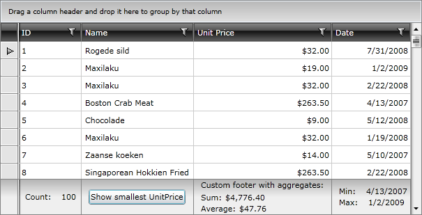

 
# Aggregate Functions

This article will discuss the following topics:

* [Types of Functions](#types-of-functions)
* [Applying Functions to Autogenerated Columns](#autogenerated-columns)
* [Update Results](#update-results)
* [Modify Displayed Aggregates](#modify-displayed-aggregates)
* [Group Aggregates](#group-aggregates)
* [Default AggregateFunctions for a Custom Column](#default-aggregatefunctions-for-a-custom-column)

## Types of Functions

Column footers can be used to display aggregated information about the data in the column by defining aggregate functions. The aggregate functions are included in __Telerik.Windows.Data__ assembly.

Here's a list of the available functions:

* __AverageFunction__: Returns the **average** of the values in the column. 

* __CountFunction__: Returns the **number of all items** in the column. 

* __FirstFunction__: Returns the **first element** in the column according to the current sorting. 

* __LastFunction__: Returns the **last element** in the column according to the current sorting. 

* __MaxFunction__: Returns the **maximum** value of the cell values in the column. 

* __MinFunction__: Returns the **minimum** value of the cell values in the column. 

* __SumFunction__: Returns the **sum** of all cell values in the column. 

>tipYou can also create your own custom functions similar to these by inheriting the __Telerik.Windows.Data.EnumerableAggregateFunction__ class.

>tipYou could also use a [Generic AggregateFunction](https://docs.telerik.com/devtools/wpf/api/html/t_telerik_windows_data_aggregatefunction_2.htm)[Generic AggregateFunction](https://docs.telerik.com/devtools/silverlight/api/html/t_telerik_windows_data_aggregatefunction_2.htm) to define some custom aggregate expressions. An example can be found [here](https://demos.telerik.com/silverlight/#GridView/CustomAggregates).

If the **ShowColumnFooters** property of the RadGridView control is set to **True**, the footer cells will display a caption and the result for the defined aggregate functions.

#### __Figure 1: RadGridView with aggregate results__

To specify an aggregate function for a certain column, just add it to the __AggregateFunctions__ collection of that column.

#### __[XAML] Example 1: Display an aggregate function for a certain column__

{{region xaml-gridview-columns-aggregate-functions_1}}
	<telerik:GridViewDataColumn Header="ID"
	                DataMemberBinding="{Binding EmployeeID}"
	                UniqueName="ID">
	    <telerik:GridViewDataColumn.AggregateFunctions>
	        <telerik:CountFunction Caption="Count: " />
	    </telerik:GridViewDataColumn.AggregateFunctions>
	</telerik:GridViewDataColumn>
{{endregion}}

#### __[C#] Example 2: Add an aggregate function for a certain column__

{{region cs-gridview-columns-aggregate-functions_2}}
	CountFunction f = new CountFunction();
	((GridViewDataColumn)this.radGridView.Columns["ID"]).AggregateFunctions.Add(f);
{{endregion}}

#### __[VB.NET] Example 2: Add an aggregate function for a certain column__

{{region vb-gridview-columns-aggregate-functions_3}}
	Dim f As New CountFunction()
	DirectCast(Me.radGridView.Columns("ID"), GridViewDataColumn).AggregateFunctions.Add(f)
{{endregion}}

#### __Figure 2: RadGridView with a defined CountFunction__

>You need to set RadGridView's __ShowColumnFooters__ property of  to true in order to display aggregates.
            
>You need to set RadGridView's __ShowGroupFooters__ property of RadGridView to true in order to display aggregates under Grouped rows.
            
>You need to set RadGridView's __SourceField__ property of AggregateFunctions collection to specify a field to use in calculating the result.
            
>RadGridView uses __System.Linq__ to generate a proper __Expression__ to do the calculation based on aggregate function defined and type of the bound data. Note that if an expression cannot be automatically generated, an exception will be thrown.

## Autogenerated Columns

You can subscribe to the **AutoGeneratingColumn** event and additionally configure a column as demonstrated in **Example 3**.

#### __[C#] Example 3: Configuring column on AutoGeneratingColumn__
	private void clubsGrid_AutoGeneratingColumn(object sender, GridViewAutoGeneratingColumnEventArgs e)
	{
	    if (e.Column.UniqueName == "Name")
	    {
	        e.Column.AggregateFunctions.Add(new CountFunction());
	    }
	}

>If you do not explicitly specify a __UniqueName__, then its value will be the name of the property set as the __DataMemberBinding__ for the column.

## Update Results      
    
If you need to recalculate the aggregate results, you can call the **CalculateAggregates** method of the control as shown in __Example 4__.

#### __[C#] Example 4: Invoke CalculateAggregates() method__

{{region gridview-columns-aggregate-functions_4}}

	private void Button1_Click(object sender, RoutedEventArgs e)
	{
	   this.radGridView.CalculateAggregates();
	}
{{endregion}}

>Note that group aggregates will not be updated using this approach. Please check this [troubleshooting article](#column-group-aggregates) on how to refresh them.

## Modify Displayed Aggregates

You can modify the default template of the displayed aggregates by setting the __Footer__ property of the column as per your specific requirements.

#### __[C#] Example 5: Overriding GridViewDataColumn.Footer__

{{region gridview-columns-aggregate-functions_5}}
	<telerik:GridViewDataColumn.Footer>
		<StackPanel Orientation="Vertical"
					Margin="0,10">
			<TextBlock Text="Custom footer with aggregates:"
					   Margin="0,0,0,2" />
			<telerik:AggregateResultsList ItemsSource="{Binding}"
										  VerticalAlignment="Center"
										  Grid.Column="4">
				<ItemsControl.ItemTemplate>
					<DataTemplate>
						<StackPanel Orientation="Horizontal"
									VerticalAlignment="Center">
							<TextBlock VerticalAlignment="Center"
									   Text="{Binding Caption}" />
							<TextBlock VerticalAlignment="Center"
									   Text="{Binding FormattedValue}" />
						</StackPanel>
					</DataTemplate>
				</ItemsControl.ItemTemplate>
				<ItemsControl.ItemsPanel>
					<ItemsPanelTemplate>
						<StackPanel Orientation="Vertical" />
					</ItemsPanelTemplate>
				</ItemsControl.ItemsPanel>
			</telerik:AggregateResultsList>
		</StackPanel>
	</telerik:GridViewDataColumn.Footer>
{{endregion}}

>Note that the Footer's DataContext is of type __AggregateResultsList__.

## Group Aggregates
        
Aggregate functions can also be defined per group. To find out more take a look at the [Group Aggregates]() article.

## Default AggregateFunctions for a Custom Column

If you need to have a default aggregate function for the custom column which is __not added in XAML__, you need to add it after the initialization of the column. This can be done by overriding the __EndInit__ method of [FrameworkContentelement](https://msdn.microsoft.com/en-us/library/system.windows.frameworkcontentelement(v=vs.110).aspx).

#### __[C#] Example 6: Adding a default AggregateFunction__

{{region gridview-columns-aggregate-functions_5}}
	public class MyColumn : GridViewDataColumn
    {
        public MyColumn()
        {
            
        }

        public override void EndInit()
        {
            this.AggregateFunctions.Add(new SumFunction());

            base.EndInit();
        }
    }
{{endregion}}

## See Also

 * [Group Aggregates]()
 * [Group Footers]()
 * [Aggregates are not shown]()
 * [Aggregates are not updated]()
