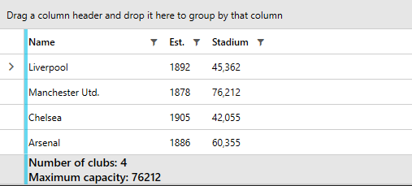
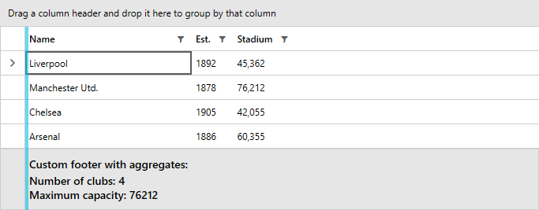

 
# Aggregate Functions

You can display aggregated information for the data in a column by adding aggregate functions to the __AggregateFunctions__ collection of the column. The aggregate functions are included in __Telerik.Windows.Data__ assembly.

## Available Aggregate Functions

There are two main types of aggregate functions available which in turn serve as the base for the concrete implementations.

* **EnumerableAggregateFunction**: Represents an AggregateFunction that uses aggregate extension methods provided in [Enumerable](https://docs.microsoft.com/en-us/dotnet/api/system.linq.enumerable).

	* __CountFunction__: Returns the **number of all items** in the column.

	* __FirstFunction__: Returns the **first element** in the column according to the current sorting.

	* __LastFunction__: Returns the **last element** in the column according to the current sorting.

* **EnumerableSelectorAggregateFunction**: Represents an AggregateFunction that uses aggregate extension methods provided in [Enumerable](https://docs.microsoft.com/en-us/dotnet/api/system.linq.enumerable) and uses its **SourceField** property as a member selector. If the SourceField property is not explicitly set, then the property specified for the **DataMemberBinding** of the column will be used.

	* __AverageFunction__: Returns the **average** of the values in the column.

	* __MaxFunction__: Returns the **maximum** value of the cell values in the column.

	* __MinFunction__: Returns the **minimum** value of the cell values in the column.

	* __SumFunction__: Returns the **sum** of all cell values in the column.

Check the [Custom Aggregate Functions]() article to see how to implement custom aggregate functions by inheriting the `EnumerableAggregateFunction` and `EnumerableSelectorAggregateFunction` classes.

## Adding an Aggregate Function

Aggregate functions can be added in xaml or in code behind. __Examples 1 and 2__ demonstrate both approaches. Note, that the RadGridView is populated with data as demonstrated in the [Getting Started]() article.

__Example 1: Populating the AggregateFunctions collection in xaml__

<snippet id='radgridview-columns-aggregate-functions-example_1_populating_the_aggregatefunctions_collection_in_xaml-xaml' />

__Example 2: Populating the AggregateFunctions collection in code__

<snippet id='radgridview-columns-aggregate-functions-example_2_populating_the_aggregatefunctions_collection_in_code-cs' />

<snippet id='radgridview-columns-aggregate-functions-example_2_populating_the_aggregatefunctions_collection_in_code-vb' />

#### __Figure 1: RadGridView with ShowColumnFooters set to True__

>You need to set the __ShowColumnFooters__ and __ShowGroupFooters__ properties to __True__ in order to display aggregates under the columns and grouped rows respectively.

<!-- -->

> If omitted, the __SourceField__ property of the aggregate functions is automatically set to the __DataMemberBinding__ of the column.
            
<!-- -->
            
>RadGridView uses __System.Linq__ to generate a proper __Expression__ to do the calculation based on aggregate function defined and type of the bound data. Note that if an expression cannot be automatically generated, an exception will be thrown.

## Autogenerated Columns

If your columns are auto-generated, you can subscribe to the **AutoGeneratingColumn** event and populate the AggregateFunctions collection as demonstrated in **Example 3**.

__Example 3: Configuring column on AutoGeneratingColumn__

<snippet id='radgridview-columns-aggregate-functions-example_3_configuring_column_on_autogeneratingcolumn-cs' />

<snippet id='radgridview-columns-aggregate-functions-example_3_configuring_column_on_autogeneratingcolumn-vb' />

## ResultFormatString

You can specify a format string for the aggregate results by setting the __ResultFormatString__ property of an aggregate function.

__Example 4: Specifying ResultFormatString__

<snippet id='radgridview-columns-aggregate-functions-example_4_specifying_resultformatstring-xaml' />

The code from __Example 4__ will display the aggregate results in the currency format with two digits after the decimal separator.

## Update Results      
    
If you need to recalculate the aggregate results, you can call the **CalculateAggregates** method of the control as shown in __Example 5__.

__Example 5: Invoke CalculateAggregates() method__

<snippet id='radgridview-columns-aggregate-functions-example_5_invoke_calculateaggregates_method-cs' />

<snippet id='radgridview-columns-aggregate-functions-example_5_invoke_calculateaggregates_method-vb' />

>Note that group aggregates will not be updated using this approach. Please check this [troubleshooting article](#column-group-aggregates) on how to refresh them.

## Modify Displayed Aggregates

You can modify the default template of the displayed aggregates by setting the __Footer__ property of the column as per your specific requirements.

__Example 6: Overriding GridViewDataColumn.Footer__

<snippet id='radgridview-columns-aggregate-functions-example_6_overriding_gridviewdatacolumn_footer-xaml' />

#### __Figure 2: A GridViewDataColumn with a custom Footer__

>Note that the Footer's DataContext is of type [AggregateResultsList](https://docs.telerik.com/devtools/wpf/api/telerik.windows.controls.gridview.aggregateresultslist).

## Group Aggregates
        
Aggregate functions can also be defined per group. To find out more, take a look at the [Group Aggregates]() article.

## Default AggregateFunctions for a Custom Column

If you want to have a default aggregate function for the custom column which is __not added in XAML__, you need to add it after the initialization of the column. This can be done by overriding the __EndInit__ method of [FrameworkContentelement](https://msdn.microsoft.com/en-us/library/system.windows.frameworkcontentelement(v=vs.110).aspx).

__Example 7: Adding a default AggregateFunction__

<snippet id='radgridview-columns-aggregate-functions-example_7_adding_a_default_aggregatefunction-cs' />

<snippet id='radgridview-columns-aggregate-functions-example_7_adding_a_default_aggregatefunction-vb' />

## See Also  
 * [Custom Aggregate Functions]()
 * [Group Aggregates]()
 * [Group Footers]()
 * [Aggregates are not shown]()
 * [Aggregates are not updated]()
 * [Style aggregate results displayed in the GroupHeaderRow]()
