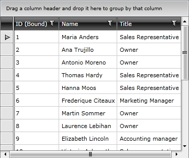
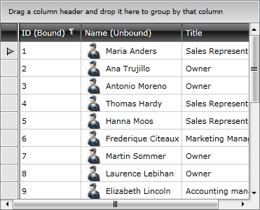
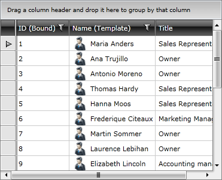

# Bound/Unbound Columns

When populating __RadGridView__ with data two logical types of columns can be used - __bound and unbound__.

__Bound columns__ represent the data from __RadGridView's__ ItemsSource. They support data related functionality such as [sorting](), [filtering](), [grouping](), [aggregates](), etc. Typically the bound columns are of type __GridViewDataColumn__ with its __DataMemberBinding__ property set.


```XAML
	<telerik:GridViewDataColumn DataMemberBinding="{Binding EmployeeID}"
	                Header="ID (Bound)" />
```



__Unbound__ columns are used for displaying a custom content. Such custom content can be buttons which are not directly related to the underlying data, textbox for adding comments, images etc. The unbound column's content is defined by setting cell template. When using unbound columns you will be unable to perform filtering, sorting and grouping.

Here is an example for unbound column:


```XAML
	<telerik:GridViewColumn Header="Name">
	    <telerik:GridViewColumn.CellTemplate>
	        <DataTemplate>
	            <StackPanel Orientation="Horizontal">
	                <Image Stretch="None"
	       Source="../../Images/User.png"
	       Margin="0,0,5,0" />
	                <TextBlock Text="{Binding Name}"
	           VerticalAlignment="Center" />
	            </StackPanel>
	        </DataTemplate>
	    </telerik:GridViewColumn.CellTemplate>
	</telerik:GridViewColumn>
```



In the example above a __DataTemplate__ containing a __StackPanel__ with an __Image__ and a __TextBox__ is shown. In this case the __StackPanel__ and the __Image__ are not related to the data items. The __TextBox__ is bound to the data item. In the same time the unbound column lacks such data functionalities as sorting, grouping and filtering. 

Using __GridViewDataColumn__, however, can give you the advantages of both the bound and unbound column allowing you to perform data operations like sorting, grouping and filtering. In this case you can simultaneously set __DataMemberBinding__ and provide [CellTemplate](), thus giving you the freedom to create rich visualizations. 

Here is the above sample of an unbound column transformed into a template column.


```XAML
	<telerik:GridViewDataColumn DataMemberBinding="{Binding Name}" Header="Name (Unbound)">
	    <telerik:GridViewDataColumn.CellTemplate>
	        <DataTemplate>
	            <StackPanel Orientation="Horizontal">
	                <Image Stretch="None"
	       Source="../../Images/User.png"
	       Margin="0,0,5,0" />
	                <TextBlock Text="{Binding Name}"
	           VerticalAlignment="Center" />
	            </StackPanel>
	        </DataTemplate>
	    </telerik:GridViewDataColumn.CellTemplate>
	</telerik:GridViewDataColumn>
```



## See Also

 * [Customizing Columns]()

 * [Data Formatting]()
