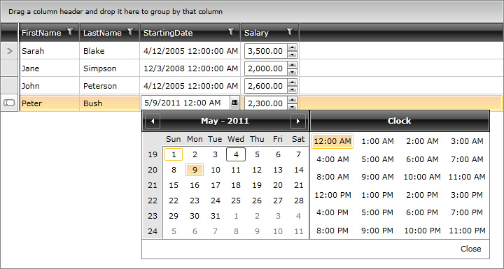
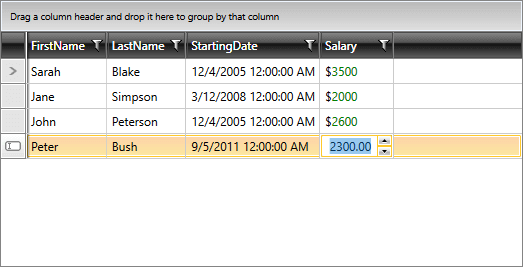

# Setting CellTemplate and CellEditTemplate

This article describes how to customize the RadGridView columns by using predefined column types and how to extend the functionality of the columns by defining a non-default editor.

## Using Predefined Column Types

RadGridView provides a set of predefined column types like __GridViewCheckBoxColumn__, __GridViewComboBoxColumn__, __GridViewSelectColumn__, etc. that you can customize in accordance with the requirements and the type of properties exposed in your business object.

When you use a standard **GridViewDataColumn**, the RadGridView control automatically generates controls for the cell's view and edit modes:

* Default controls in view mode:

  * __TextBlock__: For **string**, **numeric** and **DateTime** properties

  * __CheckBox__: For **boolean** properties

* Default controls in edit mode:

  * __TextBox__: For **string** and **numeric** properties

  * __CheckBox__: For **boolean** properties

  * __RadDatePicker__: For **DateTime** properties

## Creating CellTemplate and CellEditTemplate for a Column

Sometimes you need to extend the functionality of a column and define a custom editor. To achieve this, create a __CellTemplate__ or __CellEditTemplate__ for the column:

* __CellTemplate__: Gets or sets the data template for the cell in view mode.

* __CellEditTemplate__: Gets or sets the data template for the cell in edit mode.

>tip You can also conditionally apply different data templates to RadGridView cells by using the [CellTemplateSelector and CellEditTemplateSelector]() properties.

**Example 1** demonstrates how to use both properties to customize your columns. We set the __RadDateTimePicker__ as a __CellEditTemplate__ for the __DateTime__ column type and the __RadNumericUpDown__ as a __CellTemplate__ for the **Salary** column.

__Example 1: Setting columns' CellTemplate and CellEditTemplate__

```XAML
	<telerik:RadGridView x:Name="EmployeesGrid" AutoGenerateColumns="False" ItemsSource="{Binding Employees}">
	    <telerik:RadGridView.Columns>
	        <telerik:GridViewDataColumn DataMemberBinding="{Binding FirstName}" />
	        <telerik:GridViewDataColumn DataMemberBinding="{Binding LastName}" />
	        <telerik:GridViewDataColumn DataMemberBinding="{Binding StartingDate}">
	            <telerik:GridViewDataColumn.CellEditTemplate>
	                <DataTemplate>
	                    <telerik:RadDateTimePicker SelectedDate="{Binding StartingDate}" IsTooltipEnabled="False"/>
	                </DataTemplate>
	            </telerik:GridViewDataColumn.CellEditTemplate>
	        </telerik:GridViewDataColumn>
	        <telerik:GridViewDataColumn DataMemberBinding="{Binding Salary}">
	            <telerik:GridViewDataColumn.CellTemplate>
	                <DataTemplate>
	                    <telerik:RadNumericUpDown Value="{Binding Salary}" />
	                </DataTemplate>
	            </telerik:GridViewDataColumn.CellTemplate>
	        </telerik:GridViewDataColumn>
	    </telerik:RadGridView.Columns>
	</telerik:RadGridView>
```

The RadGridView defined above will be displayed as shown in **Figure 1**.

#### Figure 1: RadGridView with CellTemplate and CellEditTemplate defined



>important When you define a __CellEditTemplate__ for a column, the __default validation__ mechanism is __bypassed__ as you're directly binding to the source property. If you require this validation, [create a custom column editor]() instead.

The first example illustrates how to define either a __CellTemplate__ or __CellEditTemplate__. In the next example, we demonstrate how to set them both for the same column.

__Example 2: Setting the CellTemplate and CellEditTemplate of a single column__

```XAML
	<telerik:RadGridView x:Name="EmployeesGrid" AutoGenerateColumns="False" ItemsSource="{Binding Employees}">
		<telerik:RadGridView.Columns>
			<telerik:GridViewDataColumn DataMemberBinding="{Binding FirstName}" />
			<telerik:GridViewDataColumn DataMemberBinding="{Binding LastName}" />
			<telerik:GridViewDataColumn DataMemberBinding="{Binding StartingDate}" />
			<telerik:GridViewDataColumn DataMemberBinding="{Binding Salary}">
				<telerik:GridViewDataColumn.CellTemplate>
					<DataTemplate>
						<StackPanel Orientation="Horizontal">
							<TextBlock Text="$" />
							<TextBlock Text="{Binding Salary}" Foreground="Green" />
						</StackPanel>
					</DataTemplate>
				</telerik:GridViewDataColumn.CellTemplate>
				<telerik:GridViewDataColumn.CellEditTemplate>
					<DataTemplate>
						<telerik:RadNumericUpDown Value="{Binding Salary}" />
					</DataTemplate>
				</telerik:GridViewDataColumn.CellEditTemplate>
			</telerik:GridViewDataColumn>
		</telerik:RadGridView.Columns>
	</telerik:RadGridView>
```

The RadGridView defined above will be displayed as shown in **Figure 1**.

#### Figure 2: RadGridView with CellTemplate and CellEditTemplate defined for a single column



## Tips about CellTemplate and CellEditTemplate

* You can set the __CellTemplate__ and __CellEditTemplate__ in the code behind. See the [Using DataTemplate in Code]() article for details.

* If you set DataMemberBinding set to StartingDate, the aggregation, sorting, grouping and filtering operations on the column will be done based on the StartingDate property. If the user does not need to perform any aggregation, sorting, grouping or filtering operations for the column, then you can use a [GridViewColumn]() instead.

* In scenarios with a defined column.CellEditTemplate, the new value of the editor is not available in the arguments of the __CellEditEnded__ event that is raised when committing an edit. To get the right value in __e.NewValue__, create your own [Custom Column]() and override its __GetNewValueFromEditor__ method.

## See Also

* [CellTemplateSelector and CellEditTemplateSelector]()
* [Using DataTemplate in Code]()
* [Basic Column]()
* [Defining Columns]()
* [Customizing Columns]()
* [Data Formatting]()
