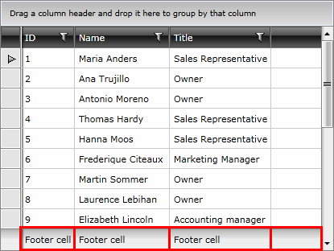
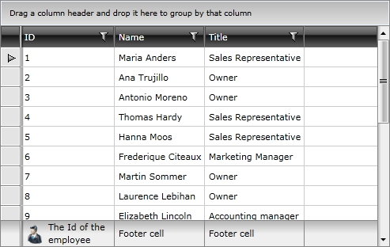
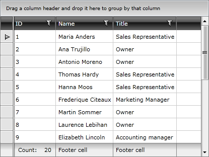

# Column Footers

RadGridView allows you to display additional information which applies to the columns in a specific row placed at the bottom of the control. This row consists of individual footer cells for each column.

By default, column footers are hidden and in order to make them visible you have to set the __ShowColumnFooters__ property to __True__.

__Example 1: Show column footers__
<snippet id='radgridview-columns-column-footers-example_1_show_column_footers-xaml' />

To set the value of the footer cells, you can use the __Footer__ property of the columns.

__Example 2: Set the content of the footer cells__

<snippet id='radgridview-columns-column-footers-example_2_set_the_content_of_the_footer_cells-xaml' />

#### Figure 1: RadGridView with footer cells

Because it is of type object, you are not limited to just using plain text. For example, you can add a corresponding picture to the footer text.

__Example 3: Adding an image to the footer content__

<snippet id='radgridview-columns-column-footers-example_3_adding_an_image_to_the_footer_content-xaml' />

#### Figure 2: Image in the footer cell

## Aggregates

Column footers are also used to display aggregated information on the data displayed in the column via aggregate functions.

__Example 4: Adding an aggregate function to a column__

<snippet id='radgridview-columns-column-footers-example_4_adding_an_aggregate_function_to_a_column-xaml' />

#### Figure 3: Footer cell with aggregate results

To learn more about aggregate functions please have a look at [this article]().

>important Please note that if the **Footer** property is explicitly defined, it will take precedence over the aggregate results.

## See Also

* [Aggregate Functions]()
* [Resizing Columns]()
* [Reordering Columns]()
