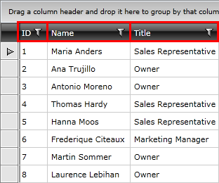
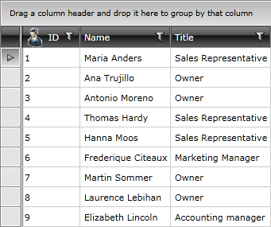
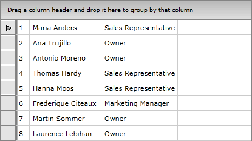
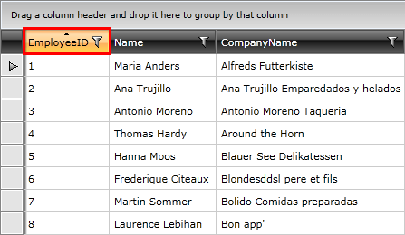
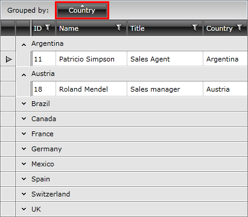
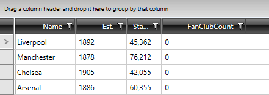

# Column Headers

This topic will guide you through the usage of the column headers, their customization as well through performing different data operations. 

* [Customizing Headers](#customizing-the-headers)
* [Hiding the Headers](#hiding-the-headers)
* [Sorting](#sorting)
* [Filtering](#filtering)
* [Grouping](#grouping)
* [Merging the Headers](#merging-the-headers)
* [Text Properties](#text-properties)

Usually the top cell of a column is called Header. Its purpose is to set a caption for the column, which describes the data displayed in it.

#### __Figure 1: Displaying column headers__ 



To set value for the header use the __Header__ property of the column. 

__Example 1: Setting the Header Property__

```XAML
	<telerik:GridViewDataColumn DataMemberBinding="{Binding EmployeeID}"
	                Header="ID" />
```

The __Header__ property is of type __object__ and you are not limited to just using plain text. For example, you can add a corresponding picture to be displayed as header.

__Example 2: Setting Custom Content to the Header Property__

```XAML
	<telerik:GridViewDataColumn DataMemberBinding="{Binding EmployeeID}">
	    <telerik:GridViewDataColumn.Header>
	        <StackPanel Orientation="Horizontal">
	            <Image Stretch="None"
	   Source="../../Images/User.png"
	   Margin="0,0,5,0" />
	            <TextBlock Text="ID"
	       VerticalAlignment="Center" />
	        </StackPanel>
	    </telerik:GridViewDataColumn.Header>
	</telerik:GridViewDataColumn>
```

#### __Figure 2: Displaying custom content in column headers__ 



## Customizing the Headers

There are two elements on the headers that can be customized:

* __Header Row__ - it is modified by setting an appropriate style as __HeaderRowStyle__ of __RadGridView__. To learn  how to style it take a look at the [Styling the Header Row]() topic.
* __Header Cell__ - it is styled by setting __HeaderCellStyle__ for the column, which means that for each column you can have a differently styled header. To learn more about how to style the header cell take a look at the [Styling the Column Headers]() topic.

## Hiding the Headers

Column headers can only be hidden by setting __ShowColumnHeaders__ property of __RadGridView__ to __False__.

__Example 3: Setting the ShowColumnHeaders property to False__

```XAML
	<telerik:RadGridView x:Name="radGridView"
	                 ShowColumnHeaders="False">
	    <!-- ... -->
	</telerik:RadGridView>
```

#### __Figure 3: Hiding the column headers__ 



## Sorting

The header of the column plays the main role when we want to sort it. It also hosts all the visual logic around this functionality. When the data is sorted by a column, its header changes its appearance and shows the sort direction via an indicator.

#### __Figure 4: Sorting the column__ 



>tip As of Q2 2013, the user can benefit from __Column Sort Sequence Indicator__. In order to have this feature enabled you need to set ShowColumnSortIndexes property of RadGridView to True.

To learn more about the sorting functionality take a look at the [Basic Sorting]() topic in the Sorting chapter.

## Filtering

The header of the column hosts the built-in filtering mechanism, which allows you to filter data by the columns' values.

#### __Figure 5: Filtering the column__ 


To learn more about the filtering functionality take a look at the [Basic Filtering]() topic in the Filtering chapter.

## Grouping

The header is also used for grouping data. It has to be dragged into the group panel at the top of the control in order to get the data grouped by that column.

#### __Figure 6: Grouping the column__ 



To learn more about the grouping functionality take a look at the [Basic Grouping]() topic in the Grouping chapter.

## Merging the Headers

Columns in RadGridView can be grouped in __column groups__(added with __Q3 2011__). [Read more]().

## Text Properties

As of __Q2 2016__, __GridViewHeaderCell__ exposes __TextWrapping__, __TextAlignment__, __TextTrimming__ and __TextDecorations__ properties. These customizations can be also applied on column level through the __HeaderTextWrapping__, __HeaderTextAlignment__, __HeaderTextTrimming__ and __HeaderTextDecorations__ properties. If the same property is set to __both elements__, the value of the one corresponding to __GridViewColumn__ will be respected.


__Example 5: Setting the Text Properties of GridViewHeaderCell and GridViewColumn__
```XAML
	<Window.Resources>
	    <Style TargetType="telerik:GridViewHeaderCell"
	           		x:Key="HeaderCellStyle">
	        <Setter Property="TextAlignment" 
	                Value="Left"/>
	    </Style>
	</Window.Resources>


	<telerik:RadGridView Name="clubsGrid" 
                     ItemsSource="{Binding Clubs}"
                     AutoGenerateColumns="False"
                     GroupRenderMode="Flat">
         <telerik:RadGridView.Columns>
            <telerik:GridViewDataColumn DataMemberBinding="{Binding Name}"
                                        HeaderCellStyle="{StaticResource HeaderCellStyle}"
                                        HeaderTextAlignment="Right"/>
                
            <telerik:GridViewDataColumn DataMemberBinding="{Binding Established}"
                                        Header="Est." 
                                        DataFormatString="{}{0:yyyy}"
                                        HeaderTextAlignment="Right"/>
               
            <telerik:GridViewDataColumn DataMemberBinding="{Binding StadiumCapacity}" 
                                        Header="Stadium" 
                                        DataFormatString="{}{0:N0}"
                                        HeaderTextTrimming="WordEllipsis"/>

            <telerik:GridViewDataColumn DataMemberBinding="{Binding FanClubCount}"
                                        HeaderTextDecorations="Underline"/>
    	</telerik:RadGridView.Columns>
	</telerik:RadGridView>
```

#### Figure 5: Setting the text properties of GridViewHeaderCell and GridViewColumn



Note, that the first column has a __HeaderCellStyle__ defined, which aligns the content of the __HeaderCell__ to the left, but the __Style__ is not applied, as the __HeaderTextAlignment__ of __GridViewColumn__ is also being set.
        
## See Also
 * [Column Footers]() 
 * [Column Groups]()
 * [Aggregate Functions]()
 * [Resizing Columns]()
