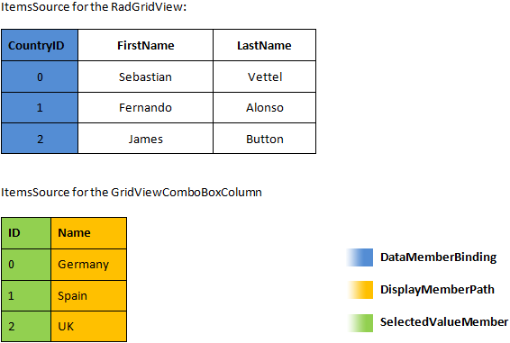
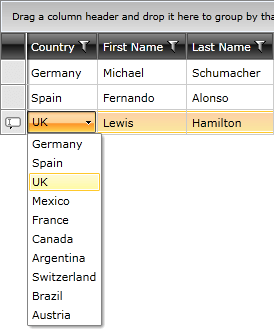
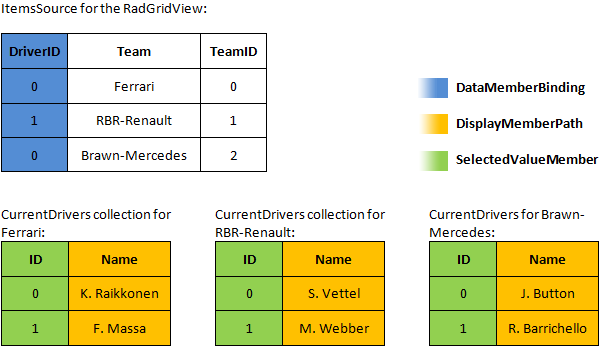
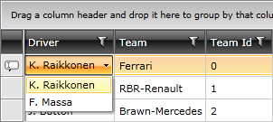
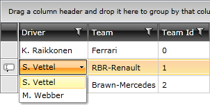
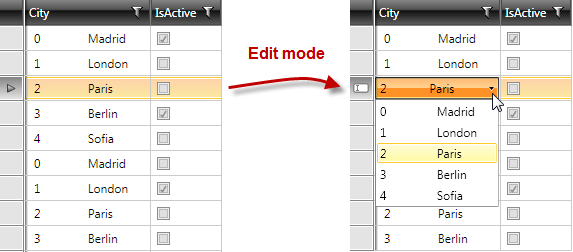

# ComboBox Column

The`GridViewComboBoxColumn` column derives from [GridViewBoundColumnBase](), which means that it inherits all of the functionality too. In addition, GridViewComboBoxColumn provides a `RadComboBox` editor for editing cell values. It also takes care to translate the `DataMemberBinding` value of the column to the corresponding `DisplayMemberPath` value of RadComboBox. 

>tip Typing on the keyboard in GridViewComboBoxColumn will point to the first item starting with the same character.

Here is a list of the most important properties:

* `DataMemberBinding`&mdash;you should specify the property of the bound business object to relate to `SelectedValueMemberPath` from column's ItemsSource. 
* `ItemsSource`&mdash;specifies the data source for the RadComboBox editor. It also takes part when translating the DataMemberBinding to the DisplayMemberPath property.
* `ItemsSourceBinding`&mdash;allows binding editor's ItemsSource to a member of the bound data item.
* `DisplayMemberPath`&mdash;member path to display. It points to a field in the assigned collection to the ItemsSource property of GridViewComboBoxColumn.
* `SelectedValueMemberPath`&mdash;used in conjunction with DisplayMemberPath in the process of translation of a value to display as content. It also tells the RadComboBox editor which property to use as a Value when the user makes selection. 
* `IsComboBoxEditable`&mdash;allows you to configure whether the editor RadComboBox is editable.
* `EmptyText`&mdash;allows you to set a string which will be displayed in both view mode and edit mode when the RadComboBox editor does not have a selected item.
 
>important The __type__ of the properties configured as `DataMemberBinding` and `SelectedValueMemberPath` should be the same.
        
The following example assumes that you have data as shown in the below image:

__Sample data structure of RadGridView:__



__Define GridViewComboBoxColumn in XAML__
```XAML
	<telerik:RadGridView x:Name="radGridView" AutoGenerateColumns="False">
	    <telerik:RadGridView.Columns>
	        <telerik:GridViewComboBoxColumn />
	    </telerik:RadGridView.Columns>
	</telerik:RadGridView>
```

__Set the DataMemberBinding property in XAML__
```XAML
	<telerik:RadGridView AutoGenerateColumns="False">
	    <telerik:RadGridView.Columns>
	        <telerik:GridViewComboBoxColumn DataMemberBinding="{Binding CountryId}" UniqueName="Country" />
	    </telerik:RadGridView.Columns>
	</telerik:RadGridView>
```

__Set the DataMemberBinding property in code__
```C#
	column.DataMemberBinding = new Binding("CountryId");
	column.UniqueName = "Country";
```

__Setting the ItemsSource property in code__
```C#
	((GridViewComboBoxColumn)this.radGridView.Columns["Country"]).ItemsSource = RadGridViewSampleData.GetCountries();
```
```VB.NET
	DirectCast(Me.radGridView.Columns("Country"), GridViewComboBoxColumn).ItemsSource = RadGridViewSampleData.GetCountries()
```

__Configure DisplayMemberPath and SelectedValuePath properties in XAML__
```XAML
	<telerik:GridViewComboBoxColumn DataMemberBinding="{Binding CountryId}"
	                    UniqueName="Country"
	                    SelectedValueMemberPath="Id"
	                    DisplayMemberPath="Name" />
```

__Configure DisplayMemberPath and SelectedValuePath properties in code__
```C#
	column.SelectedValueMemberPath = "Id";
	column.DisplayMemberPath = "Name";
```

__ComboBoxColumn after setting DisplayMemberPath and SelectedValuePath properties__



As illustrated in the above image, you can map __CountryId__ property of the business object to the respective value in Countries collection via configuring proper `DisplayMemberPath`.
      
You can download a runnable project of the previous example from our online SDK repository:[ComboboxColumn](https://github.com/telerik/xaml-sdk/tree/master/GridView/ComboboxColumn).
      
The next example shows how to use `ItemsSourceBinding`. It allows you to bind the `ItemsSource` of RadComboBox editor to a collection held by the data item. In this way, you are able to specify different sets of items depending on the entire content of the respective row. The example assumes that you have the data shown in the following image:

__Sample data structure of RadGridView__



`RadGridView` binds to a collection of objects representing the teams. The team object exposes a collection containing the current drivers, which is used as source for the editor. As in the previous example, it also exposes a __DriverID__ property that the column will later translate to an appropriate display value. 

__Configure GridViewComboBoxColumn with ItemsSourceBinding__
```XAML
	<telerik:GridViewComboBoxColumn Header="Driver"
	                    DataMemberBinding="{Binding DriverID}"
	                    UniqueName="Driver"
	                    ItemsSourceBinding="{Binding CurrentDrivers}"
	                    SelectedValueMemberPath="ID"
	                    DisplayMemberPath="Name" />
```

The next images show the result of configuring the ItemsSourceBinding property.

__Appearance after setting ItemsSourceBinding property__



__Appearance after setting ItemsSourceBinding property.__



When using the ItemsSourceBinding property, the values displayed in the column’s filtering control will be the values corresponding to the DataMemberBinding (0, 1, 2). If you want to have the displayed ones (S.Vettel, K. Raikkonen, M. Webber), then you need to set GridViewComboBoxColumn. [FilterMemberPath]() to a property containing the values used as DisplayMemberPath.
        
You can download a runnable project of the previous example from our online SDK repository:[ComboboxColumnItemsSourceBinding](https://github.com/telerik/xaml-sdk/tree/master/GridView/ComboboxColumnItemsSourceBinding).
        
>If you are setting GridViewComboBoxColumn's ItemsSource property you should specify a valid source for it. Please refer to this [troubleshooting article]().

>You can also check the [SDK Samples Browser]() that provides a more convenient approach in exploring and executing the examples in the Telerik XAML SDK repository. 
        
## Templating GridViewComboBoxColumn

The GridViewComboBoxColumn column exposes the `ItemTemplate` property, which also applies to the default editor - RadComboBox.

The following example shows how to implement a multi-column ComboBoxColumn.

Start by defining the GridViewComboBoxColumn and its ItemTemplate:

__Configure GridViewComboBoxColumn with ItemTemplate__
```XAML
	<telerik:GridViewComboBoxColumn Header="City"
	                                DisplayMemberPath="Name"
	                                SelectedValueMemberPath="ID"
	                                ItemsSource="{Binding Path=Cities, Source={StaticResource MyViewModel}}"
	                                Width="\*"
	                                DataMemberBinding="{Binding CityID}" >
	    <telerik:GridViewComboBoxColumn.ItemTemplate>
	        <DataTemplate>
	            <Grid>
	                <Grid.ColumnDefinitions>
	                    <ColumnDefinition />
	                    <ColumnDefinition Width="\*"/>
	                </Grid.ColumnDefinitions>
	                <TextBlock Text="{Binding ID}"/>
	                <TextBlock Text="{Binding Name}" Grid.Column="1"/>
	            </Grid>
	        </DataTemplate>
	    </telerik:GridViewComboBoxColumn.ItemTemplate>
	</telerik:GridViewComboBoxColumn>
```

The multi-column ComboBoxColumn in this example will have two columns showing the ID and Name of the City respectively. When you run the example, Figure 6 shows the result when the customer tries to edit in a column.

__Multi-select GridViewColumnComboBox column in RadGridView__



## Utilizing the IsLightweightModeEnabled Mode

The GridViewComboBoxColumn column exposes the `IsLightweightModeEnabled` property that will allow you to use a different lookup strategy. This will increase the performance of the column, which will result in improved performance of the RadGridView or RadTreeListView control. To enable this mode, set the IsLightweightModeEnabled property to __True__.

>tip For the best scrolling performance, utilize the `ItemsSource` property and the `DataMemberBinding` property has to be bound to a __primitive type__ property.

__Enabling the lightweight mode__
```XAML
	<telerik:GridViewComboBoxColumn IsLightweightModeEnabled="True"/>
```

## See Also
 * [Binding GridViewComboBoxColumn by using the EnumDataSource utility]()
 * [Empty Cells in ComboboxColumn]()
 * [Handle SelectionChanged for ComboBoxColumn]()
 * [Filter items in ComboboxColumn]()
 * [Number of clicks in the ComboBoxColumn]()