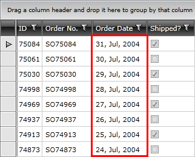

# Data Column

__GridViewDataColumn__ derives from [GridViewBoundColumnBase](), which means that it inherits all of its functionality. In addition, it automatically creates appropriate editor elements based on the bound data type without you needing to specify a [CellEditTemplate]() explicitly.

More specifically, the GridViewDataColumn will generate a **CheckBox** for **boolean** properties, a **DateTimePicker** for **DateTime** properties and a **TextBox** for all other properties once it enters edit mode.

>important The editors specified in the **CellEditTemplate** and **CellEditTemplateSelector** properties overwrite the default editors.

>RadGridView's autogenerated columns are of this type.

__Example 1: Define GridViewDataColumn in XAML.__

```XAML
	<telerik:RadGridView x:Name="radGridView"
	             AutoGenerateColumns="False">
	    <telerik:RadGridView.Columns>
	        <telerik:GridViewDataColumn DataMemberBinding="{Binding Id}" />
	    </telerik:RadGridView.Columns>
	</telerik:RadGridView>
```

__Example 2: Define GridViewDataColumn in code__

```C#
	GridViewDataColumn column = new GridViewDataColumn();
	column.DataMemberBinding = new Binding("Id");
	this.radGridView.Columns.Add(column);
```
```VB.NET
	Dim column As New GridViewDataColumn()
	column.DataMemberBinding = new Binding("Id")
	Me.radGridView.Columns.Add(column)
```

The `DataMemberBinding` property defines which property from the row's underlying data item should be used to populate the cells in the column. If the `DataMemberBinding` is not set, the column will try to fallback to the `UniqueName` property of the column (if assigned) and automatically create a binding using the unique name as the property path.

Via the __DataFormatString__ property you are able to format the bound data and display it the way you want. **Figure 1** shows a **DateTime** column with custom formatting.

#### __Figure 1: GridViewDataColumn with custom formatting__



To learn more about how to format the displayed data, please check the [Data Formatting]() article. 

## See also

* [CellTemplate and CellEditTemplate]()
* [GridViewBoundColumnBase]()
* [Data Formatting]()
