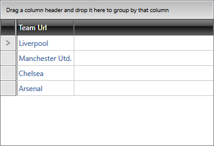

# Hyperlink Column

__GridViewHyperlinkColumn__ derives from the [GridViewBoundColumnBase]() class and its content is represented by a __HyperlinkButton__ control.

## Properties

Here's a list of properties that the column exposes:

* __DataMemberBinding__: Here you need to specify the property of the business object which is the actual link that will be navigated to. The type of the property can be a **Uri** or a plain **string**.

* __ContentBinding__: You can specify the property of the business object to be displayed as the value in the cell. If this binding is not specified, the actual link provided as the DataMemberBinding is displayed.
            
* __TargetName__: Gets or sets the name of a target window or frame for the hyperlink.

## Defining the Data

For the purposes of this article we will assume that the data objects expose **Name** and **TeamUrl** properties as defined in **Example 1**.

__Example 1: The Club class__

<snippet id='radgridview-columns-columntypes-column-types-hyperlink-column-example_1_the_club_class-cs' />

<snippet id='radgridview-columns-columntypes-column-types-hyperlink-column-example_1_the_club_class-vb' />

## Set Up the Hyperlink Column

If you bind the RadGridView control to a collection of **Club** objects, you can define the GridViewHyperlinkColumn column as shown in **Example 2**.

__Example 2: Define GridViewHyperlinkColumn in XAML__

<snippet id='radgridview-columns-columntypes-column-types-hyperlink-column-example_2_define_gridviewhyperlinkcolumn_in_xaml-xaml' />

**Figure 1** illustrates the result of the code in **Example 1**.

#### Figure 1: RadGridView with a hyperlink column

# See also

* [Dynamic Hyperlink Column]()
* [CellTemplate and CellEditTemplate]()