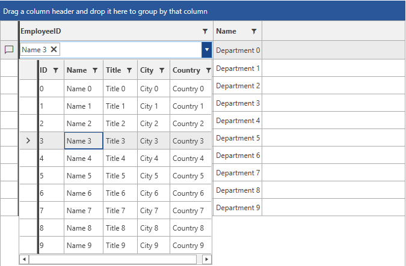

# MultiColumnComboBox Column

__GridViewMultiColumnComboBoxColumn__ derives from [GridViewBoundColumnBase](). In view mode it is represented by a standard TextBlock, whereas in edit mode the [RadMultiColumnComboBox]() component is used. Here is a list of its most important properties:

* __DataMemberBinding__: Allows you to specify the binding to the property, whose value you want to display in the column. 

* __ItemsSource__: Specifies the data source for the __RadMultiColumnComboBox__ editor.

* __ItemsSourceBinding__: Allows binding editor's __ItemsSource__ to a member of the bound data item.

* __DisplayMemberPath__: Member path to display. It points to a field in the assigned __ItemsSource__.

* __SelectedValuePath__: Used in conjunction with __DisplayMemberPath__ in the process of translation of a value to display as content. It also tells the __RadMultiColumnComboBox__ editor which property to use as a Value when the user makes selection. 

* __NullText__: Allows you to set a string which will be displayed in both view mode and edit mode when the __RadMultiColumnComboBox__ editor does not have a selected item.

* __HighlightMatches__: Gets or sets a value that indicates whether matched items will be highlighted.

* __AutoCompleteMode__: Gets or sets the [AutoCompleteMode]() of the __RadMultiColumnComboBox__ editor.

* __MatchCase__: Gets or sets value that indicates whether text matching is case sensitive.

* __KeepDropDownOpen__: Gets or sets the [KeepDropDownOpen](#keep-the-dropdown-open) of the __RadMultiColumnComboBox__ editor.

* __OpenDropDownOnInput__: Gets or sets the [OpenDropDownOnInput](#open-the-dropdown-on-input) of the __RadMultiColumnComboBox__ editor.

* __DropDownHeight__: Gets or sets the [DropDownHeight](#height-of-the-dropdown) of the __RadMultiColumnComboBox__ editor.

* __DropDownWidth__: Gets or sets the [DropDownWidth](#width-of-the-dropdown) of the __RadMultiColumnComboBox__ editor.

* __DropDownMinHeight__: Gets or sets the [DropDownMinHeight](#set-min-and-max-height-or-width-of-the-dropdown) of the __RadMultiColumnComboBox__ editor.

* __DropDownMinWidth__: Gets or sets the [DropDownMinWidth](#set-min-and-max-height-or-width-of-the-dropdown) of the __RadMultiColumnComboBox__ editor.

* __DropDownMaxHeight__: Gets or sets the [DropDownMaxHeight](#set-min-and-max-height-or-width-of-the-dropdown) of the __RadMultiColumnComboBox__ editor.

* __DropDownMaxWidth__: Gets or sets the [DropDownMaxWidth](#set-min-and-max-height-or-width-of-the-dropdown) of the __RadMultiColumnComboBox__ editor.

* __DropDownPlacement__: Gets or sets the [DropDownPlacement](#position-of-the-dropdown) of the __RadMultiColumnComboBox__ editor.

* __CloseDropDownAfterSelectionInput__: Get or sets the [CloseDropDownAfterSelectionInput](#closing-the-dropdown-when-selecting) of the __RadMultiColumnComboBox__ editor.

* __AutoGenerateColumns__: Gets or sets a value indicating whether columns in the editor's popup are created automatically when the ItemsSource property is set. The default value is **true**. This property was introduced with **R1 2020 SP1**.

* __Columns__: Gets the collection of GridViewColumns for the grid view in the editor's popup. This property was introduced with **R1 2020 SP1**.

* __CanUserSearchInHiddenColumns__: Gets or sets value that indicates whether the search engine should search in hidden columns. This property was introduced with **R3 2020**.

## Setting up GridViewMultiColumnComboBoxColumn

__Examples 1 and 2__ demonstrate how you can define some dummy data and set up a GridViewMultiColumnComboBoxColumn. The RadGridView is populated with a collection of Departments, each of which holds a collection of Employees. The Employees collection is set as the ItemsSource of the GridViewMultiColumnComboBoxColumn.

__Example 1: Defining the models and viewmodel__
<snippet id='radgridview-columns-columntypes-column-types-multicolumncomboboxcolumn-example_1_defining_the_models_and_viewmodel-cs' />

<snippet id='radgridview-columns-columntypes-column-types-multicolumncomboboxcolumn-example_1_defining_the_models_and_viewmodel-vb' />

__Example 2: Defining the xaml__
<snippet id='radgridview-columns-columntypes-column-types-multicolumncomboboxcolumn-example_2_defining_the_xaml-xaml' />

#### __Figure 1: Result from Example 2 in the Office2016 theme__

## See Also

* [ComboBox Column]()
* [Toggle RowDetails Column]()
* [Select Column]()