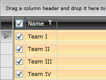

# Select Column

The __GridViewSelectColumn__ derives from the __GridViewColumn__ class and its content is represented by a CheckBox for each row. The difference between it and the __GridViewCheckBox__ column is that this one is not meant to bind to data. Instead, it allows you to select the row via the CheckBox in it, i.e. each CheckBox IsChecked property is bound to the IsSelected property of the corresponding row.

Here it is shown how to declare a column of this type.

#### __XAML__

{{region radgridview-columns-column-types-select-column_0}}

	<telerik:RadGridView x:Name="radGridView"
	                     AutoGenerateColumns="False">
	    <telerik:RadGridView.Columns>
	        <telerik:GridViewSelectColumn />
	        <telerik:GridViewDataColumn DataMemberBinding="{Binding Name}" />
	    </telerik:RadGridView.Columns>
	</telerik:RadGridView>
{{endregion}}

If you set the __SelectionMode__ property of the __RadGridView__ to either __Extended__ or __Multiple__, you will be able to select more than one row by clicking on the desired check box or to select all the rows by clicking on the check box in the header.

#### __XAML__

{{region radgridview-columns-column-types-select-column_1}}

	<telerik:RadGridView x:Name="radGridView"
	                     AutoGenerateColumns="False"
	                     SelectionMode="Extended">
	    <telerik:RadGridView.Columns>
	        <telerik:GridViewSelectColumn />
	        <telerik:GridViewDataColumn DataMemberBinding="{Binding Name}" />
	    </telerik:RadGridView.Columns>
	</telerik:RadGridView>
{{endregion}}

In case you need to get the checked CheckBox-es, you may directly work with the SelectedItems collection of the RadGridView.

# See Also

 * [CheckBox Column]() 

