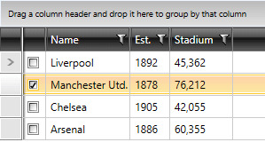
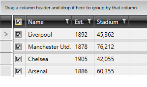
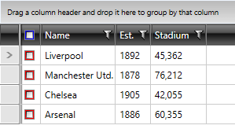

# Select Column

The __GridViewSelectColumn__ derives from [GridViewColumn]() and its content is represented by a **CheckBox** for each row. Contrary to __GridViewCheckBoxColumn__,  __GridViewSelectColumn__ does not bind to data. Instead, it allows you to select a given row via a checkbox. In other words, the **IsChecked** property of each CheckBox is bound to the **IsSelected** property of the corresponding row.

__Example 1: Defining GridViewSelectColumn in XAML__

```XAML
	<telerik:RadGridView AutoGenerateColumns="False">
	    <telerik:RadGridView.Columns>
	        <telerik:GridViewSelectColumn />
	        <telerik:GridViewDataColumn DataMemberBinding="{Binding Name}" />
	    </telerik:RadGridView.Columns>
	</telerik:RadGridView>
```

#### __Figure 1: The GridViewSelectColumn__



If you set RadGridView's [**SelectionMode**]() property to either __Extended__ or __Multiple__, you will be able to:

* Select more than one row by clicking on the desired checkbox.

* Select all the rows by clicking on the checkbox in the header.

__Example 2: Define GridViewDataColumn with Extended SelectionMode__

```XAML
	<telerik:RadGridView AutoGenerateColumns="False"
	                 SelectionMode="Extended">
	    <telerik:RadGridView.Columns>
	        <telerik:GridViewSelectColumn />
	        <telerik:GridViewDataColumn DataMemberBinding="{Binding Name}" />
	    </telerik:RadGridView.Columns>
	</telerik:RadGridView>
```

#### __Figure 2: The GridViewSelectColumn with Extended SelectionMode__



## CheckBoxStyle and HeaderCheckBoxStyle

To style the respective checkboxes, you can use the two properties of type __style__ that GridViewSelectColumn exposes:

* **CheckBoxStyle**

* **HeaderCheckBoxStyle**

__Example 3: Creating appropriate styles__

```XAML
	<Style x:Key="CheckBoxStyle" TargetType="CheckBox">
	    <Setter Property="Background" Value="Red" />
	</Style>
	<Style x:Key="HeaderCheckBoxStyle" TargetType="CheckBox">
	    <Setter Property="Background" Value="Blue" />
	</Style>
```

__Example 4: Setting RadGridView's CheckBoxStyle and HeaderCheckBoxStyle__

```XAML
	<telerik:GridViewSelectColumn CheckBoxStyle="{StaticResource CheckBoxStyle}" 
	                              HeaderCheckBoxStyle="{StaticResource HeaderCheckBoxStyle}"/>
	</telerik:RadGridView.Columns>
```

**Figure 3** shows the final result:

#### __Figure 3: The styled GridViewSelectColumn__



## See Also

 * [Column Selection]()

 * [CheckBox Column]()

 * [Multiple Selection]()

