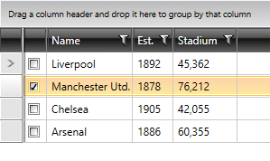
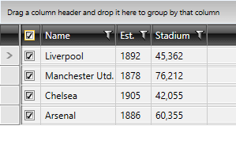
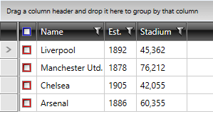

# Select Column

The __GridViewSelectColumn__ derives from [GridViewColumn]() and its content is represented by a **CheckBox** for each row. Contrary to __GridViewCheckBoxColumn__,  __GridViewSelectColumn__ does not bind to data. Instead, it allows you to select a given row via a checkbox. In other words, the **IsChecked** property of each CheckBox is bound to the **IsSelected** property of the corresponding row.

__Example 1: Defining GridViewSelectColumn in XAML__

<snippet id='radgridview-columns-columntypes-column-types-select-column-example_1_defining_gridviewselectcolumn_in_xaml-xaml' />

#### __Figure 1: The GridViewSelectColumn__

If you set RadGridView's [**SelectionMode**]() property to either __Extended__ or __Multiple__, you will be able to:

* Select more than one row by clicking on the desired checkbox.

* Select all the rows by clicking on the checkbox in the header.

__Example 2: Define GridViewDataColumn with Extended SelectionMode__

<snippet id='radgridview-columns-columntypes-column-types-select-column-example_2_define_gridviewdatacolumn_with_extended_selectionmode-xaml' />

#### __Figure 2: The GridViewSelectColumn with Extended SelectionMode__

## CheckBoxStyle and HeaderCheckBoxStyle

To style the respective checkboxes, you can use the two properties of type __style__ that GridViewSelectColumn exposes:

* **CheckBoxStyle**

* **HeaderCheckBoxStyle**

__Example 3: Creating appropriate styles__

<snippet id='radgridview-columns-columntypes-column-types-select-column-example_3_creating_appropriate_styles-xaml' />

__Example 4: Setting RadGridView's CheckBoxStyle and HeaderCheckBoxStyle__

<snippet id='radgridview-columns-columntypes-column-types-select-column-example_4_setting_radgridview_s_checkboxstyle_and_headercheckboxstyle-xaml' />

**Figure 3** shows the final result:

#### __Figure 3: The styled GridViewSelectColumn__

## See Also

 * [Column Selection]()

 * [CheckBox Column]()

 * [Multiple Selection]()

