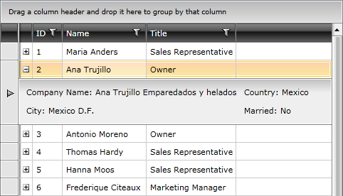

# Toggle RowDetails Column

The __GridViewToggleRowDetailsColumn__ derives from the __GridViewColumn__ class, which means that it isn't used  to display data. The column is represented by an __GridViewToggleButton__ control. Clicking on it will show the __RowDetails__ if they are available. More about row details can be found [here]().

>You should either use the __RadGridView.RowDetailsVisibilityMode__ property to control the state of __all grid rows__ or use a __GridViewToggleRowDetailsColumn__ to control the state of __each individual row__. Since the __GridViewToggleRowDetailsColumn__ operates on the respective __GridViewRow.DetailsVisibilityProperty__, having a __RadGridView.RowDetailsVisibilityMode__ different from collapsed might lead to unexpected results.

Here is a list of the most important properties.

* __ToggleButtonStyle__ - allows you to apply a style to the toggle button of the cell.

* __ExpandMode__ - allows you to specify, whether only one row details can be visible on a time. The possible values are __Single__ and __Multiple__ (default). For example, if this property is set to __Single__, expanding a new row with the toggle button will collapse the previous one.

Here it is shown how to declare a column of this type.

#### __XAML__

{{region radgridview-columns-column-types-toggle-rowdetails-column_0}}

	<telerik:RadGridView x:Name="radGridView"
	                         AutoGenerateColumns="False">
	    <telerik:RadGridView.Columns>
	        <telerik:GridViewToggleRowDetailsColumn />
	        ...
	    </telerik:RadGridView.Columns>
	</telerik:RadGridView>
{{endregion}}

