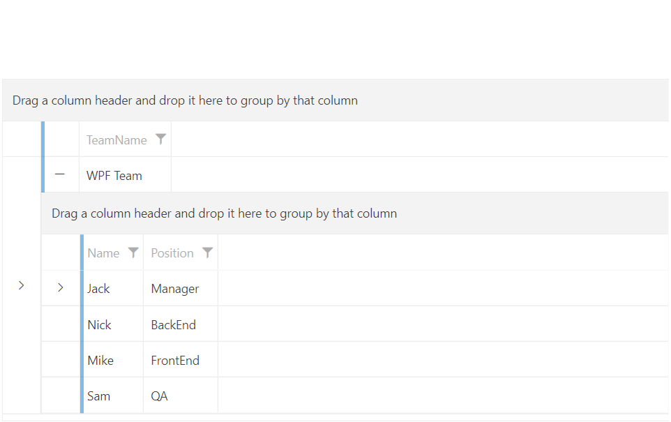
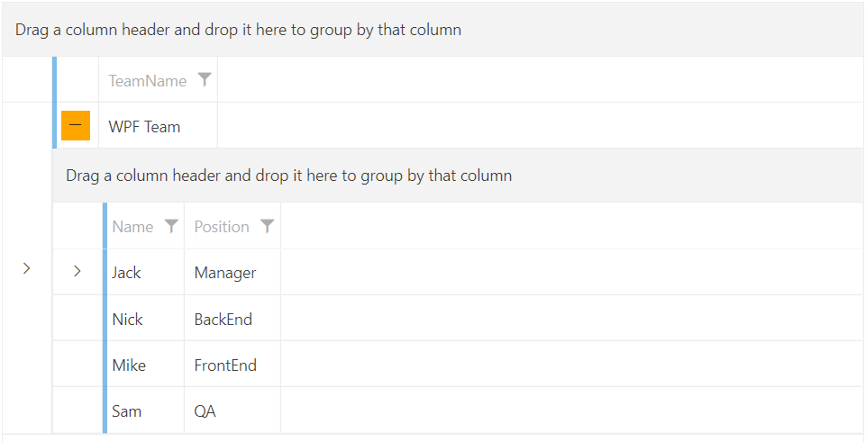

# Toggle RowDetails Column

`GridViewToggleRowDetailsColumn` derives from [GridViewColumn]() class, which means that it isn't used to display data. The column is represented by an `GridViewToggleButton` control. Clicking on it will show [RowDetails]() if they are available. This column will automatically link the created toggle buttons to the DetailsVisibilityProperty of each GridViewRow.

__Defining GridViewToggleRowDetailsColumn in XAML__
```XAML
	<telerik:RadGridView x:Name="radGridView"
	                     AutoGenerateColumns="False">
	    <telerik:RadGridView.Columns>
	        <telerik:GridViewToggleRowDetailsColumn />
	    </telerik:RadGridView.Columns>
	</telerik:RadGridView>
```

__GridViewToggleRowDetailsColumn__



>important You should either configure the `RowDetailsVisibilityMode` property of `RadGridView` to control the state of __all grid rows__ or use a GridViewToggleRowDetailsColumn to control the state of __each individual row__. Since GridViewToggleRowDetailsColumn operates on the respective DetailsVisibilityProperty of the GridViewRow, having the RowDetailsVisibilityMode property of RadGridView different from `Collapsed` might lead to unexpected results.

## Setting the Expand Mode

The GridViewToggleRowDetailsColumn exposes the `ExpandMode` property that will allow you to specify whether or not only one row details can be visible on a time. The possible values are as follows:

* `Single`&mdash;Only a single row details will be visible at a time. 
* `Multiple`&mdash;Multple row details can be visible at a time. This is the default value of the ExpandMode property.

>important If ExpandMode property is set to `Single`, expanding a new row with the toggle button will collapse the previous one.

## Stying the Toggle Button

The GridViewToggleRowDetailsColumn allows you to set a Style for the expand/collapse button. This is done via the `ToggleButtonStyle` property.

__Setting a Style for the ToggleButtonStyle__
```XAML
	<telerik:RadGridView x:Name="radGridView"
	                     AutoGenerateColumns="False">
	    <telerik:RadGridView.Columns>
			<telerik:GridViewToggleRowDetailsColumn ExpandMode="Single">
			    <telerik:GridViewToggleRowDetailsColumn.ToggleButtonStyle>
			        <Style TargetType="ToggleButton">
			            <Setter Property="Height" Value="26"/>
			            <Setter Property="Width" Value="26"/>
			            <Setter Property="Background" Value="Orange"/>
			        </Style>
			    </telerik:GridViewToggleRowDetailsColumn.ToggleButtonStyle>
			</telerik:GridViewToggleRowDetailsColumn>
	    </telerik:RadGridView.Columns>
	</telerik:RadGridView>
```

__GridViewToggleRowDetailsColumn with custom Style for the ToggleButtonStyle property__



# See also:

* [RowDetails]() 
* [Row Details Template]()
