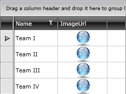

# Image Column

The __GridViewImageColumn__ derives from [GridViewBoundColumnBase](), which means that it inherits all of the functionality too. In addition, it allows you to easily configure the image's height, width and stretch.

Here is a list of the most important properties.

* __ImageStretch__ - determines the stretch mode for the images displayed in the column.

* __ImageHeight__ - height of the images displayed in the column.

* __ImageWidth__ - width of the images displayed in the column.

>tip You can bind GridViewImageColumn to a __string or a byte[] data__ via DataMemberBinding property.

__Example 1: Define GridViewImageColumn in XAML.__

```XAML
	<telerik:RadGridView x:Name="radGridView"
	                 AutoGenerateColumns="False">
	    <telerik:RadGridView.Columns>
	        <telerik:GridViewDataColumn DataMemberBinding="{Binding Name}" />
	        <telerik:GridViewImageColumn DataMemberBinding="{Binding ImageUrl}" ImageStretch="None" />
	    </telerik:RadGridView.Columns>
	</telerik:RadGridView>
```

__The resulting RadGridView__  



You can have a look at the [Image Column Filtering](https://github.com/telerik/xaml-sdk/tree/master/GridView/ImageColumnFiltering) demo from the [SDK Samples Browser](https://demos.telerik.com/xaml-sdkbrowser/) for a good example of how to override GridViewImageColumn's distinct values to be images and not a string path.

The image column exposes also the `ErrorImageSource` property which can be used to set a placeholder image for the cases when an image error occurs. Image error in this context is when the file decoding fails and the [ImageFailed](https://learn.microsoft.com/en-us/dotnet/api/system.windows.controls.image.imagefailed?view=windowsdesktop-8.0) event of the underlying `Image` control is raised.
