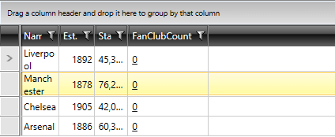

# Customizing Columns

There are three parts of the column that can be customized separately from each other:

* [Content Cells](#content-cells) 
* [Footer Cells](#footer-cells) 
* [Header Cells](#header-cells) 
* [Text Properties](#text-properties)

## Content Cells

To change the default appearance of a cell you have to either style it or template it:

* In order to template it use __CellTemplate__ property.
* If you want to style it, define an appropriate style targeting all elements of the type or set is as __CellStyle__ for a column. To learn more read the [Styling a Cell]() chapter. 
* You can also change the default look of a cell when it is in edit mode by setting an appropriate __CellEditTemplate__.

This [help article]() explains how to set __CellTemplate/CellEditTemplate__ in details.    

>In a scenario when there is a column.CellEditTemplate defined, the new value of the editor is not available in the arguments of the __CellEditEnded__ event raised when commiting an edit. To get the right value in __e.NewValue__, you can create your own [custom column]() and override its __GetNewValueFromEditor__ method.        

This [help article]() explains how to create a __custom column with a button__ in details.
        
This [help article]() explains how to create a __column with a custom editor__ in details.
        
You can also check [CellStyleSelector]() and [CellTemplateSelector]() topics on how to conditionally apply a cell style or a cell template.
        
## Footer Cells

RadGridView provides a way to change the default look and appearance of both column and group footers:
 
* to change column footers' style use __FooterCellStyle__ property. To learn more read the [Styling the Column Footers]() topic. 
* to customize group footers' style use __GroupFooterCellStyle__ property. To learn more read the [Styling the Group Footers]() topic.

To learn more about the group footers take a look at the [Group Footers]() topic. For the column footers visit the [Column Footers]() topic.

## Header Cells

To change the look and the appearance of header cells you have to define an appropriate style and set it to the __HeaderCellStyle__ property of the column. To learn how to do that take a look at the [Styling the Column Headers]() topic.

To learn more about the column headers take a look at the [Column Headers]() topic.

>The customizations apply to all cells of a type. 

## Text Properties
__GridViewColumn__ provides out-of-the-box mechanism for customizing the visual appearance of its text content. This can be achieved through the __TextWrapping__, __TextAlignment__, __TextTrimming__ and __TextDecorations__ properties.

__Example 1: Setting the Text Properties of GridViewColumn__
```XAML
	<telerik:RadGridView Name="clubsGrid" 
                     ItemsSource="{Binding Clubs}"
                     AutoGenerateColumns="False"
                     GroupRenderMode="Flat"
                     Margin="5">
            <telerik:RadGridView.Columns>
	            <telerik:GridViewDataColumn DataMemberBinding="{Binding Name}" 
	                                        TextWrapping="Wrap"/>
	            <telerik:GridViewDataColumn DataMemberBinding="{Binding Established}"
	                                        TextAlignment="Right"
	                                        Header="Est." 
	                                        DataFormatString="{}{0:yyyy}"/>
	            <telerik:GridViewDataColumn DataMemberBinding="{Binding StadiumCapacity}"
	                                        TextTrimming="WordEllipsis"
	                                        Header="Stadium" 
	                                        DataFormatString="{}{0:N0}"/>
	            <telerik:GridViewDataColumn DataMemberBinding="{Binding FanClubCount}"
                                        TextDecorations="Underline"/>
    		</telerik:RadGridView.Columns>
	</telerik:RadGridView>
```

#### __Figure 1: GridViewColumn with customized text properties__ 


## See Also
 * [Data Formatting]()
 * [Column Headers]()
 * [Column Footers]() 
 * [Add button column]()
 * [Create Custom Editor with RadGridView]()
