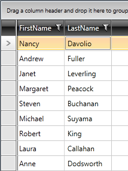

# Defining Columns

__RadGridView__ provides two mechanisms for defining its columns: 

* [Automatic columns definition](#automatic-columns-generation) based on the underlying data source. 

* [Manual columns definition](#manual-columns-definition) in XAML or code-behind. 

This help article explains how to do both with code examples. You can also 
[copy properties from one column to another](#copying-properties-from-another-column).

## Automatic Columns Generation

By default, __RadGridView__ will generate its columns automatically based on the underlying data source. When, for example, you set the __ItemsSource__ of __RadGridView__ to a collection of employees (see code in __Example 1__ and the result in __Figure 1__), the control will create a separate column for each public property of the __Employee__ object.

Specific editors will be generated for the following types:

* **String**: **TextBox** editor (default)
* **Boolean**: **CheckBox** editor accompanied by **GridViewCheckBox** element displayed in view mode 
* **DateTime**: **RadDatePicker** editor

However, if you wish to explicitly specify the column name for certain property of your data class or to prevent the creation of a column for it, use the __System.ComponentModel.DataAnnotations.DisplayAttribute__, as it is shown in **Example 1**.

#### __[C#] Example 1: Defining the business object__

{{region cs-gridview-columns-defining-columns_0}}
	public class Employee
	{
	    [DisplayAttribute(AutoGenerateField = false)]
	    public int EmployeeId
	    {
	        get;
	        set;
	    }
	    [DisplayAttribute(Name = "First Name")]
	    public string FirstName
	    {
	        get;
	        set;
	    }
	    [DisplayAttribute(Name = "Last Name")]
	    public string LastName
	    {
	        get;
	        set;
	    }
	}
{{endregion}}

#### __[VB] Defining the business object__

{{region vb-gridview-columns-defining-columns_1}}
	Public Class Employee
	    <DisplayAttribute(AutoGenerateField:=False)>
	    Public Property EmployeeId() As Integer
	        Get
	            Return m_EmployeeId
	        End Get
	        Set(value As Integer)
	            m_EmployeeId = value
	        End Set
	    End Property
	    Private m_EmployeeId As Integer
	    <DisplayAttribute(Name:="First Name")>
	    Public Property FirstName() As String
	        Get
	            Return m_FirstName
	        End Get
	        Set(value As String)
	            m_FirstName = value
	        End Set
	    End Property
	    Private m_FirstName As String
	    <DisplayAttribute(Name:="Last Name")>
	    Public Property LastName() As String
	        Get
	            Return m_LastName
	        End Get
	        Set(value As String)
	            m_LastName = value
	        End Set
	    End Property
	    Private m_LastName As String
	End Class
{{endregion}}

__Figure 1:__ The result of letting __RadGridView__ automatically generate the two columns. 

## Manual Columns Definition

Using the built-in auto generation of columns does not fit all scenarios. In such cases you can manually define the needed columns. When defining a column you can choose between several column types:

*  [GridViewColumn]() 
*  [GridViewBoundColumnBase]()
*  [Data Column]()
*  [Hyperlink Column]() 
*  [Dynamic Hyperlink Column]()
*  [Expression Column]()
*  [Image Column]()
*  [Select Column]()
*  [CheckBox Column]()
*  [ComboBox Column]()
*  [MultiColumnComboBox Column]()
*  [Masked Input Column]()
*  [Toggle Row Details Column]().

You must add the columns to the __Columns__ collection of __RadGridView__. Later on in the application lifecycle, you can easily access them via the **Columns** indexer by specifying the name of the property the column is bound to or the index of the column.

Examples 2 and 3 demonstrate how to define a column both in XAML and code-behind.

#### __[XAML] Example 2: Defining a GridViewDataColumn declaratively__

{{region xaml-gridview-columns-defining-columns_2}}
	<telerik:GridViewDataColumn/>
{{endregion}}

>You will find the column types in the same namespace (__Telerik.Windows.Controls__) and assembly (__Telerik.Windows.Controls.GridView.dll__) as __RadGridView__.

#### __[C#] Example 3: Defining a GridViewDataColumn programmatically__

{{region cs-gridview-columns-defining-columns_3}}
	GridViewDataColumn column = new GridViewDataColumn();
{{endregion}}

#### __[VB] Example 3: Defining a GridViewDataColumn programmatically__

{{region vb-gridview-columns-defining-columns_4}}
	Dim column As New GridViewDataColumn()
{{endregion}}

You can then set the column's __Header__ property and add the column to the __Columns__ collection. The __default Header__ will be the property specified as __DataMemberBinding__.
			  
#### __[XAML] Example 4: Defining a column declaratively with DataMemberBinding property set__

{{region xaml-gridview-columns-defining-columns_5}}
	<telerik:RadGridView x:Name="radGridView"
	                 AutoGenerateColumns="False">
	    <telerik:RadGridView.Columns>
	        <telerik:GridViewDataColumn DataMemberBinding="{Binding FirstName}" Header="First Name" />
	    </telerik:RadGridView.Columns>
	</telerik:RadGridView>
{{endregion}}

#### __[C#] Example 5: Defining a column programmatically with UniqueName property set__

{{region cs-gridview-columns-defining-columns_6}}
	GridViewDataColumn column = new GridViewDataColumn();
	column.DataMemberBinding = new Binding("FirstName");
	column.Header = "My Column";
	this.radGridView.AutoGenerateColumns = false;
	this.radGridView.Columns.Add(column);
{{endregion}}

#### __[VB] Example 5: Defining a column programmatically with UniqueName property set__

{{region vb-gridview-columns-defining-columns_7}}
	Dim column As New GridViewDataColumn()
	column.DataMemberBinding = New Binding("FirstName")
	column.Header = "My Column"
	Me.radGridView.AutoGenerateColumns = False
	Me.radGridView.Columns.Add(column)
{{endregion}}

Similarly, you can set any of the column's other properties or [copy them from another column](#copying-properties-from-another-column).

To access the column later, use the string used for the DataMemberBinding value or its __column index__ as a key for the __Columns__ collection.

#### __[C#] Example 6: Accessing a column by index__

{{region cs-gridview-columns-defining-columns_8}}
	var myColumn = this.radGridView.Columns["MyColumn"];
	myColumn = this.radGridView.Columns[0];
{{endregion}}

#### __[VB] Example 6: Accessing a column by index__

{{region vb-gridview-columns-defining-columns_9}}
	Dim myColumn = Me.radGridView.Columns("MyColumn")
	myColumn = Me.radGridView.Columns(0)
{{endregion}}

## Copying Properties from Another Column

__RadGridView__ provides a mechanism for easily fetching the properties of one column to another. This can be done through the __CopyPropertiesFrom__ method of __GridViewColumn__. 

#### __[C#] Example 7: Copying the properties of one column to another__

{{region cs-gridview-columns-defining-columns_14}}
	GridViewDataColumn col = new GridViewDataColumn();
	col.CopyPropertiesFrom(this.clubsGrid.Columns[0]);
	this.clubsGrid.Columns.Add(col);
{{endregion}}

#### __[VB] Example 7: Copying the properties of one column to another__

{{region cs-gridview-columns-defining-columns_14}}
	Dim col As GridViewDataColumn = New GridViewDataColumn()
	col.CopyPropertiesFrom(Me.clubsGrid.Columns(0))
	Me.clubsGrid.Columns.Add(col)
{{endregion}}

## See Also

 * [Basic Column]()
 
 * [CellTemplate and CellEditTemplate]()

 * [Customizing Columns]()
 
 * [Column Groups]()

 * [Data Formatting]()
