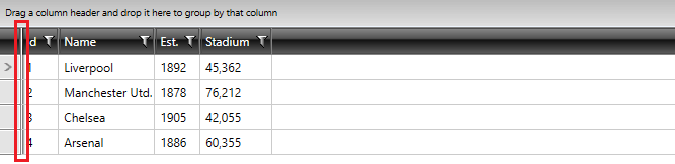
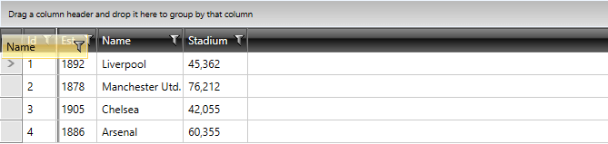
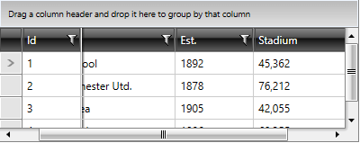
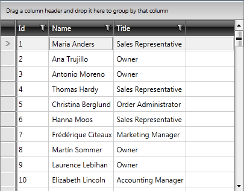
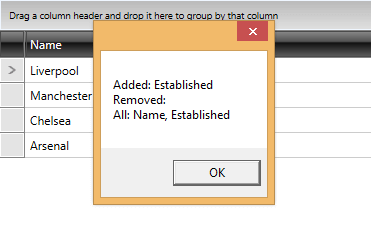

# Frozen Columns

As of __R1 2018 RadGridView__ supports pinning columns both on its left and right side. Prior this version, the __FrozenColumnsCount__ property was available, through which columns could be frozen on the left side only. With the newer functionality this property is obsolete. It is replaced with the __LeftFrozenColumnsCount__ and __RightFrozenColumnsCount__ properties.

## Left Frozen Columns

__RadGridView__ provides an easy way to select one or more columns and exclude them from the horizontal scrolling. The frozen columns stay static on top of the horizontal scrolling. To freeze a column on the left, the user has to drag the left frozen columns separator.



Once there is a frozen column, you can freeze other columns by dragging their headers behind the frozen columns separator.



Similarly, you can unfreeze columns by dragging their headers outside the frozen columns separator.

A frozen column always stays on top of horizontal scrolling.



## Right Frozen Columns

The approach of using the right side frozen columns is basically the same. The only difference is that the __RightFrozenColumnsSplitterVisibility__ property of __RadGridView__ needs to be set to set to __Visible__, as by default it is hidden. 

## Freezing Columns Programmatically 

> In order to programmatically freeze columns on the right side, the __RightFrozenColumnsSplitterVisibility__ property needs to be set to __Visible__.

You can freeze columns programmatically using the __LeftFrozenColumnCount__ and __RightFrozenColumnCount__ properties of __RadGridView__ control. They are both numeric and you have to set them to the number of columns you wish to freeze.

In __Example 1__, the first two columns are frozen starting from __left to right__.

__Example 1: Setting LeftFrozenColumnCount__

```XAML
	<telerik:RadGridView LeftFrozenColumnCount="2" />
```

__Example 1: Setting LeftFrozenColumnCount__

```C#
	this.radGridView.LeftFrozenColumnCount = 2;
```
```VB.NET
	Me.radGridView.LeftFrozenColumnCount = 2
```

In __Example 2__, the first two columns are frozen starting from __right to left__.

__Example 2: Setting RightFrozenColumnCount__

```XAML
	<telerik:RadGridView RightFrozenColumnCount="2" />
```

__Example 2: Setting RightFrozenColumnCount__

```C#
	this.radGridView.RightFrozenColumnCount = 2;
```
```VB.NET
	Me.radGridView.RightFrozenColumnCount = 2
```

## Disabling Frozen Columns

To disable the freezing of a column, just set the __CanUserFreezeColumns__ to __False__ (as shown in Example 2) and the frozen columns separator will disappear.

__Example 2: Disabling Frozen Columns__

```XAML
	<telerik:RadGridView x:Name="radGridView"
	             CanUserFreezeColumns="False" />
```



## Hiding the Left Frozen Columns Splitter

You can set the **FrozenColumnsSplitterVisibility** property of the __RadGridView__ control in order to hide/show the left frozen columns splitter.

The property has one of three values:

* **Visible:** Displays the element.
* **Hidden:** Does not display the element, but reserves space for the element in the layout.
* **Collapsed:** Does not display the element, and does not reserve space for it in the layout.

#### __Figure 1: FrozenColumnsSplitterVisibility set to Visible and Hidden/Collapsed, respectively__


## Frozen Columns Events

As of R1 2016, we've added the __FrozenColumnsChanged__ event which is fired whenever columns are frozen or unfrozen.

__Example 3__ shows that you can subscribe to the event either declaratively or at runtime like this:

__Example 3: Subscribing to the FrozenColumnsChanged Event__

```XAML
	<telerik:RadGridView x:Name="gridView"
	             FrozenColumnsChanged="gridView_FrozenColumnsChanged" />
```

__Example 3: Subscribing to the FrozenColumnsChanged Event__

```C#
	gridView.FrozenColumnsChanged += new EventHandler<FrozenColumnsChangedEventArgs>(gridView_FrozenColumnsChanged);
```
```VB.NET
	AddHandler Me.gridView.FrozenColumnsChanged, AddressOf gridView_FrozenColumnsChanged
```

Via the FrozenColumnsChangedEventArgs, you can get the:

* __AddedFrozenColumns__ - the columns that were added to the collection of frozen columns

* __RemovedFrozenColumns__ - the columns that were removed from the collection of frozen columns

* __AllFrozenColumns__ - the collection of frozen columns

__Example 4__ shows how you can get the names of the columns currently in the frozen columns collection as well as the columns added or removed from it.

__Example 4: Using the FrozenColumnsChanged Event__

```C#
	private void gridView_FrozenColumnsChanged(object sender, Telerik.Windows.Controls.GridView.GridView.FrozenColumnsChangedEventArgs e)
	{
	    var msg = "Added: " + string.Join(", ", e.AddedFrozenColumns.Select(x => x.UniqueName)) +
	        "\nRemoved: " + string.Join(", ", e.RemovedFrozenColumns.Select(x => x.UniqueName)) +
	        "\nAll: " + string.Join(", ", e.AllFrozenColumns.Select(x => x.UniqueName));
	    MessageBox.Show(msg);
	}
```
```VB.NET
	Private Sub gridView_FrozenColumnsChanged(ByVal sender As Object, ByVal e As Telerik.Windows.Controls.GridView.GridView.FrozenColumnsChangedEventArgs)
	    Dim msg = "Added: " & String.Join(", ", e.AddedFrozenColumns.Select(Function(x) x.UniqueName)) & ControlChars.Lf & "Removed: " & String.Join(", ", e.RemovedFrozenColumns.Select(Function(x) x.UniqueName)) & ControlChars.Lf & "All: " & String.Join(", ", e.AllFrozenColumns.Select(Function(x) x.UniqueName))
	    MessageBox.Show(msg)
	End Sub
```




## See Also

 * [RadGridView Overview]()

 * [Bound/Unbound Columns]()

 * [Customizing Columns]()
 
 * [Column Groups]()
