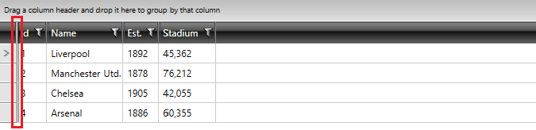
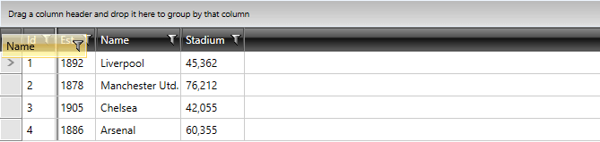
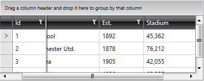
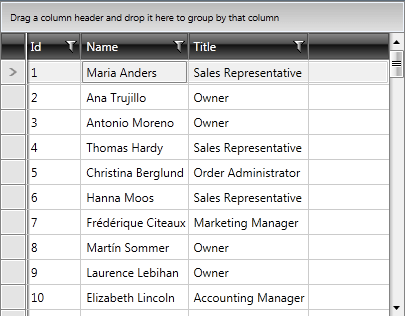
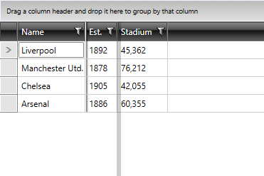
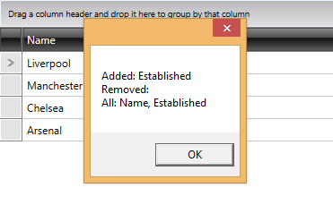

# Frozen Columns

With the __R1 2018__, `RadGridView` supports pinning columns both on its left and right side. Prior this version, the `FrozenColumnsCount` property was available, through which columns could be frozen on the left side only. With the newer functionality this property is obsolete. It is replaced with the `LeftFrozenColumnCount` and `RightFrozenColumnCount` properties.

## Left Frozen Columns

RadGridView provides an easy way to select one or more columns and exclude them from the horizontal scrolling. The frozen columns stay static on top of the horizontal scrolling. To freeze a column on the left, the user has to drag the left frozen columns separator.

Once there is a frozen column, you can freeze other columns by dragging their headers behind the frozen columns separator.

Similarly, you can unfreeze columns by dragging their headers outside the frozen columns separator.

A frozen column always stays on top of horizontal scrolling.

## Right Frozen Columns

The approach of using the right side frozen columns is basically the same. The only difference is that the `RightFrozenColumnsSplitterVisibility` property of RadGridView needs to be set to __Visible__, as by default it is hidden. 

## Freezing Columns Programmatically 

> In order to programmatically freeze columns on the right side, the RightFrozenColumnsSplitterVisibility property needs to be set to __Visible__.

You can freeze columns programmatically using the `LeftFrozenColumnCount` and `RightFrozenColumnCount` properties of RadGridView control. They are both numeric and you have to set them to the number of columns you wish to freeze.

In the following example, the first two columns are frozen starting from __left to right__.

__Setting LeftFrozenColumnCount__

<snippet id='radgridview-columns-frozen-columns-setting_leftfrozencolumncount-xaml' />

__Setting LeftFrozenColumnCount__

<snippet id='radgridview-columns-frozen-columns-setting_leftfrozencolumncount-cs' />

<snippet id='radgridview-columns-frozen-columns-setting_leftfrozencolumncount-vb' />

In the following example, the first two columns are frozen starting from __right to left__.

__Setting RightFrozenColumnCount__

<snippet id='radgridview-columns-frozen-columns-setting_rightfrozencolumncount-xaml' />

__Setting RightFrozenColumnCount__

<snippet id='radgridview-columns-frozen-columns-setting_rightfrozencolumncount-cs' />

<snippet id='radgridview-columns-frozen-columns-setting_rightfrozencolumncount-vb' />

## Disabling Frozen Columns

To disable the freezing of a column, just set the `CanUserFreezeColumns` to __False__ (as shown in the following example) and the frozen columns separator will disappear.

__Disabling Frozen Columns__

<snippet id='radgridview-columns-frozen-columns-disabling_frozen_columns-xaml' />

## Hiding the Left Frozen Columns Splitter

You can set the `FrozenColumnsSplitterVisibility` property of the RadGridView control in order to hide/show the left frozen columns splitter.

The property has one of three values:

* `Visible`&mdash;Displays the element.
* `Hidden`&mdash;Does not display the element, but reserves space for the element in the layout.
* `Collapsed`&mdash;Does not display the element, and does not reserve space for it in the layout.

#### __FrozenColumnsSplitterVisibility set to Visible and Hidden/Collapsed, respectively__

## Frozen Columns Events

The RadGridView control exposes the `FrozenColumnsChanged` event which is fired whenever columns are frozen or unfrozen.

The following example shows that you can subscribe to the event either declaratively or at runtime like this:

__Subscribing to the FrozenColumnsChanged Event__

<snippet id='radgridview-columns-frozen-columns-subscribing_to_the_frozencolumnschanged_event-xaml' />

__Subscribing to the FrozenColumnsChanged Event__

<snippet id='radgridview-columns-frozen-columns-subscribing_to_the_frozencolumnschanged_event-cs' />

<snippet id='radgridview-columns-frozen-columns-subscribing_to_the_frozencolumnschanged_event-vb' />

Via the `FrozenColumnsChangedEventArgs`, you can get the:

* `AddedFrozenColumns`&mdash;the columns that were added to the collection of frozen columns
* `RemovedFrozenColumns`&mdash;the columns that were removed from the collection of frozen columns
* `AllFrozenColumns`&mdash;the collection of frozen columns

The next example shows how you can get the names of the columns currently in the frozen columns collection as well as the columns added or removed from it.

__Using the FrozenColumnsChanged Event__

<snippet id='radgridview-columns-frozen-columns-using_the_frozencolumnschanged_event-cs' />

<snippet id='radgridview-columns-frozen-columns-using_the_frozencolumnschanged_event-vb' />

## Frozen Columns Threshold

The RadGridView control allows you to specify a threshold for both the left and right frozen columns' splitters when dragging. This controls the amount of drag that needs to be performed for the column to be frozen or unfrozen. To customize the threshold, you can set utilize the `LeftFrozenColumnSplitterThreshold` and `RightFrozenColumnSplitterThreshold` properties of the RadGridView control. The properties are of type `double` and accepted values are between __0__ and __1__. Setting one of the properties to __0__ means that the column will be frozen/unfrozen immediately when the splitter is dragged and __1__ means that the column will be frozen/unfrozen only when the splitter is dragged all the way to the end of the column's width. The default value for both properties is __0.5__, which means that the column will be frozen/unfrozen when the splitter is dragged at least half of the column's width.

__Setting the LeftFrozenColumnSplitterThreshold and RightFrozenColumnSplitterThreshold Properties__

<snippet id='radgridview-columns-frozen-columns-setting_the_leftfrozencolumnsplitterthreshold_and_rightfrozencolumnsplitterthreshold_properties-xaml' />

<snippet id='radgridview-columns-frozen-columns-setting_the_leftfrozencolumnsplitterthreshold_and_rightfrozencolumnsplitterthreshold_properties-cs' />

<snippet id='radgridview-columns-frozen-columns-setting_the_leftfrozencolumnsplitterthreshold_and_rightfrozencolumnsplitterthreshold_properties-vb' />

## See Also

 * [RadGridView Overview]()
 * [Bound/Unbound Columns]()
 * [Customizing Columns]()

 * [Column Groups]()
