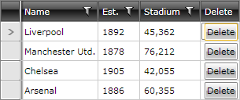

# Add a Button Column

This article demonstrates how to add a column with a delete button for each row. We will benefit from the static [RadGridViewCommands]() class to automatically delete the corresponding row item upon clicking the button. **Figure 1** illustrates the desired result.

#### Figure 1: RadGridView with custom button column

There are several ways to achieve this. Let's look at some of them.

* [Create a Custom Column](#create-a-custom-column)
* [Use the GridViewColumn's CellTemplate Property](#use-the-gridviewcolumns-celltemplate-property)

## Create a Custom Column

This approach involves inheriting from __GridViewColumn__ and overriding the __CreateCellElement__ method. In this method, you can create the button (if it has not already been created) and set its properties as demonstrated in **Example 1**.

>important In order to automatically export a custom column, it should implement the **IExportableColumn** interface.

#### __[C#] Example 1: Override the CreateCellElement method__

{{region cs-gridview-add-button-column_0}}
	public class MyButtonColumn : Telerik.Windows.Controls.GridViewColumn
	{
	    public override FrameworkElement CreateCellElement(GridViewCell cell, object dataItem)
	    {
	        RadButton button = cell.Content as RadButton;
	        if (button == null)
	        {
	            button = new RadButton();
	            button.Content = "Delete";
	            button.Command = RadGridViewCommands.Delete;
	        }
	
	        button.CommandParameter = dataItem;
	
	        return button;
	    }
	}
{{endregion}}

#### __[VB.NET] Example 1: Override the CreateCellElement method__

{{region vb-gridview-add-button-column_0}}
	Public Class MyButtonColumn
	Inherits Telerik.Windows.Controls.GridViewColumn

		Public Overrides Function CreateCellElement(ByVal cell As GridViewCell, ByVal dataItem As Object) As FrameworkElement
			Dim button As RadButton = TryCast(cell.Content, RadButton)
			If button Is Nothing Then
				button = New RadButton()
				button.Content = "Delete"
				button.Command = RadGridViewCommands.Delete
			End If

			button.CommandParameter = dataItem

			Return button
		End Function
	End Class
{{endregion}}

Now you need to add this custom column to our RadGridView's **Columns** collection. **Example 2** shows how to do this in XAML.

#### __[XAML] Example 2: Define the custom column in XAML__

{{region xaml-gridview-add-button-column_1}}
	<telerik:RadGridView.Columns>
	    <!-- ... -->
	    <my:MyButtonColumn Header="Delete" />
	</telerik:RadGridView.Columns>
{{endregion}}

The same can be achieved in code-behind as illustrated in **Example 3**.

#### __[C#] Example 3: Define the custom column in code-behind__

{{region cs-gridview-add-button-column_2}}
	private void clubsGrid_DataLoaded(object sender, EventArgs e)
	{
	    this.clubsGrid.Columns.Add(new MyButtonColumn()
	    {
	        Header = "Delete"
	    });
	}
{{endregion}}

#### __[VB.NET] Example 3: Define the custom column in code-behind__

{{region vb-gridview-add-button-column_2}}
	Private Sub clubsGrid_DataLoaded(ByVal sender As Object, ByVal e As EventArgs)
		Me.clubsGrid.Columns.Add(New MyButtonColumn() With {.Header = "Delete"})
	End Sub
{{endregion}}

## Use the GridViewColumn's CellTemplate Property

With this approach we will re-define the template of the cells for that column. In this case, we specify a simple **DataTemplate** which contains our delete button.

#### __[XAML] Specify the GridViewColumn's CellTemplate__

{{region xaml-gridview-add-button-column_3}}
	<telerik:RadGridView.Columns>
	    <!-- ... -->
	    <telerik:GridViewColumn Header="Delete" >
	        <telerik:GridViewColumn.CellTemplate>
	            <DataTemplate>
	                <telerik:RadButton Content="Delete" 
	                        Command="telerik:RadGridViewCommands.Delete"
	                        CommandParameter="{Binding}" />
	            </DataTemplate>
	        </telerik:GridViewColumn.CellTemplate>
	    </telerik:GridViewColumn>
	</telerik:RadGridView.Columns>
{{endregion}}

Notice that we've set the **Command** of the button to the **RadGridViewCommands.Delete** command and passed in the current row item (the DataContext of the cell) as the **CommandParameter**.

## See Also

 * [CellTemplate and CellEditTemplate]()
 * [Create Custom Column Editor]()
 * [Create Custom Editor with RadGridView]()
