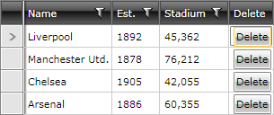

# Customize Cell Content

This article demonstrates how to add a column with a delete button for each row. We will benefit from the static [RadGridViewCommands]() class to automatically delete the corresponding row item upon clicking the button. The following image illustrates the desired result.

__RadGridView with custom button column__

There are several ways to achieve this. Let's look at some of them.

* [Create a Custom Column](#create-a-custom-column)
* [Use the GridViewColumn's CellTemplate Property](#use-the-gridviewcolumn-celltemplate-property)

## Create a Custom Column

This approach involves inheriting from `GridViewColumn` and overriding the `CreateCellElement` method. In this method, you can create the button (if it has not already been created) and set its properties as demonstrated in the following example.

>important In order to automatically export a custom column, it should implement the `IExportableColumn` interface.

__Override the CreateCellElement method__

<snippet id='radgridview-columns-how-to-add-button-column-override_the_createcellelement_method-cs' />

<snippet id='radgridview-columns-how-to-add-button-column-override_the_createcellelement_method-vb' />

Now you need to add this custom column to our RadGridView's `Columns` collection. The below shows how to do this in XAML.

__Define the custom column in XAML__

<snippet id='radgridview-columns-how-to-add-button-column-define_the_custom_column_in_xaml-xaml' />

The same can be achieved in code-behind as illustrated below.

__Define the custom column in code-behind__

<snippet id='radgridview-columns-how-to-add-button-column-define_the_custom_column_in_code_behind-cs' />

<snippet id='radgridview-columns-how-to-add-button-column-define_the_custom_column_in_code_behind-vb' />

## Use the GridViewColumn CellTemplate Property

With this approach we will re-define the template of the cells for that column. In this case, we specify a simple `DataTemplate` which contains our delete button.

__Specify the GridViewColumn's CellTemplate__

<snippet id='radgridview-columns-how-to-add-button-column-specify_the_gridviewcolumn_s_celltemplate-xaml' />

Notice that we've set the `Command` of the button to the `RadGridViewCommands.Delete` command and passed in the current row item (the DataContext of the cell) as the `CommandParameter`.

## See Also

 * [CellTemplate and CellEditTemplate]()
 * [Create Custom Column Editor]()
 * [Create Custom Editor with RadGridView]()
