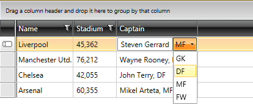

# Create Custom Column Editor

This tutorial will guide you through the common task of creating a custom column in __RadGridView__. More precisely, you will learn to create a UserControl with __TextBox__ and __RadComboBox__, as well as a custom bound column that uses it as an edit element.

* In the beginning you need __RadGridView__ populated with sample data. Below are the business object definition (__Example 1__), as well as __RadGridView__ declaration (__Example 2__).
			
__Example 1: Business object definition__

```C#
	public class Club : INotifyPropertyChanged
	{
	    private string name;
	    private DateTime established;
	    private int stadiumCapacity;
	    private Captain captain;
	
	    public Club(string name, DateTime established, int stadiumCapacity, Captain captain)
	    {
	        this.name = name;
	        this.established = established;
	        this.stadiumCapacity = stadiumCapacity;
	        this.captain = captain;
	    }
	
	    public String Name
	    {
	        get { return this.name; }
	        set
	        {
	            if (this.name != value)
	            {
	                this.name = value;
	                this.OnPropertyChanged("Name");
	            }
	        }
	    }
	
	    public DateTime Established
	    {
	        get
	        {
	            return this.established;
	        }
	        set
	        {
	            if (this.established != value)
	            {
	                this.established = value;
	                this.OnPropertyChanged("Established");
	            }
	        }
	    }
	
	    public int StadiumCapacity
	    {
	        get { return this.stadiumCapacity; }
	        set
	        {
	            if (this.stadiumCapacity != value)
	            {
	                this.stadiumCapacity = value;
	                this.OnPropertyChanged("StadiumCapacity");
	            }
	        }
	    }
	
	    public Captain Captain
	    {
	        get
	        {
	            return this.captain;
	        }
	        set
	        {
	            if (this.captain != value)
	            {
	                this.captain = value;
	                this.OnPropertyChanged("Captain");
	            }
	        }
	    }
	
	    public static ObservableCollection<Club> GetClubs()
	    {
	        ObservableCollection<Club> clubs = new ObservableCollection<Club>();
	
	        clubs.Add(new Club("Liverpool", new DateTime(1892, 1, 1, 13, 35, 15), 45362, new Captain("Steven Gerrard", Position.MF)));
	        clubs.Add(new Club("Manchester Utd.", new DateTime(1878, 1, 1, 18, 45, 25), 76212, new Captain("Wayne Rooney", Position.FW)));
	        clubs.Add(new Club("Chelsea", new DateTime(1905, 1, 1, 23, 45, 35), 42055, new Captain("John Terry", Position.DF)));
	        clubs.Add(new Club("Arsenal", new DateTime(1886, 1, 1, 4, 55, 45), 60355, new Captain("Mikel Arteta", Position.MF)));
	
	        return clubs;
	    }
	
	    public event PropertyChangedEventHandler PropertyChanged;
	
	    protected virtual void OnPropertyChanged(PropertyChangedEventArgs args)
	    {
	        PropertyChangedEventHandler handler = this.PropertyChanged;
	        if (handler != null)
	        {
	            handler(this, args);
	        }
	    }
	
	    private void OnPropertyChanged(string propertyName)
	    {
	        this.OnPropertyChanged(new PropertyChangedEventArgs(propertyName));
	    }
	}
```
```VB.NET
	Public Class Club
	    Implements INotifyPropertyChanged
	    Private _name As String
	    Private _established As Date
	    Private _stadiumCapacity As Integer
	    Private _captain As Captain
	
	    Public Sub New(ByVal name As String, ByVal established As Date, ByVal stadiumCapacity As Integer, ByVal captain As Captain)
	        Me._name = name
	        Me._established = established
	        Me._stadiumCapacity = stadiumCapacity
	        Me._captain = captain
	    End Sub
	
	    Public Property Name() As String
	        Get
	            Return Me._name
	        End Get
	        Set(ByVal value As String)
	            If Me._name <> value Then
	                Me._name = value
	                Me.OnPropertyChanged("Name")
	            End If
	        End Set
	    End Property
	
	    Public Property Established() As Date
	        Get
	            Return Me._established
	        End Get
	        Set(ByVal value As Date)
	            If Me._established <> value Then
	                Me._established = value
	                Me.OnPropertyChanged("Established")
	            End If
	        End Set
	    End Property
	
	    Public Property StadiumCapacity() As Integer
	        Get
	            Return Me._stadiumCapacity
	        End Get
	        Set(ByVal value As Integer)
	            If Me._stadiumCapacity <> value Then
	                Me._stadiumCapacity = value
	                Me.OnPropertyChanged("StadiumCapacity")
	            End If
	        End Set
	    End Property
	
	    Public Property Captain() As Captain
	        Get
	            Return Me._captain
	        End Get
	        Set(ByVal value As Captain)
	            If Me._captain IsNot value Then
	                Me._captain = value
	                Me.OnPropertyChanged("Captain")
	            End If
	        End Set
	    End Property
	
	    Public Shared Function GetClubs() As ObservableCollection(Of Club)
	        Dim clubs As New ObservableCollection(Of Club)()
	
	        clubs.Add(New Club("Liverpool", New Date(1892, 1, 1, 13, 35, 15), 45362, New Captain("Steven Gerrard", Position.MF)))
	        clubs.Add(New Club("Manchester Utd.", New Date(1878, 1, 1, 18, 45, 25), 76212, New Captain("Wayne Rooney", Position.FW)))
	        clubs.Add(New Club("Chelsea", New Date(1905, 1, 1, 23, 45, 35), 42055, New Captain("John Terry", Position.DF)))
	        clubs.Add(New Club("Arsenal", New Date(1886, 1, 1, 4, 55, 45), 60355, New Captain("Mikel Arteta", Position.MF)))
	
	        Return clubs
	    End Function
	
	    Public Event PropertyChanged As PropertyChangedEventHandler Implements INotifyPropertyChanged.PropertyChanged
	
	    Protected Overridable Sub OnPropertyChanged(ByVal args As PropertyChangedEventArgs)
	        Dim handler As PropertyChangedEventHandler = Me.PropertyChangedEvent
	        If handler IsNot Nothing Then
	            handler(Me, args)
	        End If
	    End Sub
	
	    Private Sub OnPropertyChanged(ByVal propertyName As String)
	        Me.OnPropertyChanged(New PropertyChangedEventArgs(propertyName))
	    End Sub
	End Class
```

Note, that the __Club__ object has a __Captain__ property. The __Captain__ object itself, has two properties — __Name__, which is of type **string**, and __Position__, which is an **Enum**.

__Example 2: Initial declaration of RadGridView__

```XAML
	<telerik:RadGridView x:Name="radGridView" AutoGenerateColumns="False" ItemsSource="{Binding Clubs}">
	    <telerik:RadGridView.Columns>
	        <telerik:GridViewDataColumn DataMemberBinding="{Binding Name}" Header="Name" />
	        <telerik:GridViewDataColumn DataFormatString="{}{0:N0}"
	                        DataMemberBinding="{Binding StadiumCapacity}"
	                        Header="Stadium" />
	        <local:CustomColumn DataMemberBinding="{Binding Captain}" FilterMemberPath="Position"/>
	    </telerik:RadGridView.Columns>
	</telerik:RadGridView>
```

__Example 3: Populating RadGridView__

```C#
	this.radGridView.ItemsSource = Club.GetClubs();
```
```VB.NET
	Me.radGridView.ItemsSource = Club.GetClubs()
```

* The next step is to create a __UserControl__ with __TextBox__ and __RadComboBox__. Create a new __UserControl__ named __CustomCaptainEditor__ (__Example 4__ ).
			
__Example 4: Declaration of CustomCaptainEditor  UserControl__

```XAML
	<Grid>
	    <Grid.ColumnDefinitions>
	        <ColumnDefinition />
	        <ColumnDefinition />
	    </Grid.ColumnDefinitions>
	    <TextBox Text="{Binding CaptainName, Mode=TwoWay, RelativeSource={RelativeSource AncestorType=my:CustomCaptainEditor}}"/>
	    <telerik:RadComboBox   Grid.Column="1" SelectedValue="{Binding CaptainPosition, Mode=TwoWay, RelativeSource={RelativeSource AncestorType=my:CustomCaptainEditor}}" 
	                       ItemsSource="{Binding Positions, RelativeSource={RelativeSource AncestorType=my:CustomCaptainEditor}}"
	                       DisplayMemberPath="Name" SelectedValuePath="Value"/>
	</Grid>
```

__Example 5: Code-behind definition of the CustomCaptainEditor UserControl__

```C#
	public partial class CustomCaptainEditor : UserControl
	{
	    public static readonly DependencyProperty CaptainNameProperty =
	       DependencyProperty.Register("CaptainName", typeof(String), typeof(CustomCaptainEditor), new PropertyMetadata(null));
	
	    public static readonly DependencyProperty CaptainPositionProperty =
	        DependencyProperty.Register("CaptainPosition", typeof(Position), typeof(CustomCaptainEditor), new PropertyMetadata(null));
	
	    public CustomCaptainEditor()
	    {
	        InitializeComponent();
	    }
	
	    public String CaptainName
	    {
	        get
	        {
	            return (String)this.GetValue(CaptainNameProperty);
	        }
	        set
	        {
	            this.SetValue(CaptainNameProperty, value);
	        }
	    }
	
	    public Position CaptainPosition
	    {
	        get
	        {
	            return (Position)this.GetValue(CaptainPositionProperty);
	        }
	        set
	        {
	            this.SetValue(CaptainPositionProperty, value);
	        }
	    }
	
	    private IEnumerable<EnumMemberViewModel> positions;
	
	    public IEnumerable<EnumMemberViewModel> Positions
	    {
	        get
	        {
	            if (this.positions == null)
	            {
	                this.positions = EnumDataSource.FromType(typeof(Position));
	            }
	            return this.positions;
	        }
	    }
	}
```
```VB.NET
	Partial Public Class CustomCaptainEditor
	    Inherits UserControl
	
	    Public Shared ReadOnly CaptainNameProperty As DependencyProperty = DependencyProperty.Register("CaptainName", GetType(String), GetType(CustomCaptainEditor), New PropertyMetadata(Nothing))
	
	    Public Shared ReadOnly CaptainPositionProperty As DependencyProperty = DependencyProperty.Register("CaptainPosition", GetType(Position), GetType(CustomCaptainEditor), New PropertyMetadata(Nothing))
	
	    Public Sub New()
	        InitializeComponent()
	    End Sub
	
	    Public Property CaptainName() As String
	        Get
	            Return CStr(Me.GetValue(CaptainNameProperty))
	        End Get
	        Set(ByVal value As String)
	            Me.SetValue(CaptainNameProperty, value)
	        End Set
	    End Property
	
	    Public Property CaptainPosition() As Position
	        Get
	            Return CType(Me.GetValue(CaptainPositionProperty), Position)
	        End Get
	        Set(ByVal value As Position)
	            Me.SetValue(CaptainPositionProperty, value)
	        End Set
	    End Property
	    
	    Private _positions As IEnumerable(Of EnumMemberViewModel)
	
	    Public ReadOnly Property Positions() As IEnumerable(Of EnumMemberViewModel)
	        Get
	            If Me._positions Is Nothing Then
	                Me._positions = EnumDataSource.FromType(GetType(Position))
	            End If
	            Return Me._positions
	        End Get
	    End Property
	End Class
```

Take a look at the code-behind of the control. Two additional dependency properties are created in order to enable binding to the __Name__ and __Position__ properties of the business model.

* Create a new class named __CustomColumn__, which derives from __GridViewBoundColumnBase (Example 6)__.

__Example 6: Definition of CustomColumn class__

```C#
	public class CustomColumn : GridViewBoundColumnBase
	{
	   public override FrameworkElement CreateCellElement(GridViewCell cell, object dataItem)
	   {
	       TextBlock tb = cell.Content as TextBlock;
	       if (tb == null)
	       {
	           tb = new TextBlock();
	           tb.SetBinding(TextBlock.TextProperty, new Binding(this.DataMemberBinding.Path.Path) { Converter = new MyConverter() });
	       }
	
	       return tb;
	   }
	
	   public override FrameworkElement CreateCellEditElement(GridViewCell cell, object dataItem)
	   {
	       var editor = new CustomCaptainEditor();
	
	       editor.SetBinding(CustomCaptainEditor.CaptainNameProperty,
	           CreateBinding(string.Format("{0}.Name", this.DataMemberBinding.Path.Path)));
	       editor.SetBinding(CustomCaptainEditor.CaptainPositionProperty,
	           CreateBinding(string.Format("{0}.Position", this.DataMemberBinding.Path.Path)));
	
	       return editor;
	   }
	
	   private Binding CreateBinding(string property)
	   {
	       Binding binding = new Binding(property);
	       binding.Mode = BindingMode.TwoWay;
	       binding.UpdateSourceTrigger = UpdateSourceTrigger.PropertyChanged;
	
	       return binding;
	   }
	}
```
```VB.NET
	Public Class CustomColumn
	    Inherits GridViewBoundColumnBase
	
	    Public Overrides Function CreateCellElement(ByVal cell As GridViewCell, ByVal dataItem As Object) As FrameworkElement
	        Dim tb As TextBlock = TryCast(cell.Content, TextBlock)
	        If tb Is Nothing Then
	            tb = New TextBlock()
	            tb.SetBinding(TextBlock.TextProperty, New Binding(Me.DataMemberBinding.Path.Path) With {.Converter = New MyConverter()})
	        End If
	
	        Return tb
	    End Function
	
	    Public Overrides Function CreateCellEditElement(ByVal cell As GridViewCell, ByVal dataItem As Object) As FrameworkElement
	        Dim editor = New CustomCaptainEditor()
	
	        editor.SetBinding(CustomCaptainEditor.CaptainNameProperty, CreateBinding(String.Format("{0}.Name", Me.DataMemberBinding.Path.Path)))
	        editor.SetBinding(CustomCaptainEditor.CaptainPositionProperty, CreateBinding(String.Format("{0}.Position", Me.DataMemberBinding.Path.Path)))
	
	        Return editor
	    End Function
	
	    Private Function CreateBinding(ByVal [property] As String) As Binding
	        Dim binding As New Binding([property])
	        binding.Mode = BindingMode.TwoWay
	        binding.UpdateSourceTrigger = UpdateSourceTrigger.PropertyChanged
	
	        Return binding
	    End Function
	End Class
```

>In a scenario when there is a column.CellEditTemplate defined, the new value of the editor is not available in the arguments of the __CellEditEnded__ event raised when commiting an edit. To get the right value in __e.NewValue__, you should override the column's __GetNewValueFromEditor__ method.

Here is the code of the custom converter we have used:

__Example 7: The MyConverter class__

```C#
	public class MyConverter : IValueConverter
	{
	    public object Convert(object value, Type targetType, object parameter, System.Globalization.CultureInfo culture)
	    {
	        var captain = value as Captain;
	        if (String.IsNullOrEmpty(captain.Name))
	        {
	            return String.Format("{0}", captain.Position);
	        }
	
	        return String.Format("{0}, {1}", captain.Name, captain.Position);
	    }
	
	    public object ConvertBack(object value, Type targetType, object parameter, System.Globalization.CultureInfo culture)
	    {
	        return value;
	    }
	}
```
```VB.NET
	public class MyConverter : IValueConverter
	{
	    public object Convert(object value, Type targetType, object parameter, System.Globalization.CultureInfo culture)
	    {
	        var captain = value as Captain;
	        if (String.IsNullOrEmpty(captain.Name))
	        {
	            return String.Format("{0}", captain.Position);
	        }
	
	        return String.Format("{0}, {1}", captain.Name, captain.Position);
	    }
	
	    public object ConvertBack(object value, Type targetType, object parameter, System.Globalization.CultureInfo culture)
	    {
	        return value;
	    }
	}
```

* Run your demo and try to edit a cell from the new custom column. The result should be similar to the snapshot in __Figure 1__.

#### __Figure 1: Snapshot of the created CustomColumn__



>tip You can download a runnable project of the previous example from the online SDK repository [CustomColumnEditor](https://github.com/telerik/xaml-sdk/tree/master/GridView/CustomColumnEditor).

>You can also check the [SDK Samples Browser]() that provides a more convenient approach to exploring and executing the examples in the Telerik XAML SDK repository. 

## See Also
 
 * [Add a button column]()

 * [Create Custom Editor with RadGridView]()


 
