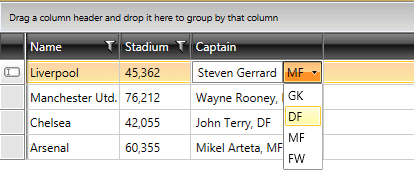

# Create Custom Column Editor

This tutorial will guide you through the common task of creating a custom column in __RadGridView__. More precisely, you will learn to create a UserControl with __TextBox__ and __RadComboBox__, as well as a custom bound column that uses it as an edit element.

* In the beginning you need __RadGridView__ populated with sample data. Below are the business object definition (__Example 1__), as well as __RadGridView__ declaration (__Example 2__).
			
__Example 1: Business object definition__

<snippet id='radgridview-columns-how-to-create-custom-column-editor-example_1_business_object_definition-cs' />

<snippet id='radgridview-columns-how-to-create-custom-column-editor-example_1_business_object_definition-vb' />

Note, that the __Club__ object has a __Captain__ property. The __Captain__ object itself, has two properties — __Name__, which is of type **string**, and __Position__, which is an **Enum**.

__Example 2: Initial declaration of RadGridView__

<snippet id='radgridview-columns-how-to-create-custom-column-editor-example_2_initial_declaration_of_radgridview-xaml' />

__Example 3: Populating RadGridView__

<snippet id='radgridview-columns-how-to-create-custom-column-editor-example_3_populating_radgridview-cs' />

<snippet id='radgridview-columns-how-to-create-custom-column-editor-example_3_populating_radgridview-vb' />

* The next step is to create a __UserControl__ with __TextBox__ and __RadComboBox__. Create a new __UserControl__ named __CustomCaptainEditor__ (__Example 4__ ).
			
__Example 4: Declaration of CustomCaptainEditor  UserControl__

<snippet id='radgridview-columns-how-to-create-custom-column-editor-example_4_declaration_of_customcaptaineditor_usercontrol-xaml' />

__Example 5: Code-behind definition of the CustomCaptainEditor UserControl__

<snippet id='radgridview-columns-how-to-create-custom-column-editor-example_5_code_behind_definition_of_the_customcaptaineditor_usercontrol-cs' />

<snippet id='radgridview-columns-how-to-create-custom-column-editor-example_5_code_behind_definition_of_the_customcaptaineditor_usercontrol-vb' />

Take a look at the code-behind of the control. Two additional dependency properties are created in order to enable binding to the __Name__ and __Position__ properties of the business model.

* Create a new class named __CustomColumn__, which derives from __GridViewBoundColumnBase (Example 6)__.

__Example 6: Definition of CustomColumn class__

<snippet id='radgridview-columns-how-to-create-custom-column-editor-example_6_definition_of_customcolumn_class-cs' />

<snippet id='radgridview-columns-how-to-create-custom-column-editor-example_6_definition_of_customcolumn_class-vb' />

>In a scenario when there is a column.CellEditTemplate defined, the new value of the editor is not available in the arguments of the __CellEditEnded__ event raised when commiting an edit. To get the right value in __e.NewValue__, you should override the column's __GetNewValueFromEditor__ method.

Here is the code of the custom converter we have used:

__Example 7: The MyConverter class__

<snippet id='radgridview-columns-how-to-create-custom-column-editor-example_7_the_myconverter_class-cs' />

<snippet id='radgridview-columns-how-to-create-custom-column-editor-example_7_the_myconverter_class-vb' />

* Run your demo and try to edit a cell from the new custom column. The result should be similar to the snapshot in __Figure 1__.

#### __Figure 1: Snapshot of the created CustomColumn__

>tip You can download a runnable project of the previous example from the online SDK repository [CustomColumnEditor](https://github.com/telerik/xaml-sdk/tree/master/GridView/CustomColumnEditor).

>You can also check the [SDK Samples Browser]() that provides a more convenient approach to exploring and executing the examples in the Telerik XAML SDK repository. 

## See Also
 
 * [Add a button column]()

 * [Create Custom Editor with RadGridView]()

 
