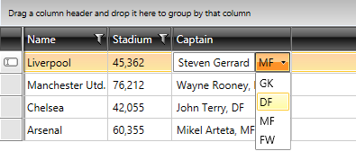

# Create Custom Column Editor

This tutorial will guide you through the common task of creating a custom column in __RadGridView__. More precisely, a UserControl with __TextBox__ and __RadComboBox__, as well as a custom bound column that uses it as an edit element, will be created.

* In the beginning you need __RadGridView__ populated with sample data. Below are the business object definition ( __Example 1__), as well as __RadGridView__ declaration( __Example 2__).
			
#### __[C#] Example 1: Business object definition.__

{{region gridview-how-to-create-custom-captain-editor-column_0}}

	 public class Club : INotifyPropertyChanged
    {
        private string name;
        private DateTime established;
        private int stadiumCapacity;
        private Captain captain;

        public Club(string name, DateTime established, int stadiumCapacity, Captain captain)
        {
            this.name = name;
            this.established = established;
            this.stadiumCapacity = stadiumCapacity;
            this.captain = captain;
        }

        public String Name
        {
            get { return this.name; }
            set
            {
                if (this.name != value)
                {
                    this.name = value;
                    this.OnPropertyChanged("Name");
                }
            }
        }

        public DateTime Established
        {
            get
            {
                return this.established;
            }
            set
            {
                if (this.established != value)
                {
                    this.established = value;
                    this.OnPropertyChanged("Established");
                }
            }
        }

        public int StadiumCapacity
        {
            get { return this.stadiumCapacity; }
            set
            {
                if (this.stadiumCapacity != value)
                {
                    this.stadiumCapacity = value;
                    this.OnPropertyChanged("StadiumCapacity");
                }
            }
        }

        public Captain Captain
        {
            get
            {
                return this.captain;
            }
            set
            {
                if (this.captain != value)
                {
                    this.captain = value;
                    this.OnPropertyChanged("Captain");
                }
            }
        }

        public static ObservableCollection<Club> GetClubs()
        {
            ObservableCollection<Club> clubs = new ObservableCollection<Club>();

            clubs.Add(new Club("Liverpool", new DateTime(1892, 1, 1, 13, 35, 15), 45362, new Captain("Steven Gerrard", Position.MF)));
            clubs.Add(new Club("Manchester Utd.", new DateTime(1878, 1, 1, 18, 45, 25), 76212, new Captain("Wayne Rooney", Position.FW)));
            clubs.Add(new Club("Chelsea", new DateTime(1905, 1, 1, 23, 45, 35), 42055, new Captain("John Terry", Position.DF)));
            clubs.Add(new Club("Arsenal", new DateTime(1886, 1, 1, 4, 55, 45), 60355, new Captain("Mikel Arteta", Position.MF)));

            return clubs;
        }

        public event PropertyChangedEventHandler PropertyChanged;

        protected virtual void OnPropertyChanged(PropertyChangedEventArgs args)
        {
            PropertyChangedEventHandler handler = this.PropertyChanged;
            if (handler != null)
            {
                handler(this, args);
            }
        }

        private void OnPropertyChanged(string propertyName)
        {
            this.OnPropertyChanged(new PropertyChangedEventArgs(propertyName));
        }
    }
{{endregion}}

Note, that the __Club__ object has a __Captain__ property. The __Captain__ object itself, has two properties— __Name__, which is of type string and __Position__ which is an enum.

#### __[XAML] Example 2: Initial declaration of RadGridView.__

{{region gridview-how-to-create-custom-captain-editor-column_0}}

	<telerik:RadGridView x:Name="radGridView" AutoGenerateColumns="False" ItemsSource="{Binding Clubs}">
            <telerik:RadGridView.Columns>
                <telerik:GridViewDataColumn DataMemberBinding="{Binding Name}" Header="Name" />
                <telerik:GridViewDataColumn DataFormatString="{}{0:N0}"
				                            DataMemberBinding="{Binding StadiumCapacity}"
				                            Header="Stadium" />
                <local:CustomColumn DataMemberBinding="{Binding Captain}" FilterMemberPath="Position"/>
            </telerik:RadGridView.Columns>
        </telerik:RadGridView>
{{endregion}}

#### __[C#] Example 3: Populating RadGridView.__

{{region gridview-how-to-create-date-time-picker-column_1}}

	this.radGridView.ItemsSource = Club.GetClubs();
{{endregion}}

* The next step is to create a __UserControl__ with __TextBox__ and __RadComboBox__. Create a new __UserControl__ named __CustomCaptainEditor__ ( __Example 4__ ).
			
#### __[XAML] Example 4: Declaration of CustomCaptainEditor  UserControl__

{{region gridview-how-to-create-custom-captain-editor-column_1}}

	<UserControl x:Class="CustomColumnEditor.CustomCaptainEditor"
             xmlns="http://schemas.microsoft.com/winfx/2006/xaml/presentation"
             xmlns:x="http://schemas.microsoft.com/winfx/2006/xaml"
             xmlns:mc="http://schemas.openxmlformats.org/markup-compatibility/2006" 
             xmlns:d="http://schemas.microsoft.com/expression/blend/2008" 
             mc:Ignorable="d" 
             xmlns:my="clr-namespace:CustomColumnEditor"
             xmlns:telerik="http://schemas.telerik.com/2008/xaml/presentation"
             d:DesignHeight="300" d:DesignWidth="300">
    <Grid>
        <Grid.ColumnDefinitions>
            <ColumnDefinition />
            <ColumnDefinition />
        </Grid.ColumnDefinitions>
        <TextBox Text="{Binding CaptainName, Mode=TwoWay, RelativeSource={RelativeSource AncestorType=my:CustomCaptainEditor}}"/>
        <telerik:RadComboBox   Grid.Column="1" SelectedValue="{Binding CaptainPosition, Mode=TwoWay, RelativeSource={RelativeSource AncestorType=my:CustomCaptainEditor}}" 
                               ItemsSource="{Binding Positions, RelativeSource={RelativeSource AncestorType=my:CustomCaptainEditor}}"
                               DisplayMemberPath="Name" SelectedValuePath="Value"/>
    </Grid>
	</UserControl>
{{endregion}}

#### __[C#] Example 5: Code-behind definition of the CustomCaptainEditor UserControl.__

{{region gridview-how-to-create-custom-captain-editor-column_2}}

	 public partial class CustomCaptainEditor : UserControl
    {
        public static readonly DependencyProperty CaptainNameProperty =
           DependencyProperty.Register("CaptainName", typeof(String), typeof(CustomCaptainEditor), new PropertyMetadata(null));

        public static readonly DependencyProperty CaptainPositionProperty =
            DependencyProperty.Register("CaptainPosition", typeof(Position), typeof(CustomCaptainEditor), new PropertyMetadata(null));

        public CustomCaptainEditor()
        {
            InitializeComponent();
        }

        public String CaptainName
        {
            get
            {
                return (String)this.GetValue(CaptainNameProperty);
            }
            set
            {
                this.SetValue(CaptainNameProperty, value);
            }
        }

        public Position CaptainPosition
        {
            get
            {
                return (Position)this.GetValue(CaptainPositionProperty);
            }
            set
            {
                this.SetValue(CaptainPositionProperty, value);
            }
        }

        private IEnumerable<EnumMemberViewModel> positions;

        public IEnumerable<EnumMemberViewModel> Positions
        {
            get
            {
                if (this.positions == null)
                {
                    this.positions = EnumDataSource.FromType(typeof(Position));
                }
                return this.positions;
            }
        }
    }
{{endregion}}

Take a look at the code-behind of the control. Two additional dependency properties are created, in order to enable binding to the __Name__ and __Position__ properties of the business model.

* Create a new class named __CustomColumn__, which derives from __GridViewBoundColumnBase (Example 6)__.

#### __[C#] Example 6: Definition of DateTimePickerColumn class.__

{{region gridview-how-to-create-custom-captain-editor-column_4}}

	public class CustomColumn : GridViewBoundColumnBase
	{
	    public override FrameworkElement CreateCellElement(GridViewCell cell, object dataItem)
	    {
	        TextBlock tb = new TextBlock();
	        tb.SetBinding(TextBlock.TextProperty, new Binding(this.DataMemberBinding.Path.Path) { Converter = new MyConverter() });
	
	        return tb;
	    }
	
	    public override FrameworkElement CreateCellEditElement(GridViewCell cell, object dataItem)
	    {
	        var editor = new CustomCaptainEditor();
	
	        editor.SetBinding(CustomCaptainEditor.CaptainNameProperty,
	            CreateBinding(string.Format("{0}.Name", this.DataMemberBinding.Path.Path)));
	        editor.SetBinding(CustomCaptainEditor.CaptainPositionProperty,
	            CreateBinding(string.Format("{0}.Position", this.DataMemberBinding.Path.Path)));
	
	        return editor;
	    }
	
	    private Binding CreateBinding(string property)
	    {
	        Binding binding = new Binding(property);
	        binding.Mode = BindingMode.TwoWay;
	        binding.UpdateSourceTrigger = UpdateSourceTrigger.PropertyChanged;
	
	        return binding;
	    }
	}

{{endregion}}

>In a scenario when there is a column.CellEditTemplate defined, the new value of the editor is not available in the arguments of the __CellEditEnded__ event raised when commiting an edit. To get the right value in __e.NewValue__, you should override the column's __GetNewValueFromEditor__ method.

* Finally, go back to the __RadGridView__ XAML declaration and update it(__Example 7__).
			

#### __[XAML] Example 7: The updated declaration of RadGridView.__

{{region gridview-how-to-create-custom-captain-editor-column_2}}

	<telerik:RadGridView x:Name="radGridView" AutoGenerateColumns="False" ItemsSource="{Binding Clubs}">
            <telerik:RadGridView.Columns>
                <telerik:GridViewDataColumn DataMemberBinding="{Binding Name}" Header="Name" />
                <telerik:GridViewDataColumn DataFormatString="{}{0:N0}"
				                            DataMemberBinding="{Binding StadiumCapacity}"
				                            Header="Stadium" />
                <local:CustomColumn DataMemberBinding="{Binding Captain}" FilterMemberPath="Position"/>
            </telerik:RadGridView.Columns>
        </telerik:RadGridView>
{{endregion}}

* Run your demo and try to edit a cell from the new custom column. The result should be similar to the snapshot in __Figure 1__.
			
__Figure 1:__ Snapshot of the created CustomColumnEditor. 

>tipYou can download a runnable project of the previous example from our online SDK repository     [CreateCustomColumnEditor](https://github.com/telerik/xaml-sdk/tree/master/GridView/CreateCustomColumnEditor).

>You can also check the [SDK Samples Browser]() that provides a more convenient  approach in exploring and executing the examples in the Telerik XAML SDK repository. 

# See Also
 
 * [Add a button column]()

 * [Create Custom Editor with RadGridView]()

 
