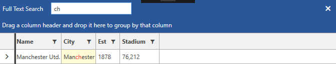

# Exclude Column from Search

__GridViewBoundColumnBase__ provides a mechanism for it to be excluded from the search mechanism. This can be achieved through its __IsSearchable__ property. It is available as of __R2 2018__. Its default value is __True__, meaning that the column will be included in the search operation. When set to __False__ the column will not take part in the searching. 

#### __Figure 1: RadGridView without having the IsSearchable set to none of its columns__

#### __Example 1: Setting the IsSearchable property to False__

{{region xaml-gridview-how-to-exclude-column-from-search_0}}
		<telerik:RadGridView Grid.Row="0" 
                             Name="clubsGrid" 
                             ItemsSource="{Binding Clubs}"
                             ShowSearchPanel="True"
                             AutoGenerateColumns="False"
                             GroupRenderMode="Flat"
                             Margin="5">
            <telerik:RadGridView.Columns>
                <telerik:GridViewDataColumn DataMemberBinding="{Binding Name}" 
                                            IsSearchable="False"/>
                <telerik:GridViewDataColumn DataMemberBinding="{Binding City}"/>
                <telerik:GridViewDataColumn DataMemberBinding="{Binding Established}" 
                                            Header="Est"
                                            DataFormatString="{}{0:yyyy}"/>
				<telerik:GridViewDataColumn DataMemberBinding="{Binding StadiumCapacity}" 
                                            Header="Stadium"
                                            DataFormatString="{}{0:N0}"/>
            </telerik:RadGridView.Columns>
		</telerik:RadGridView>
{{endregion}}

#### __Figure 2: RadGridView with having the IsSearchable set to one of its columns__

## See Also

* [Search As You Type]()
* [Basic Filtering]()
* [Programmatic Filtering]()

