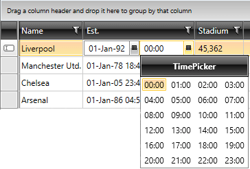

# Create Custom DateTimePicker Column

## 

This tutorial will guide you through the common task of creating a custom column in __RadGridView__. More precisely, an UserControl with __RadDatePicker__ and __RadTimePicker__, as well as a custom bound column that uses it as an edit element, will be created.

* In the beginning you need a __RadGridView__ populated with sample data. Below are the custom business object definition (__Example 1__), as well as the __RadGridView__ declaration(__Example 2__).
			

#### __[C#] Example 1: Definition of Club custom business object.__

{{region gridview-how-to-create-date-time-picker-column_0}}
	public class Club
	{
	    public Club( string name, DateTime established, int stadiumCapacity )
	    {
	        this.Name = name;
	        this.Established = established;
	        this.StadiumCapacity = stadiumCapacity;
	    }
	    public string Name
	    {
	        get;
	        set;
	    }
	    public DateTime? Established
	    {
	        get;
	        set;
	    }
	    public int StadiumCapacity
	    {
	        get;
	        set;
	    }
	    public static IEnumerable<Club> GetClubs()
	    {
	        ObservableCollection<Club> clubs = new ObservableCollection<Club>();
	        clubs.Add( new Club( "Liverpool", new DateTime( 1892, 1, 1 ), 45362 ) );
	        clubs.Add( new Club( "Manchester Utd.", new DateTime( 1878, 1, 1 ), 76212 ) );
	        clubs.Add( new Club( "Chelsea", new DateTime( 1905, 1, 1 ), 42055 ) );
	        clubs.Add( new Club( "Arsenal", new DateTime( 1886, 1, 1 ), 60355 ) );
	        return clubs;
	    }
	}
	{{endregion}}

#### __[VB] Example 1: Definition of Club custom business object.__

{{region gridview-how-to-create-date-time-picker-column_0}}
		Public Class Club
			Public Sub New(name As String, established As DateTime, stadiumCapacity As Integer)
				Me.Name = name
				Me.Established = established
				Me.StadiumCapacity = stadiumCapacity
			End Sub
			Public Property Name() As String
				Get
				End Get
				Set(value As String)
				End Set
			End Property
			Public Property Established() As System.Nullable(Of DateTime)
				Get
				End Get
				Set(value As System.Nullable(Of DateTime))
				End Set
			End Property
			Public Property StadiumCapacity() As Integer
				Get
				End Get
				Set(value As Integer)
				End Set
			End Property
			Public Shared Function GetClubs() As IEnumerable(Of Club)
				Dim clubs As New ObservableCollection(Of Club)()
				clubs.Add(New Club("Liverpool", New DateTime(1892, 1, 1), 45362))
				clubs.Add(New Club("Manchester Utd.", New DateTime(1878, 1, 1), 76212))
				clubs.Add(New Club("Chelsea", New DateTime(1905, 1, 1), 42055))
				clubs.Add(New Club("Arsenal", New DateTime(1886, 1, 1), 60355))
				Return clubs
			End Function
		End Class
	#End Region
	
	#Region "gridview-how-to-create-date-time-picker-column_1"
		Me.radGridView.ItemsSource = Club.GetClubs()
	#End Region
	
	#Region "gridview-how-to-create-date-time-picker-column_2"
		Partial Public Class DateTimePicker
			Inherits UserControl
	
			Public Shared ReadOnly SelectedDateProperty As DependencyProperty = DependencyProperty.Register("SelectedDate", GetType(Date?), GetType(DateTimePicker), New PropertyMetadata(Nothing))
	
			Public Sub New()
				InitializeComponent()
			End Sub
	
			Public Property SelectedDate() As Date?
				Get
					Return CType(Me.GetValue(SelectedDateProperty), Date?)
				End Get
				Set(ByVal value As Date?)
					Me.SetValue(SelectedDateProperty, value)
				End Set
			End Property
	
			Private Sub HandlePickersSelectionChanged()
				If Me.Calendar.SelectedDate IsNot Nothing AndAlso Me.TimePicker.SelectedTime IsNot Nothing Then
					Me.SelectedDate = Me.Calendar.SelectedDate + Me.TimePicker.SelectedTime
				End If
			End Sub
	
			Private Sub OnTimePickerSelectionChanged(ByVal sender As Object, ByVal e As System.Windows.Controls.SelectionChangedEventArgs)
				Me.HandlePickersSelectionChanged()
			End Sub
	
			Private Sub OnCalendarSelectionChanged(ByVal sender As Object, ByVal e As System.Windows.Controls.SelectionChangedEventArgs)
				Me.HandlePickersSelectionChanged()
			End Sub
		End Class
	#End Region
	
	#Region "gridview-how-to-create-date-time-picker-column_3"
		Partial Public Class DateTimePicker
			Inherits UserControl
	
			Public Shared ReadOnly SelectedDateProperty As DependencyProperty = DependencyProperty.Register("SelectedDate", GetType(Date?), GetType(DateTimePicker), New PropertyMetadata(Nothing))
	
			Public Sub New()
				InitializeComponent()
			End Sub
	
			Public Property SelectedDate() As Date?
				Get
					Return CType(Me.GetValue(SelectedDateProperty), Date?)
				End Get
				Set(ByVal value As Date?)
					Me.SetValue(SelectedDateProperty, value)
				End Set
			End Property
	
			Private Sub HandlePickersSelectionChanged()
				If Me.Calendar.SelectedDate IsNot Nothing AndAlso Me.TimePicker.SelectedTime IsNot Nothing Then
					Me.SelectedDate = Me.Calendar.SelectedDate + Me.TimePicker.SelectedTime
				End If
			End Sub
	
			Private Sub OnTimePickerSelectionChanged(ByVal sender As Object, ByVal e As Telerik.Windows.Controls.SelectionChangedEventArgs)
				Me.HandlePickersSelectionChanged()
			End Sub
	
			Private Sub OnCalendarSelectionChanged(ByVal sender As Object, ByVal e As Telerik.Windows.Controls.SelectionChangedEventArgs)
				Me.HandlePickersSelectionChanged()
			End Sub
		End Class
	#End Region
	
	#Region "gridview-how-to-create-date-time-picker-column_4"
		Public Class DateTimePickerColumn
			Inherits GridViewBoundColumnBase
	
			Public Overrides Function CreateCellEditElement(ByVal cell As GridViewCell, ByVal dataItem As Object) As FrameworkElement
				Me.BindingTarget = DateTimePicker.SelectedDateProperty
				Dim picker = New DateTimePicker()
				picker.SetBinding(Me.BindingTarget, Me.CreateValueBinding())
				Return picker
			End Function
	
			Private Function CreateValueBinding() As Binding
				Dim valueBinding = New Binding()
				valueBinding.Mode = BindingMode.TwoWay
				valueBinding.NotifyOnValidationError = True
				valueBinding.ValidatesOnExceptions = True
				valueBinding.UpdateSourceTrigger = UpdateSourceTrigger.Explicit
				valueBinding.Path = New PropertyPath(Me.DataMemberBinding.Path.Path)
				Return valueBinding
			End Function
		End Class
	#End Region
	
	End Class

#### __[XAML] Example 2: Initial declaration of RadGridView.__

{{region gridview-how-to-create-date-time-picker-column_0}}
			<telerik:RadGridView Name="radGridView" AutoGenerateColumns="False">
				<telerik:RadGridView.Columns>
					<telerik:GridViewDataColumn DataMemberBinding="{Binding Name}" Header="Name" />
					<telerik:GridViewDataColumn DataFormatString="{}{0:N0}"
					                            DataMemberBinding="{Binding StadiumCapacity}"
					                            Header="Stadium" />
				</telerik:RadGridView.Columns>
			</telerik:RadGridView>
	{{endregion}}

#### __[C#] Example 3: Populating RadGridView with sample data through its ItemsSource property.__

{{region gridview-how-to-create-date-time-picker-column_1}}
	this.radGridView.ItemsSource = Club.GetClubs();
	{{endregion}}

#### __[VB] Example 3: Populating RadGridView with sample data through its ItemsSource property.__

{{region gridview-how-to-create-date-time-picker-column_1}}
		Me.radGridView.ItemsSource = Club.GetClubs()
	#End Region
	
	#Region "gridview-how-to-create-date-time-picker-column_2"
		Partial Public Class DateTimePicker
			Inherits UserControl
	
			Public Shared ReadOnly SelectedDateProperty As DependencyProperty = DependencyProperty.Register("SelectedDate", GetType(Date?), GetType(DateTimePicker), New PropertyMetadata(Nothing))
	
			Public Sub New()
				InitializeComponent()
			End Sub
	
			Public Property SelectedDate() As Date?
				Get
					Return CType(Me.GetValue(SelectedDateProperty), Date?)
				End Get
				Set(ByVal value As Date?)
					Me.SetValue(SelectedDateProperty, value)
				End Set
			End Property
	
			Private Sub HandlePickersSelectionChanged()
				If Me.Calendar.SelectedDate IsNot Nothing AndAlso Me.TimePicker.SelectedTime IsNot Nothing Then
					Me.SelectedDate = Me.Calendar.SelectedDate + Me.TimePicker.SelectedTime
				End If
			End Sub
	
			Private Sub OnTimePickerSelectionChanged(ByVal sender As Object, ByVal e As System.Windows.Controls.SelectionChangedEventArgs)
				Me.HandlePickersSelectionChanged()
			End Sub
	
			Private Sub OnCalendarSelectionChanged(ByVal sender As Object, ByVal e As System.Windows.Controls.SelectionChangedEventArgs)
				Me.HandlePickersSelectionChanged()
			End Sub
		End Class
	#End Region
	
	#Region "gridview-how-to-create-date-time-picker-column_3"
		Partial Public Class DateTimePicker
			Inherits UserControl
	
			Public Shared ReadOnly SelectedDateProperty As DependencyProperty = DependencyProperty.Register("SelectedDate", GetType(Date?), GetType(DateTimePicker), New PropertyMetadata(Nothing))
	
			Public Sub New()
				InitializeComponent()
			End Sub
	
			Public Property SelectedDate() As Date?
				Get
					Return CType(Me.GetValue(SelectedDateProperty), Date?)
				End Get
				Set(ByVal value As Date?)
					Me.SetValue(SelectedDateProperty, value)
				End Set
			End Property
	
			Private Sub HandlePickersSelectionChanged()
				If Me.Calendar.SelectedDate IsNot Nothing AndAlso Me.TimePicker.SelectedTime IsNot Nothing Then
					Me.SelectedDate = Me.Calendar.SelectedDate + Me.TimePicker.SelectedTime
				End If
			End Sub
	
			Private Sub OnTimePickerSelectionChanged(ByVal sender As Object, ByVal e As Telerik.Windows.Controls.SelectionChangedEventArgs)
				Me.HandlePickersSelectionChanged()
			End Sub
	
			Private Sub OnCalendarSelectionChanged(ByVal sender As Object, ByVal e As Telerik.Windows.Controls.SelectionChangedEventArgs)
				Me.HandlePickersSelectionChanged()
			End Sub
		End Class
	#End Region
	
	#Region "gridview-how-to-create-date-time-picker-column_4"
		Public Class DateTimePickerColumn
			Inherits GridViewBoundColumnBase
	
			Public Overrides Function CreateCellEditElement(ByVal cell As GridViewCell, ByVal dataItem As Object) As FrameworkElement
				Me.BindingTarget = DateTimePicker.SelectedDateProperty
				Dim picker = New DateTimePicker()
				picker.SetBinding(Me.BindingTarget, Me.CreateValueBinding())
				Return picker
			End Function
	
			Private Function CreateValueBinding() As Binding
				Dim valueBinding = New Binding()
				valueBinding.Mode = BindingMode.TwoWay
				valueBinding.NotifyOnValidationError = True
				valueBinding.ValidatesOnExceptions = True
				valueBinding.UpdateSourceTrigger = UpdateSourceTrigger.Explicit
				valueBinding.Path = New PropertyPath(Me.DataMemberBinding.Path.Path)
				Return valueBinding
			End Function
		End Class
	#End Region
	
	End Class

* The next step is to create an __UserControl__ with __RadDatePicker__ and __RadTimePicker__. Create a new __UserControl__ named __DateTimePicker__ (__Example 4__).
			

#### __[XAML] Example 4: Declaration of the DateTimePicker UserControl__

{{region gridview-how-to-create-date-time-picker-column_1}}
			<UserControl x:Class="CreateCustomDateTimePickerColumn.DateTimePicker"
	             xmlns="http://schemas.microsoft.com/winfx/2006/xaml/presentation"
	             xmlns:x="http://schemas.microsoft.com/winfx/2006/xaml"
	             xmlns:d="http://schemas.microsoft.com/expression/blend/2008"
	             xmlns:mc="http://schemas.openxmlformats.org/markup-compatibility/2006"
	             xmlns:telerik="http://schemas.telerik.com/2008/xaml/presentation">
	
				<Grid>
					<Grid.ColumnDefinitions>
						<ColumnDefinition />
						<ColumnDefinition />
					</Grid.ColumnDefinitions>
					<Grid.Resources>
						
					</Grid.Resources>
					<telerik:RadDatePicker x:Name="Calendar"
			                       SelectedValue="{Binding Established}"
			                       SelectionChanged="OnCalendarSelectionChanged" />
					<telerik:RadTimePicker x:Name="TimePicker"
			                       Grid.Column="1"
			                       ClockStyle="{StaticResource RadClockStyle}"
			                       SelectedValue="{Binding Established}"
			                       SelectionChanged="OnTimePickerSelectionChanged" />
				</Grid>
			</UserControl>
	{{endregion}}



#### __[C#] Example 5: Code-behind definition of the custom DateTimePicker UserControl.__

{{region gridview-how-to-create-date-time-picker-column_2}}
	public partial class DateTimePicker : UserControl
	{
		public static readonly DependencyProperty SelectedDateProperty =
			DependencyProperty.Register("SelectedDate", typeof(DateTime?), typeof(DateTimePicker), new PropertyMetadata(null));
	
		public DateTimePicker()
		{
			InitializeComponent();
		}
	
		public DateTime? SelectedDate
		{
			get
			{
				return (DateTime?)this.GetValue(SelectedDateProperty);
			}
			set
			{
				this.SetValue(SelectedDateProperty, value);
			}
		}
	
		private void HandlePickersSelectionChanged()
		{
			if (this.Calendar.SelectedDate != null && this.TimePicker.SelectedTime != null)
			{
				this.SelectedDate = this.Calendar.SelectedDate + this.TimePicker.SelectedTime;
			}
		}
	
		private void OnTimePickerSelectionChanged(object sender, System.Windows.Controls.SelectionChangedEventArgs e)
		{
			this.HandlePickersSelectionChanged();
		}
	
		private void OnCalendarSelectionChanged(object sender, System.Windows.Controls.SelectionChangedEventArgs e)
		{
			this.HandlePickersSelectionChanged();
		}
	}
	{{endregion}}

#### __[VB] Example 5: Code-behind definition of the custom DateTimePicker UserControl.__

{{region gridview-how-to-create-date-time-picker-column_2}}
		Partial Public Class DateTimePicker
			Inherits UserControl
	
			Public Shared ReadOnly SelectedDateProperty As DependencyProperty = DependencyProperty.Register("SelectedDate", GetType(Date?), GetType(DateTimePicker), New PropertyMetadata(Nothing))
	
			Public Sub New()
				InitializeComponent()
			End Sub
	
			Public Property SelectedDate() As Date?
				Get
					Return CType(Me.GetValue(SelectedDateProperty), Date?)
				End Get
				Set(ByVal value As Date?)
					Me.SetValue(SelectedDateProperty, value)
				End Set
			End Property
	
			Private Sub HandlePickersSelectionChanged()
				If Me.Calendar.SelectedDate IsNot Nothing AndAlso Me.TimePicker.SelectedTime IsNot Nothing Then
					Me.SelectedDate = Me.Calendar.SelectedDate + Me.TimePicker.SelectedTime
				End If
			End Sub
	
			Private Sub OnTimePickerSelectionChanged(ByVal sender As Object, ByVal e As System.Windows.Controls.SelectionChangedEventArgs)
				Me.HandlePickersSelectionChanged()
			End Sub
	
			Private Sub OnCalendarSelectionChanged(ByVal sender As Object, ByVal e As System.Windows.Controls.SelectionChangedEventArgs)
				Me.HandlePickersSelectionChanged()
			End Sub
		End Class
	#End Region
	
	#Region "gridview-how-to-create-date-time-picker-column_3"
		Partial Public Class DateTimePicker
			Inherits UserControl
	
			Public Shared ReadOnly SelectedDateProperty As DependencyProperty = DependencyProperty.Register("SelectedDate", GetType(Date?), GetType(DateTimePicker), New PropertyMetadata(Nothing))
	
			Public Sub New()
				InitializeComponent()
			End Sub
	
			Public Property SelectedDate() As Date?
				Get
					Return CType(Me.GetValue(SelectedDateProperty), Date?)
				End Get
				Set(ByVal value As Date?)
					Me.SetValue(SelectedDateProperty, value)
				End Set
			End Property
	
			Private Sub HandlePickersSelectionChanged()
				If Me.Calendar.SelectedDate IsNot Nothing AndAlso Me.TimePicker.SelectedTime IsNot Nothing Then
					Me.SelectedDate = Me.Calendar.SelectedDate + Me.TimePicker.SelectedTime
				End If
			End Sub
	
			Private Sub OnTimePickerSelectionChanged(ByVal sender As Object, ByVal e As Telerik.Windows.Controls.SelectionChangedEventArgs)
				Me.HandlePickersSelectionChanged()
			End Sub
	
			Private Sub OnCalendarSelectionChanged(ByVal sender As Object, ByVal e As Telerik.Windows.Controls.SelectionChangedEventArgs)
				Me.HandlePickersSelectionChanged()
			End Sub
		End Class
	#End Region
	
	#Region "gridview-how-to-create-date-time-picker-column_4"
		Public Class DateTimePickerColumn
			Inherits GridViewBoundColumnBase
	
			Public Overrides Function CreateCellEditElement(ByVal cell As GridViewCell, ByVal dataItem As Object) As FrameworkElement
				Me.BindingTarget = DateTimePicker.SelectedDateProperty
				Dim picker = New DateTimePicker()
				picker.SetBinding(Me.BindingTarget, Me.CreateValueBinding())
				Return picker
			End Function
	
			Private Function CreateValueBinding() As Binding
				Dim valueBinding = New Binding()
				valueBinding.Mode = BindingMode.TwoWay
				valueBinding.NotifyOnValidationError = True
				valueBinding.ValidatesOnExceptions = True
				valueBinding.UpdateSourceTrigger = UpdateSourceTrigger.Explicit
				valueBinding.Path = New PropertyPath(Me.DataMemberBinding.Path.Path)
				Return valueBinding
			End Function
		End Class
	#End Region
	
	End Class



#### __[C#] Example 5: Code-behind definition of the custom DateTimePicker UserControl.__

{{region gridview-how-to-create-date-time-picker-column_3}}
	public partial class DateTimePicker : UserControl
	{
		public static readonly DependencyProperty SelectedDateProperty =
			DependencyProperty.Register("SelectedDate", typeof(DateTime?), typeof(DateTimePicker), new PropertyMetadata(null));
	
		public DateTimePicker_SL()
		{
			InitializeComponent();
		}
	
		public DateTime? SelectedDate
		{
			get
			{
				return (DateTime?)this.GetValue(SelectedDateProperty);
			}
			set
			{
				this.SetValue(SelectedDateProperty, value);
			}
		}
	
		private void HandlePickersSelectionChanged()
		{
			if (this.Calendar.SelectedDate != null && this.TimePicker.SelectedTime != null)
			{
				this.SelectedDate = this.Calendar.SelectedDate + this.TimePicker.SelectedTime;
			}
		}
	
		private void OnTimePickerSelectionChanged(object sender, Telerik.Windows.Controls.SelectionChangedEventArgs e)
		{
			this.HandlePickersSelectionChanged();
		}
	
		private void OnCalendarSelectionChanged(object sender, Telerik.Windows.Controls.SelectionChangedEventArgs e)
		{
			this.HandlePickersSelectionChanged();
		}
	}
	{{endregion}}

#### __[VB] Example 5: Code-behind definition of the custom DateTimePicker UserControl.__

{{region gridview-how-to-create-date-time-picker-column_3}}
		Partial Public Class DateTimePicker
			Inherits UserControl
	
			Public Shared ReadOnly SelectedDateProperty As DependencyProperty = DependencyProperty.Register("SelectedDate", GetType(Date?), GetType(DateTimePicker), New PropertyMetadata(Nothing))
	
			Public Sub New()
				InitializeComponent()
			End Sub
	
			Public Property SelectedDate() As Date?
				Get
					Return CType(Me.GetValue(SelectedDateProperty), Date?)
				End Get
				Set(ByVal value As Date?)
					Me.SetValue(SelectedDateProperty, value)
				End Set
			End Property
	
			Private Sub HandlePickersSelectionChanged()
				If Me.Calendar.SelectedDate IsNot Nothing AndAlso Me.TimePicker.SelectedTime IsNot Nothing Then
					Me.SelectedDate = Me.Calendar.SelectedDate + Me.TimePicker.SelectedTime
				End If
			End Sub
	
			Private Sub OnTimePickerSelectionChanged(ByVal sender As Object, ByVal e As Telerik.Windows.Controls.SelectionChangedEventArgs)
				Me.HandlePickersSelectionChanged()
			End Sub
	
			Private Sub OnCalendarSelectionChanged(ByVal sender As Object, ByVal e As Telerik.Windows.Controls.SelectionChangedEventArgs)
				Me.HandlePickersSelectionChanged()
			End Sub
		End Class
	#End Region
	
	#Region "gridview-how-to-create-date-time-picker-column_4"
		Public Class DateTimePickerColumn
			Inherits GridViewBoundColumnBase
	
			Public Overrides Function CreateCellEditElement(ByVal cell As GridViewCell, ByVal dataItem As Object) As FrameworkElement
				Me.BindingTarget = DateTimePicker.SelectedDateProperty
				Dim picker = New DateTimePicker()
				picker.SetBinding(Me.BindingTarget, Me.CreateValueBinding())
				Return picker
			End Function
	
			Private Function CreateValueBinding() As Binding
				Dim valueBinding = New Binding()
				valueBinding.Mode = BindingMode.TwoWay
				valueBinding.NotifyOnValidationError = True
				valueBinding.ValidatesOnExceptions = True
				valueBinding.UpdateSourceTrigger = UpdateSourceTrigger.Explicit
				valueBinding.Path = New PropertyPath(Me.DataMemberBinding.Path.Path)
				Return valueBinding
			End Function
		End Class
	#End Region
	
	End Class



Take a look at the code-behind for the control. An additional dependency property is created, in order to enable binding to the __SelectedDate__. What is done in the rest of the code, is to update the __SelectedDate__ property each time the __RadDatePicker__ or __RadTimePicker__ values are changed by the user.

* Create a new class named __DateTimePickerColumn__, which derives from __GridViewBoundColumnBase (Example 6)__.

#### __[C#] Example 6: Definition of the DateTimePickerColumn class.__

{{region gridview-how-to-create-date-time-picker-column_4}}
	public class DateTimePickerColumn : GridViewBoundColumnBase
	{
		public override FrameworkElement CreateCellEditElement(GridViewCell cell, object dataItem)
		{
			this.BindingTarget = DateTimePicker.SelectedDateProperty;
			var picker = new DateTimePicker();
			picker.SetBinding(this.BindingTarget, this.CreateValueBinding());
			return picker;
		}
	
		private Binding CreateValueBinding()
		{
			var valueBinding = new Binding();
			valueBinding.Mode = BindingMode.TwoWay;
			valueBinding.NotifyOnValidationError = true;
			valueBinding.ValidatesOnExceptions = true;
			valueBinding.UpdateSourceTrigger = UpdateSourceTrigger.Explicit;
			valueBinding.Path = new PropertyPath(this.DataMemberBinding.Path.Path);
			return valueBinding;
		}
	}
	{{endregion}}

#### __[VB] Example 6: Definition of the DateTimePickerColumn class.__

{{region gridview-how-to-create-date-time-picker-column_4}}
		Public Class DateTimePickerColumn
			Inherits GridViewBoundColumnBase
	
			Public Overrides Function CreateCellEditElement(ByVal cell As GridViewCell, ByVal dataItem As Object) As FrameworkElement
				Me.BindingTarget = DateTimePicker.SelectedDateProperty
				Dim picker = New DateTimePicker()
				picker.SetBinding(Me.BindingTarget, Me.CreateValueBinding())
				Return picker
			End Function
	
			Private Function CreateValueBinding() As Binding
				Dim valueBinding = New Binding()
				valueBinding.Mode = BindingMode.TwoWay
				valueBinding.NotifyOnValidationError = True
				valueBinding.ValidatesOnExceptions = True
				valueBinding.UpdateSourceTrigger = UpdateSourceTrigger.Explicit
				valueBinding.Path = New PropertyPath(Me.DataMemberBinding.Path.Path)
				Return valueBinding
			End Function
		End Class
	#End Region
	
	End Class

* Finally, go back to the __RadGridView__ XAML declaration and update it(__Example 7__).
			

#### __[XAML] Example 7: The updated declaration of RadGridView.__

{{region gridview-how-to-create-date-time-picker-column_2}}
	<telerik:RadGridView Name="radGridView" AutoGenerateColumns="False">
		<telerik:RadGridView.Columns>
			<telerik:GridViewDataColumn DataMemberBinding="{Binding Name}" Header="Name" />
			<local:DateTimePickerColumn DataMemberBinding="{Binding Established}" Header="Est." />
			<telerik:GridViewDataColumn DataFormatString="{}{0:N0}"
					                    DataMemberBinding="{Binding StadiumCapacity}"
					                    Header="Stadium" />
		</telerik:RadGridView.Columns>
	</telerik:RadGridView>
	{{endregion}}

* Run your demo and try to edit a cell from the new custom column. The result should be similar to the snapshot in __Figure 1__.
			

__Figure 1:__ Snapshot of the created custom DateTimePickerColumn.
			

# See Also

 * [Add a button column]()

 * [Create Custom Editor with RadGridView]()
